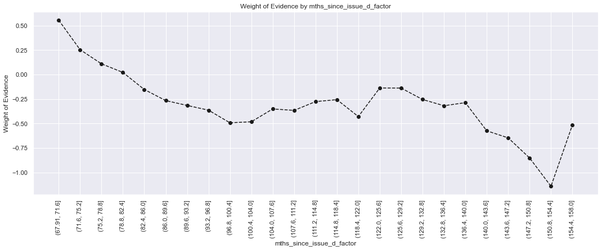

```python
import pandas as pd
import numpy as np
import seaborn as sns
import matplotlib.pyplot as plt
from sklearn.model_selection import train_test_split, RepeatedStratifiedKFold, cross_val_score
from sklearn.linear_model import LogisticRegression
from sklearn.metrics import roc_curve, roc_auc_score, confusion_matrix, precision_recall_curve, auc
from sklearn.feature_selection import f_classif
from sklearn.pipeline import Pipeline
from sklearn.base import BaseEstimator, TransformerMixin
from scipy.stats import chi2_contingency
```


```python
loan_data = pd.read_csv('credit_risk_dataset.csv')
```

    C:\Users\krutu\anaconda3\lib\site-packages\IPython\core\interactiveshell.py:3444: DtypeWarning: Columns (19) have mixed types.Specify dtype option on import or set low_memory=False.
      exec(code_obj, self.user_global_ns, self.user_ns)
    


```python
pd.options.display.max_columns = None
loan_data.head()
```


<div>
<style scoped>
    .dataframe tbody tr th:only-of-type {
        vertical-align: middle;
    }

    .dataframe tbody tr th {
        vertical-align: top;
    }

    .dataframe thead th {
        text-align: right;
    }
</style>
<table border="1" class="dataframe">
  <thead>
    <tr style="text-align: right;">
      <th></th>
      <th>id</th>
      <th>member_id</th>
      <th>loan_amnt</th>
      <th>funded_amnt</th>
      <th>funded_amnt_inv</th>
      <th>term</th>
      <th>int_rate</th>
      <th>installment</th>
      <th>grade</th>
      <th>sub_grade</th>
      <th>emp_title</th>
      <th>emp_length</th>
      <th>home_ownership</th>
      <th>annual_inc</th>
      <th>verification_status</th>
      <th>issue_d</th>
      <th>loan_status</th>
      <th>pymnt_plan</th>
      <th>url</th>
      <th>desc</th>
      <th>purpose</th>
      <th>title</th>
      <th>zip_code</th>
      <th>addr_state</th>
      <th>dti</th>
      <th>delinq_2yrs</th>
      <th>earliest_cr_line</th>
      <th>inq_last_6mths</th>
      <th>mths_since_last_delinq</th>
      <th>mths_since_last_record</th>
      <th>open_acc</th>
      <th>pub_rec</th>
      <th>revol_bal</th>
      <th>revol_util</th>
      <th>total_acc</th>
      <th>initial_list_status</th>
      <th>out_prncp</th>
      <th>out_prncp_inv</th>
      <th>total_pymnt</th>
      <th>total_pymnt_inv</th>
      <th>total_rec_prncp</th>
      <th>total_rec_int</th>
      <th>total_rec_late_fee</th>
      <th>recoveries</th>
      <th>collection_recovery_fee</th>
      <th>last_pymnt_d</th>
      <th>last_pymnt_amnt</th>
      <th>next_pymnt_d</th>
      <th>last_credit_pull_d</th>
      <th>collections_12_mths_ex_med</th>
      <th>mths_since_last_major_derog</th>
      <th>policy_code</th>
      <th>application_type</th>
      <th>annual_inc_joint</th>
      <th>dti_joint</th>
      <th>verification_status_joint</th>
      <th>acc_now_delinq</th>
      <th>tot_coll_amt</th>
      <th>tot_cur_bal</th>
      <th>open_acc_6m</th>
      <th>open_il_6m</th>
      <th>open_il_12m</th>
      <th>open_il_24m</th>
      <th>mths_since_rcnt_il</th>
      <th>total_bal_il</th>
      <th>il_util</th>
      <th>open_rv_12m</th>
      <th>open_rv_24m</th>
      <th>max_bal_bc</th>
      <th>all_util</th>
      <th>total_rev_hi_lim</th>
      <th>inq_fi</th>
      <th>total_cu_tl</th>
      <th>inq_last_12m</th>
    </tr>
  </thead>
  <tbody>
    <tr>
      <th>0</th>
      <td>1077501</td>
      <td>1296599</td>
      <td>5000</td>
      <td>5000</td>
      <td>4975.0</td>
      <td>36 months</td>
      <td>10.65</td>
      <td>162.87</td>
      <td>B</td>
      <td>B2</td>
      <td>NaN</td>
      <td>10+ years</td>
      <td>RENT</td>
      <td>24000.0</td>
      <td>Verified</td>
      <td>Dec-11</td>
      <td>Fully Paid</td>
      <td>n</td>
      <td>https://www.lendingclub.com/browse/loanDetail....</td>
      <td>Borrower added on 12/22/11 &gt; I need to upgra...</td>
      <td>credit_card</td>
      <td>Computer</td>
      <td>860xx</td>
      <td>AZ</td>
      <td>27.65</td>
      <td>0.0</td>
      <td>Jan-85</td>
      <td>1.0</td>
      <td>NaN</td>
      <td>NaN</td>
      <td>3.0</td>
      <td>0.0</td>
      <td>13648</td>
      <td>83.7</td>
      <td>9.0</td>
      <td>f</td>
      <td>0.0</td>
      <td>0.0</td>
      <td>5861.071414</td>
      <td>5831.78</td>
      <td>5000.00</td>
      <td>861.07</td>
      <td>0.00</td>
      <td>0.00</td>
      <td>0.00</td>
      <td>Jan-15</td>
      <td>171.62</td>
      <td>NaN</td>
      <td>Jan-16</td>
      <td>0.0</td>
      <td>NaN</td>
      <td>1</td>
      <td>INDIVIDUAL</td>
      <td>NaN</td>
      <td>NaN</td>
      <td>NaN</td>
      <td>0.0</td>
      <td>NaN</td>
      <td>NaN</td>
      <td>NaN</td>
      <td>NaN</td>
      <td>NaN</td>
      <td>NaN</td>
      <td>NaN</td>
      <td>NaN</td>
      <td>NaN</td>
      <td>NaN</td>
      <td>NaN</td>
      <td>NaN</td>
      <td>NaN</td>
      <td>NaN</td>
      <td>NaN</td>
      <td>NaN</td>
      <td>NaN</td>
    </tr>
    <tr>
      <th>1</th>
      <td>1077430</td>
      <td>1314167</td>
      <td>2500</td>
      <td>2500</td>
      <td>2500.0</td>
      <td>60 months</td>
      <td>15.27</td>
      <td>59.83</td>
      <td>C</td>
      <td>C4</td>
      <td>Ryder</td>
      <td>&lt; 1 year</td>
      <td>RENT</td>
      <td>30000.0</td>
      <td>Source Verified</td>
      <td>Dec-11</td>
      <td>Charged Off</td>
      <td>n</td>
      <td>https://www.lendingclub.com/browse/loanDetail....</td>
      <td>Borrower added on 12/22/11 &gt; I plan to use t...</td>
      <td>car</td>
      <td>bike</td>
      <td>309xx</td>
      <td>GA</td>
      <td>1.00</td>
      <td>0.0</td>
      <td>Apr-99</td>
      <td>5.0</td>
      <td>NaN</td>
      <td>NaN</td>
      <td>3.0</td>
      <td>0.0</td>
      <td>1687</td>
      <td>9.4</td>
      <td>4.0</td>
      <td>f</td>
      <td>0.0</td>
      <td>0.0</td>
      <td>1008.710000</td>
      <td>1008.71</td>
      <td>456.46</td>
      <td>435.17</td>
      <td>0.00</td>
      <td>117.08</td>
      <td>1.11</td>
      <td>Apr-13</td>
      <td>119.66</td>
      <td>NaN</td>
      <td>Sep-13</td>
      <td>0.0</td>
      <td>NaN</td>
      <td>1</td>
      <td>INDIVIDUAL</td>
      <td>NaN</td>
      <td>NaN</td>
      <td>NaN</td>
      <td>0.0</td>
      <td>NaN</td>
      <td>NaN</td>
      <td>NaN</td>
      <td>NaN</td>
      <td>NaN</td>
      <td>NaN</td>
      <td>NaN</td>
      <td>NaN</td>
      <td>NaN</td>
      <td>NaN</td>
      <td>NaN</td>
      <td>NaN</td>
      <td>NaN</td>
      <td>NaN</td>
      <td>NaN</td>
      <td>NaN</td>
      <td>NaN</td>
    </tr>
    <tr>
      <th>2</th>
      <td>1077175</td>
      <td>1313524</td>
      <td>2400</td>
      <td>2400</td>
      <td>2400.0</td>
      <td>36 months</td>
      <td>15.96</td>
      <td>84.33</td>
      <td>C</td>
      <td>C5</td>
      <td>NaN</td>
      <td>10+ years</td>
      <td>RENT</td>
      <td>12252.0</td>
      <td>Not Verified</td>
      <td>Dec-11</td>
      <td>Fully Paid</td>
      <td>n</td>
      <td>https://www.lendingclub.com/browse/loanDetail....</td>
      <td>NaN</td>
      <td>small_business</td>
      <td>real estate business</td>
      <td>606xx</td>
      <td>IL</td>
      <td>8.72</td>
      <td>0.0</td>
      <td>Nov-01</td>
      <td>2.0</td>
      <td>NaN</td>
      <td>NaN</td>
      <td>2.0</td>
      <td>0.0</td>
      <td>2956</td>
      <td>98.5</td>
      <td>10.0</td>
      <td>f</td>
      <td>0.0</td>
      <td>0.0</td>
      <td>3003.653644</td>
      <td>3003.65</td>
      <td>2400.00</td>
      <td>603.65</td>
      <td>0.00</td>
      <td>0.00</td>
      <td>0.00</td>
      <td>Jun-14</td>
      <td>649.91</td>
      <td>NaN</td>
      <td>Jan-16</td>
      <td>0.0</td>
      <td>NaN</td>
      <td>1</td>
      <td>INDIVIDUAL</td>
      <td>NaN</td>
      <td>NaN</td>
      <td>NaN</td>
      <td>0.0</td>
      <td>NaN</td>
      <td>NaN</td>
      <td>NaN</td>
      <td>NaN</td>
      <td>NaN</td>
      <td>NaN</td>
      <td>NaN</td>
      <td>NaN</td>
      <td>NaN</td>
      <td>NaN</td>
      <td>NaN</td>
      <td>NaN</td>
      <td>NaN</td>
      <td>NaN</td>
      <td>NaN</td>
      <td>NaN</td>
      <td>NaN</td>
    </tr>
    <tr>
      <th>3</th>
      <td>1076863</td>
      <td>1277178</td>
      <td>10000</td>
      <td>10000</td>
      <td>10000.0</td>
      <td>36 months</td>
      <td>13.49</td>
      <td>339.31</td>
      <td>C</td>
      <td>C1</td>
      <td>AIR RESOURCES BOARD</td>
      <td>10+ years</td>
      <td>RENT</td>
      <td>49200.0</td>
      <td>Source Verified</td>
      <td>Dec-11</td>
      <td>Fully Paid</td>
      <td>n</td>
      <td>https://www.lendingclub.com/browse/loanDetail....</td>
      <td>Borrower added on 12/21/11 &gt; to pay for prop...</td>
      <td>other</td>
      <td>personel</td>
      <td>917xx</td>
      <td>CA</td>
      <td>20.00</td>
      <td>0.0</td>
      <td>Feb-96</td>
      <td>1.0</td>
      <td>35.0</td>
      <td>NaN</td>
      <td>10.0</td>
      <td>0.0</td>
      <td>5598</td>
      <td>21.0</td>
      <td>37.0</td>
      <td>f</td>
      <td>0.0</td>
      <td>0.0</td>
      <td>12226.302210</td>
      <td>12226.30</td>
      <td>10000.00</td>
      <td>2209.33</td>
      <td>16.97</td>
      <td>0.00</td>
      <td>0.00</td>
      <td>Jan-15</td>
      <td>357.48</td>
      <td>NaN</td>
      <td>Jan-15</td>
      <td>0.0</td>
      <td>NaN</td>
      <td>1</td>
      <td>INDIVIDUAL</td>
      <td>NaN</td>
      <td>NaN</td>
      <td>NaN</td>
      <td>0.0</td>
      <td>NaN</td>
      <td>NaN</td>
      <td>NaN</td>
      <td>NaN</td>
      <td>NaN</td>
      <td>NaN</td>
      <td>NaN</td>
      <td>NaN</td>
      <td>NaN</td>
      <td>NaN</td>
      <td>NaN</td>
      <td>NaN</td>
      <td>NaN</td>
      <td>NaN</td>
      <td>NaN</td>
      <td>NaN</td>
      <td>NaN</td>
    </tr>
    <tr>
      <th>4</th>
      <td>1075358</td>
      <td>1311748</td>
      <td>3000</td>
      <td>3000</td>
      <td>3000.0</td>
      <td>60 months</td>
      <td>12.69</td>
      <td>67.79</td>
      <td>B</td>
      <td>B5</td>
      <td>University Medical Group</td>
      <td>1 year</td>
      <td>RENT</td>
      <td>80000.0</td>
      <td>Source Verified</td>
      <td>Dec-11</td>
      <td>Current</td>
      <td>n</td>
      <td>https://www.lendingclub.com/browse/loanDetail....</td>
      <td>Borrower added on 12/21/11 &gt; I plan on combi...</td>
      <td>other</td>
      <td>Personal</td>
      <td>972xx</td>
      <td>OR</td>
      <td>17.94</td>
      <td>0.0</td>
      <td>Jan-96</td>
      <td>0.0</td>
      <td>38.0</td>
      <td>NaN</td>
      <td>15.0</td>
      <td>0.0</td>
      <td>27783</td>
      <td>53.9</td>
      <td>38.0</td>
      <td>f</td>
      <td>766.9</td>
      <td>766.9</td>
      <td>3242.170000</td>
      <td>3242.17</td>
      <td>2233.10</td>
      <td>1009.07</td>
      <td>0.00</td>
      <td>0.00</td>
      <td>0.00</td>
      <td>Jan-16</td>
      <td>67.79</td>
      <td>Feb-16</td>
      <td>Jan-16</td>
      <td>0.0</td>
      <td>NaN</td>
      <td>1</td>
      <td>INDIVIDUAL</td>
      <td>NaN</td>
      <td>NaN</td>
      <td>NaN</td>
      <td>0.0</td>
      <td>NaN</td>
      <td>NaN</td>
      <td>NaN</td>
      <td>NaN</td>
      <td>NaN</td>
      <td>NaN</td>
      <td>NaN</td>
      <td>NaN</td>
      <td>NaN</td>
      <td>NaN</td>
      <td>NaN</td>
      <td>NaN</td>
      <td>NaN</td>
      <td>NaN</td>
      <td>NaN</td>
      <td>NaN</td>
      <td>NaN</td>
    </tr>
  </tbody>
</table>
</div>


```python
loan_data.info()
```

    <class 'pandas.core.frame.DataFrame'>
    RangeIndex: 466285 entries, 0 to 466284
    Data columns (total 74 columns):
     #   Column                       Non-Null Count   Dtype  
    ---  ------                       --------------   -----  
     0   id                           466285 non-null  int64  
     1   member_id                    466285 non-null  int64  
     2   loan_amnt                    466285 non-null  int64  
     3   funded_amnt                  466285 non-null  int64  
     4   funded_amnt_inv              466285 non-null  float64
     5   term                         466285 non-null  object 
     6   int_rate                     466285 non-null  float64
     7   installment                  466285 non-null  float64
     8   grade                        466285 non-null  object 
     9   sub_grade                    466285 non-null  object 
     10  emp_title                    438697 non-null  object 
     11  emp_length                   445277 non-null  object 
     12  home_ownership               466285 non-null  object 
     13  annual_inc                   466281 non-null  float64
     14  verification_status          466285 non-null  object 
     15  issue_d                      466285 non-null  object 
     16  loan_status                  466285 non-null  object 
     17  pymnt_plan                   466285 non-null  object 
     18  url                          466285 non-null  object 
     19  desc                         125983 non-null  object 
     20  purpose                      466285 non-null  object 
     21  title                        466265 non-null  object 
     22  zip_code                     466285 non-null  object 
     23  addr_state                   466285 non-null  object 
     24  dti                          466285 non-null  float64
     25  delinq_2yrs                  466256 non-null  float64
     26  earliest_cr_line             466256 non-null  object 
     27  inq_last_6mths               466256 non-null  float64
     28  mths_since_last_delinq       215934 non-null  float64
     29  mths_since_last_record       62638 non-null   float64
     30  open_acc                     466256 non-null  float64
     31  pub_rec                      466256 non-null  float64
     32  revol_bal                    466285 non-null  int64  
     33  revol_util                   465945 non-null  float64
     34  total_acc                    466256 non-null  float64
     35  initial_list_status          466285 non-null  object 
     36  out_prncp                    466285 non-null  float64
     37  out_prncp_inv                466285 non-null  float64
     38  total_pymnt                  466285 non-null  float64
     39  total_pymnt_inv              466285 non-null  float64
     40  total_rec_prncp              466285 non-null  float64
     41  total_rec_int                466285 non-null  float64
     42  total_rec_late_fee           466285 non-null  float64
     43  recoveries                   466285 non-null  float64
     44  collection_recovery_fee      466285 non-null  float64
     45  last_pymnt_d                 465909 non-null  object 
     46  last_pymnt_amnt              466285 non-null  float64
     47  next_pymnt_d                 239071 non-null  object 
     48  last_credit_pull_d           466243 non-null  object 
     49  collections_12_mths_ex_med   466140 non-null  float64
     50  mths_since_last_major_derog  98974 non-null   float64
     51  policy_code                  466285 non-null  int64  
     52  application_type             466285 non-null  object 
     53  annual_inc_joint             0 non-null       float64
     54  dti_joint                    0 non-null       float64
     55  verification_status_joint    0 non-null       float64
     56  acc_now_delinq               466256 non-null  float64
     57  tot_coll_amt                 396009 non-null  float64
     58  tot_cur_bal                  396009 non-null  float64
     59  open_acc_6m                  0 non-null       float64
     60  open_il_6m                   0 non-null       float64
     61  open_il_12m                  0 non-null       float64
     62  open_il_24m                  0 non-null       float64
     63  mths_since_rcnt_il           0 non-null       float64
     64  total_bal_il                 0 non-null       float64
     65  il_util                      0 non-null       float64
     66  open_rv_12m                  0 non-null       float64
     67  open_rv_24m                  0 non-null       float64
     68  max_bal_bc                   0 non-null       float64
     69  all_util                     0 non-null       float64
     70  total_rev_hi_lim             396009 non-null  float64
     71  inq_fi                       0 non-null       float64
     72  total_cu_tl                  0 non-null       float64
     73  inq_last_12m                 0 non-null       float64
    dtypes: float64(46), int64(6), object(22)
    memory usage: 263.3+ MB
    


```python
na_values = loan_data.isnull().mean()
na_values[na_values>0.8]
```


    mths_since_last_record       0.865666
    annual_inc_joint             1.000000
    dti_joint                    1.000000
    verification_status_joint    1.000000
    open_acc_6m                  1.000000
    open_il_6m                   1.000000
    open_il_12m                  1.000000
    open_il_24m                  1.000000
    mths_since_rcnt_il           1.000000
    total_bal_il                 1.000000
    il_util                      1.000000
    open_rv_12m                  1.000000
    open_rv_24m                  1.000000
    max_bal_bc                   1.000000
    all_util                     1.000000
    inq_fi                       1.000000
    total_cu_tl                  1.000000
    inq_last_12m                 1.000000
    dtype: float64


```python
loan_data.dropna(thresh = loan_data.shape[0]*0.2, how = 'all', axis = 1, inplace = True)
loan_data.drop(columns = ['id', 'member_id', 'sub_grade', 'emp_title', 'url', 'desc', 'title', 'zip_code', 'next_pymnt_d',
                          'recoveries', 'collection_recovery_fee', 'total_rec_prncp', 'total_rec_late_fee'], inplace = True)
```


```python
loan_data.info()
```

    <class 'pandas.core.frame.DataFrame'>
    RangeIndex: 466285 entries, 0 to 466284
    Data columns (total 43 columns):
     #   Column                       Non-Null Count   Dtype  
    ---  ------                       --------------   -----  
     0   loan_amnt                    466285 non-null  int64  
     1   funded_amnt                  466285 non-null  int64  
     2   funded_amnt_inv              466285 non-null  float64
     3   term                         466285 non-null  object 
     4   int_rate                     466285 non-null  float64
     5   installment                  466285 non-null  float64
     6   grade                        466285 non-null  object 
     7   emp_length                   445277 non-null  object 
     8   home_ownership               466285 non-null  object 
     9   annual_inc                   466281 non-null  float64
     10  verification_status          466285 non-null  object 
     11  issue_d                      466285 non-null  object 
     12  loan_status                  466285 non-null  object 
     13  pymnt_plan                   466285 non-null  object 
     14  purpose                      466285 non-null  object 
     15  addr_state                   466285 non-null  object 
     16  dti                          466285 non-null  float64
     17  delinq_2yrs                  466256 non-null  float64
     18  earliest_cr_line             466256 non-null  object 
     19  inq_last_6mths               466256 non-null  float64
     20  mths_since_last_delinq       215934 non-null  float64
     21  open_acc                     466256 non-null  float64
     22  pub_rec                      466256 non-null  float64
     23  revol_bal                    466285 non-null  int64  
     24  revol_util                   465945 non-null  float64
     25  total_acc                    466256 non-null  float64
     26  initial_list_status          466285 non-null  object 
     27  out_prncp                    466285 non-null  float64
     28  out_prncp_inv                466285 non-null  float64
     29  total_pymnt                  466285 non-null  float64
     30  total_pymnt_inv              466285 non-null  float64
     31  total_rec_int                466285 non-null  float64
     32  last_pymnt_d                 465909 non-null  object 
     33  last_pymnt_amnt              466285 non-null  float64
     34  last_credit_pull_d           466243 non-null  object 
     35  collections_12_mths_ex_med   466140 non-null  float64
     36  mths_since_last_major_derog  98974 non-null   float64
     37  policy_code                  466285 non-null  int64  
     38  application_type             466285 non-null  object 
     39  acc_now_delinq               466256 non-null  float64
     40  tot_coll_amt                 396009 non-null  float64
     41  tot_cur_bal                  396009 non-null  float64
     42  total_rev_hi_lim             396009 non-null  float64
    dtypes: float64(24), int64(4), object(15)
    memory usage: 153.0+ MB
    


```python
loan_data['loan_status'].value_counts(normalize = True)
```


    Current                                                0.480878
    Fully Paid                                             0.396193
    Charged Off                                            0.091092
    Late (31-120 days)                                     0.014798
    In Grace Period                                        0.006747
    Does not meet the credit policy. Status:Fully Paid     0.004263
    Late (16-30 days)                                      0.002612
    Default                                                0.001784
    Does not meet the credit policy. Status:Charged Off    0.001632
    Name: loan_status, dtype: float64


```python
loan_data['good_bad'] = np.where(loan_data.loc[:, 'loan_status'].isin(['Charged Off', 'Default', 'Late (31-120 days)',
                                                                       'Does not meet the credit policy. Status:Charged Off']), 0, 1)
loan_data.drop(columns = ['loan_status'], inplace = True)
```


```python
X = loan_data.drop('good_bad', axis = 1)
y = loan_data['good_bad']
X_train, X_test, y_train, y_test = train_test_split(X, y, test_size = 0.2, random_state = 42, stratify = y)

X_train, X_test = X_train.copy(), X_test.copy()
```


```python
def emp_length_converter(df, column):
    df[column] = df[column].str.replace('\+ years', '')
    df[column] = df[column].str.replace('< 1 year', str(0))
    df[column] = df[column].str.replace(' years', '')
    df[column] = df[column].str.replace(' year', '')
    df[column] = pd.to_numeric(df[column])
    df[column].fillna(value = 0, inplace = True)

emp_length_converter(X_train, 'emp_length')

X_train['emp_length'].unique()
```

    C:\Users\krutu\AppData\Local\Temp/ipykernel_18472/572542809.py:2: FutureWarning: The default value of regex will change from True to False in a future version.
      df[column] = df[column].str.replace('\+ years', '')
    


    array([ 7., 10.,  3.,  4.,  2.,  0.,  1.,  6.,  5.,  8.,  9.])


```python
def date_columns(df, column):
    today_date = pd.to_datetime('2020-08-01')
    df[column] = pd.to_datetime(df[column], format = "%b-%y")
    df['mths_since_' + column] = round(pd.to_numeric((today_date - df[column]) / np.timedelta64(1, 'M')))
    df['mths_since_' + column] = df['mths_since_' + column].apply(lambda x: df['mths_since_' + column].max() if x < 0 else x)
    df.drop(columns = [column], inplace = True)

date_columns(X_train, 'earliest_cr_line')
date_columns(X_train, 'issue_d')
date_columns(X_train, 'last_pymnt_d')
date_columns(X_train, 'last_credit_pull_d')

print(X_train['mths_since_earliest_cr_line'].describe())
print(X_train['mths_since_issue_d'].describe())
print(X_train['mths_since_last_pymnt_d'].describe())
print(X_train['mths_since_last_credit_pull_d'].describe())
```

    count    373003.000000
    mean        274.293609
    std          86.372742
    min         105.000000
    25%         215.000000
    50%         257.000000
    75%         317.000000
    max         619.000000
    Name: mths_since_earliest_cr_line, dtype: float64
    count    373028.000000
    mean         83.252485
    std          14.339074
    min          68.000000
    25%          73.000000
    50%          79.000000
    75%          89.000000
    max         158.000000
    Name: mths_since_issue_d, dtype: float64
    count    372717.000000
    mean         63.289989
    std          12.803859
    min          55.000000
    25%          55.000000
    50%          56.000000
    75%          67.000000
    max         152.000000
    Name: mths_since_last_pymnt_d, dtype: float64
    count    372998.000000
    mean         59.041810
    std           9.630887
    min          55.000000
    25%          55.000000
    50%          55.000000
    75%          57.000000
    max         159.000000
    Name: mths_since_last_credit_pull_d, dtype: float64
    


```python
def loan_term_converter(df, column):
    df[column] = pd.to_numeric(df[column].str.replace(' months', ''))

loan_term_converter(X_train, 'term')
```


```python
X_train_cat = X_train.select_dtypes(include = 'object').copy()
X_train_num = X_train.select_dtypes(include = 'number').copy()
```


```python
chi2_check = {}

for column in X_train_cat:
    chi, p, dof, ex = chi2_contingency(pd.crosstab(y_train, X_train_cat[column]))
    chi2_check.setdefault('Feature',[]).append(column)
    chi2_check.setdefault('p-value',[]).append(round(p, 10))

chi2_result = pd.DataFrame(data = chi2_check)
chi2_result.sort_values(by = ['p-value'], ascending = True, ignore_index = True, inplace = True)
chi2_result
```


<div>
<style scoped>
    .dataframe tbody tr th:only-of-type {
        vertical-align: middle;
    }

    .dataframe tbody tr th {
        vertical-align: top;
    }

    .dataframe thead th {
        text-align: right;
    }
</style>
<table border="1" class="dataframe">
  <thead>
    <tr style="text-align: right;">
      <th></th>
      <th>Feature</th>
      <th>p-value</th>
    </tr>
  </thead>
  <tbody>
    <tr>
      <th>0</th>
      <td>grade</td>
      <td>0.000000</td>
    </tr>
    <tr>
      <th>1</th>
      <td>home_ownership</td>
      <td>0.000000</td>
    </tr>
    <tr>
      <th>2</th>
      <td>verification_status</td>
      <td>0.000000</td>
    </tr>
    <tr>
      <th>3</th>
      <td>purpose</td>
      <td>0.000000</td>
    </tr>
    <tr>
      <th>4</th>
      <td>addr_state</td>
      <td>0.000000</td>
    </tr>
    <tr>
      <th>5</th>
      <td>initial_list_status</td>
      <td>0.000000</td>
    </tr>
    <tr>
      <th>6</th>
      <td>pymnt_plan</td>
      <td>0.000923</td>
    </tr>
    <tr>
      <th>7</th>
      <td>application_type</td>
      <td>1.000000</td>
    </tr>
  </tbody>
</table>
</div>


```python
X_train_num.fillna(X_train_num.mean(), inplace = True)

F_statistic, p_values = f_classif(X_train_num, y_train)

ANOVA_F_table = pd.DataFrame(data = {'Numerical_Feature': X_train_num.columns.values, 'F-Score': F_statistic, 'p values': p_values.round(decimals=10)})
ANOVA_F_table.sort_values(by = ['F-Score'], ascending = False, ignore_index = True, inplace = True)
ANOVA_F_table
```

    C:\Users\krutu\anaconda3\lib\site-packages\sklearn\feature_selection\_univariate_selection.py:114: UserWarning: Features [25] are constant.
      warnings.warn("Features %s are constant." % constant_features_idx,
    C:\Users\krutu\anaconda3\lib\site-packages\sklearn\feature_selection\_univariate_selection.py:116: RuntimeWarning: invalid value encountered in true_divide
      f = msb / msw
    


<div>
<style scoped>
    .dataframe tbody tr th:only-of-type {
        vertical-align: middle;
    }

    .dataframe tbody tr th {
        vertical-align: top;
    }

    .dataframe thead th {
        text-align: right;
    }
</style>
<table border="1" class="dataframe">
  <thead>
    <tr style="text-align: right;">
      <th></th>
      <th>Numerical_Feature</th>
      <th>F-Score</th>
      <th>p values</th>
    </tr>
  </thead>
  <tbody>
    <tr>
      <th>0</th>
      <td>mths_since_last_pymnt_d</td>
      <td>23513.805570</td>
      <td>0.000000e+00</td>
    </tr>
    <tr>
      <th>1</th>
      <td>total_pymnt_inv</td>
      <td>14784.534040</td>
      <td>0.000000e+00</td>
    </tr>
    <tr>
      <th>2</th>
      <td>total_pymnt</td>
      <td>14686.729567</td>
      <td>0.000000e+00</td>
    </tr>
    <tr>
      <th>3</th>
      <td>int_rate</td>
      <td>11462.788313</td>
      <td>0.000000e+00</td>
    </tr>
    <tr>
      <th>4</th>
      <td>last_pymnt_amnt</td>
      <td>10826.949727</td>
      <td>0.000000e+00</td>
    </tr>
    <tr>
      <th>5</th>
      <td>out_prncp</td>
      <td>9635.116160</td>
      <td>0.000000e+00</td>
    </tr>
    <tr>
      <th>6</th>
      <td>out_prncp_inv</td>
      <td>9633.442129</td>
      <td>0.000000e+00</td>
    </tr>
    <tr>
      <th>7</th>
      <td>mths_since_last_credit_pull_d</td>
      <td>7020.218888</td>
      <td>0.000000e+00</td>
    </tr>
    <tr>
      <th>8</th>
      <td>mths_since_issue_d</td>
      <td>2816.028871</td>
      <td>0.000000e+00</td>
    </tr>
    <tr>
      <th>9</th>
      <td>inq_last_6mths</td>
      <td>2003.820465</td>
      <td>0.000000e+00</td>
    </tr>
    <tr>
      <th>10</th>
      <td>term</td>
      <td>1590.811890</td>
      <td>0.000000e+00</td>
    </tr>
    <tr>
      <th>11</th>
      <td>revol_util</td>
      <td>931.880533</td>
      <td>0.000000e+00</td>
    </tr>
    <tr>
      <th>12</th>
      <td>dti</td>
      <td>863.811228</td>
      <td>0.000000e+00</td>
    </tr>
    <tr>
      <th>13</th>
      <td>annual_inc</td>
      <td>861.298449</td>
      <td>0.000000e+00</td>
    </tr>
    <tr>
      <th>14</th>
      <td>tot_cur_bal</td>
      <td>784.596617</td>
      <td>0.000000e+00</td>
    </tr>
    <tr>
      <th>15</th>
      <td>mths_since_earliest_cr_line</td>
      <td>447.541677</td>
      <td>0.000000e+00</td>
    </tr>
    <tr>
      <th>16</th>
      <td>total_rev_hi_lim</td>
      <td>377.070243</td>
      <td>0.000000e+00</td>
    </tr>
    <tr>
      <th>17</th>
      <td>total_rec_int</td>
      <td>273.765687</td>
      <td>0.000000e+00</td>
    </tr>
    <tr>
      <th>18</th>
      <td>total_acc</td>
      <td>208.751175</td>
      <td>0.000000e+00</td>
    </tr>
    <tr>
      <th>19</th>
      <td>emp_length</td>
      <td>146.954085</td>
      <td>0.000000e+00</td>
    </tr>
    <tr>
      <th>20</th>
      <td>revol_bal</td>
      <td>119.561249</td>
      <td>0.000000e+00</td>
    </tr>
    <tr>
      <th>21</th>
      <td>installment</td>
      <td>74.947851</td>
      <td>0.000000e+00</td>
    </tr>
    <tr>
      <th>22</th>
      <td>loan_amnt</td>
      <td>57.496753</td>
      <td>0.000000e+00</td>
    </tr>
    <tr>
      <th>23</th>
      <td>funded_amnt</td>
      <td>50.089615</td>
      <td>0.000000e+00</td>
    </tr>
    <tr>
      <th>24</th>
      <td>pub_rec</td>
      <td>39.596857</td>
      <td>3.000000e-10</td>
    </tr>
    <tr>
      <th>25</th>
      <td>funded_amnt_inv</td>
      <td>23.260798</td>
      <td>1.415100e-06</td>
    </tr>
    <tr>
      <th>26</th>
      <td>open_acc</td>
      <td>16.299684</td>
      <td>5.408370e-05</td>
    </tr>
    <tr>
      <th>27</th>
      <td>collections_12_mths_ex_med</td>
      <td>7.358687</td>
      <td>6.674257e-03</td>
    </tr>
    <tr>
      <th>28</th>
      <td>mths_since_last_major_derog</td>
      <td>3.116419</td>
      <td>7.750777e-02</td>
    </tr>
    <tr>
      <th>29</th>
      <td>mths_since_last_delinq</td>
      <td>3.079668</td>
      <td>7.927751e-02</td>
    </tr>
    <tr>
      <th>30</th>
      <td>delinq_2yrs</td>
      <td>1.066138</td>
      <td>3.018201e-01</td>
    </tr>
    <tr>
      <th>31</th>
      <td>acc_now_delinq</td>
      <td>0.690407</td>
      <td>4.060264e-01</td>
    </tr>
    <tr>
      <th>32</th>
      <td>tot_coll_amt</td>
      <td>0.393157</td>
      <td>5.306448e-01</td>
    </tr>
    <tr>
      <th>33</th>
      <td>policy_code</td>
      <td>NaN</td>
      <td>NaN</td>
    </tr>
  </tbody>
</table>
</div>


```python
top_num_features = ANOVA_F_table.iloc[:20,0].to_list()

corrmat = X_train_num[top_num_features].corr()
plt.figure(figsize=(10,10))
sns.heatmap(corrmat);
```


    

    


```python
drop_columns_list = ANOVA_F_table.iloc[20:, 0].to_list()
drop_columns_list.extend(chi2_result.iloc[4:, 0].to_list())
drop_columns_list.extend(['out_prncp_inv', 'total_pymnt_inv'])

def col_to_drop(df, columns_list):
    df.drop(columns = columns_list, inplace = True)

col_to_drop(X_train, drop_columns_list)
```


```python
X_train.info()
```

    <class 'pandas.core.frame.DataFrame'>
    Int64Index: 373028 entries, 456615 to 38736
    Data columns (total 22 columns):
     #   Column                         Non-Null Count   Dtype  
    ---  ------                         --------------   -----  
     0   term                           373028 non-null  int64  
     1   int_rate                       373028 non-null  float64
     2   grade                          373028 non-null  object 
     3   emp_length                     373028 non-null  float64
     4   home_ownership                 373028 non-null  object 
     5   annual_inc                     373024 non-null  float64
     6   verification_status            373028 non-null  object 
     7   purpose                        373028 non-null  object 
     8   dti                            373028 non-null  float64
     9   inq_last_6mths                 373003 non-null  float64
     10  revol_util                     372764 non-null  float64
     11  total_acc                      373003 non-null  float64
     12  out_prncp                      373028 non-null  float64
     13  total_pymnt                    373028 non-null  float64
     14  total_rec_int                  373028 non-null  float64
     15  last_pymnt_amnt                373028 non-null  float64
     16  tot_cur_bal                    316872 non-null  float64
     17  total_rev_hi_lim               316872 non-null  float64
     18  mths_since_earliest_cr_line    373003 non-null  float64
     19  mths_since_issue_d             373028 non-null  float64
     20  mths_since_last_pymnt_d        372717 non-null  float64
     21  mths_since_last_credit_pull_d  372998 non-null  float64
    dtypes: float64(17), int64(1), object(4)
    memory usage: 65.5+ MB
    


```python
def dummy_creation(df, columns_list):
    df_dummies = []
    for col in columns_list:
        df_dummies.append(pd.get_dummies(df[col], prefix = col, prefix_sep = ':'))
    df_dummies = pd.concat(df_dummies, axis = 1)
    df = pd.concat([df, df_dummies], axis = 1)
    return df

X_train = dummy_creation(X_train, ['grade', 'home_ownership', 'verification_status', 'purpose'])
```


```python
emp_length_converter(X_test, 'emp_length')
date_columns(X_test, 'earliest_cr_line')
date_columns(X_test, 'issue_d')
date_columns(X_test, 'last_pymnt_d')
date_columns(X_test, 'last_credit_pull_d')
loan_term_converter(X_test, 'term')
col_to_drop(X_test, drop_columns_list)
X_test = dummy_creation(X_test, ['grade', 'home_ownership', 'verification_status', 'purpose'])

X_test = X_test.reindex(labels=X_train.columns, axis=1, fill_value=0)
```

    C:\Users\krutu\AppData\Local\Temp/ipykernel_18472/572542809.py:2: FutureWarning: The default value of regex will change from True to False in a future version.
      df[column] = df[column].str.replace('\+ years', '')
    


```python
X_train_prepr = X_train.copy()
y_train_prepr = y_train.copy()
X_test_prepr = X_test.copy()
y_test_prepr = y_test.copy()
```


```python
def woe_discrete(df, cat_variabe_name, y_df):
    df = pd.concat([df[cat_variabe_name], y_df], axis = 1)
    df = pd.concat([df.groupby(df.columns.values[0], as_index = False)[df.columns.values[1]].count(),
                    df.groupby(df.columns.values[0], as_index = False)[df.columns.values[1]].mean()], axis = 1)
    df = df.iloc[:, [0, 1, 3]]
    df.columns = [df.columns.values[0], 'n_obs', 'prop_good']
    df['prop_n_obs'] = df['n_obs'] / df['n_obs'].sum()
    df['n_good'] = df['prop_good'] * df['n_obs']
    df['n_bad'] = (1 - df['prop_good']) * df['n_obs']
    df['prop_n_good'] = df['n_good'] / df['n_good'].sum()
    df['prop_n_bad'] = df['n_bad'] / df['n_bad'].sum()
    df['WoE'] = np.log(df['prop_n_good'] / df['prop_n_bad'])
    df = df.sort_values(['WoE'])
    df = df.reset_index(drop = True)
    df['diff_prop_good'] = df['prop_good'].diff().abs()
    df['diff_WoE'] = df['WoE'].diff().abs()
    df['IV'] = (df['prop_n_good'] - df['prop_n_bad']) * df['WoE']
    df['IV'] = df['IV'].sum()
    return df
```


```python
sns.set()

def plot_by_woe(df_WoE, rotation_of_x_axis_labels = 0):
    x = np.array(df_WoE.iloc[:, 0].apply(str))
    y = df_WoE['WoE']
    plt.figure(figsize=(18, 6))
    plt.plot(x, y, marker = 'o', linestyle = '--', color = 'k')
    plt.xlabel(df_WoE.columns[0])
    plt.ylabel('Weight of Evidence')
    plt.title(str('Weight of Evidence by ' + df_WoE.columns[0]))
    plt.xticks(rotation = rotation_of_x_axis_labels)    
```


```python
df_temp = woe_discrete(X_train_prepr, 'grade', y_train_prepr)
df_temp
```


<div>
<style scoped>
    .dataframe tbody tr th:only-of-type {
        vertical-align: middle;
    }

    .dataframe tbody tr th {
        vertical-align: top;
    }

    .dataframe thead th {
        text-align: right;
    }
</style>
<table border="1" class="dataframe">
  <thead>
    <tr style="text-align: right;">
      <th></th>
      <th>grade</th>
      <th>n_obs</th>
      <th>prop_good</th>
      <th>prop_n_obs</th>
      <th>n_good</th>
      <th>n_bad</th>
      <th>prop_n_good</th>
      <th>prop_n_bad</th>
      <th>WoE</th>
      <th>diff_prop_good</th>
      <th>diff_WoE</th>
      <th>IV</th>
    </tr>
  </thead>
  <tbody>
    <tr>
      <th>0</th>
      <td>G</td>
      <td>2623</td>
      <td>0.721693</td>
      <td>0.007032</td>
      <td>1893.0</td>
      <td>730.0</td>
      <td>0.005697</td>
      <td>0.017904</td>
      <td>-1.144981</td>
      <td>NaN</td>
      <td>NaN</td>
      <td>0.292145</td>
    </tr>
    <tr>
      <th>1</th>
      <td>F</td>
      <td>10606</td>
      <td>0.758061</td>
      <td>0.028432</td>
      <td>8040.0</td>
      <td>2566.0</td>
      <td>0.024198</td>
      <td>0.062932</td>
      <td>-0.955774</td>
      <td>0.036369</td>
      <td>0.189207</td>
      <td>0.292145</td>
    </tr>
    <tr>
      <th>2</th>
      <td>E</td>
      <td>28590</td>
      <td>0.804477</td>
      <td>0.076643</td>
      <td>23000.0</td>
      <td>5590.0</td>
      <td>0.069224</td>
      <td>0.137097</td>
      <td>-0.683340</td>
      <td>0.046416</td>
      <td>0.272434</td>
      <td>0.292145</td>
    </tr>
    <tr>
      <th>3</th>
      <td>D</td>
      <td>61713</td>
      <td>0.845527</td>
      <td>0.165438</td>
      <td>52180.0</td>
      <td>9533.0</td>
      <td>0.157049</td>
      <td>0.233801</td>
      <td>-0.397915</td>
      <td>0.041050</td>
      <td>0.285425</td>
      <td>0.292145</td>
    </tr>
    <tr>
      <th>4</th>
      <td>C</td>
      <td>100342</td>
      <td>0.885870</td>
      <td>0.268993</td>
      <td>88890.0</td>
      <td>11452.0</td>
      <td>0.267536</td>
      <td>0.280865</td>
      <td>-0.048620</td>
      <td>0.040343</td>
      <td>0.349295</td>
      <td>0.292145</td>
    </tr>
    <tr>
      <th>5</th>
      <td>B</td>
      <td>109344</td>
      <td>0.921422</td>
      <td>0.293125</td>
      <td>100752.0</td>
      <td>8592.0</td>
      <td>0.303238</td>
      <td>0.210723</td>
      <td>0.363975</td>
      <td>0.035552</td>
      <td>0.412595</td>
      <td>0.292145</td>
    </tr>
    <tr>
      <th>6</th>
      <td>A</td>
      <td>59810</td>
      <td>0.961361</td>
      <td>0.160336</td>
      <td>57499.0</td>
      <td>2311.0</td>
      <td>0.173057</td>
      <td>0.056678</td>
      <td>1.116232</td>
      <td>0.039939</td>
      <td>0.752257</td>
      <td>0.292145</td>
    </tr>
  </tbody>
</table>
</div>


```python
plot_by_woe(df_temp)
```


    

    


```python
df_temp = woe_discrete(X_train_prepr, 'home_ownership', y_train_prepr)
df_temp
```


<div>
<style scoped>
    .dataframe tbody tr th:only-of-type {
        vertical-align: middle;
    }

    .dataframe tbody tr th {
        vertical-align: top;
    }

    .dataframe thead th {
        text-align: right;
    }
</style>
<table border="1" class="dataframe">
  <thead>
    <tr style="text-align: right;">
      <th></th>
      <th>home_ownership</th>
      <th>n_obs</th>
      <th>prop_good</th>
      <th>prop_n_obs</th>
      <th>n_good</th>
      <th>n_bad</th>
      <th>prop_n_good</th>
      <th>prop_n_bad</th>
      <th>WoE</th>
      <th>diff_prop_good</th>
      <th>diff_WoE</th>
      <th>IV</th>
    </tr>
  </thead>
  <tbody>
    <tr>
      <th>0</th>
      <td>OTHER</td>
      <td>159</td>
      <td>0.792453</td>
      <td>0.000426</td>
      <td>126.0</td>
      <td>33.0</td>
      <td>0.000379</td>
      <td>0.000809</td>
      <td>-0.758081</td>
      <td>NaN</td>
      <td>NaN</td>
      <td>0.02166</td>
    </tr>
    <tr>
      <th>1</th>
      <td>NONE</td>
      <td>41</td>
      <td>0.853659</td>
      <td>0.000110</td>
      <td>35.0</td>
      <td>6.0</td>
      <td>0.000105</td>
      <td>0.000147</td>
      <td>-0.334267</td>
      <td>0.061206</td>
      <td>0.423814</td>
      <td>0.02166</td>
    </tr>
    <tr>
      <th>2</th>
      <td>RENT</td>
      <td>150776</td>
      <td>0.874052</td>
      <td>0.404195</td>
      <td>131786.0</td>
      <td>18990.0</td>
      <td>0.396642</td>
      <td>0.465738</td>
      <td>-0.160588</td>
      <td>0.020393</td>
      <td>0.173678</td>
      <td>0.02166</td>
    </tr>
    <tr>
      <th>3</th>
      <td>OWN</td>
      <td>33313</td>
      <td>0.890343</td>
      <td>0.089304</td>
      <td>29660.0</td>
      <td>3653.0</td>
      <td>0.089269</td>
      <td>0.089591</td>
      <td>-0.003605</td>
      <td>0.016292</td>
      <td>0.156984</td>
      <td>0.02166</td>
    </tr>
    <tr>
      <th>4</th>
      <td>MORTGAGE</td>
      <td>188739</td>
      <td>0.904143</td>
      <td>0.505965</td>
      <td>170647.0</td>
      <td>18092.0</td>
      <td>0.513604</td>
      <td>0.443714</td>
      <td>0.146272</td>
      <td>0.013800</td>
      <td>0.149877</td>
      <td>0.02166</td>
    </tr>
  </tbody>
</table>
</div>


```python
plot_by_woe(df_temp)
```


    

    


```python
df_temp = woe_discrete(X_train_prepr, 'verification_status', y_train_prepr)
df_temp
```


<div>
<style scoped>
    .dataframe tbody tr th:only-of-type {
        vertical-align: middle;
    }

    .dataframe tbody tr th {
        vertical-align: top;
    }

    .dataframe thead th {
        text-align: right;
    }
</style>
<table border="1" class="dataframe">
  <thead>
    <tr style="text-align: right;">
      <th></th>
      <th>verification_status</th>
      <th>n_obs</th>
      <th>prop_good</th>
      <th>prop_n_obs</th>
      <th>n_good</th>
      <th>n_bad</th>
      <th>prop_n_good</th>
      <th>prop_n_bad</th>
      <th>WoE</th>
      <th>diff_prop_good</th>
      <th>diff_WoE</th>
      <th>IV</th>
    </tr>
  </thead>
  <tbody>
    <tr>
      <th>0</th>
      <td>Verified</td>
      <td>134571</td>
      <td>0.872045</td>
      <td>0.360753</td>
      <td>117352.0</td>
      <td>17219.0</td>
      <td>0.353200</td>
      <td>0.422303</td>
      <td>-0.178691</td>
      <td>NaN</td>
      <td>NaN</td>
      <td>0.022522</td>
    </tr>
    <tr>
      <th>1</th>
      <td>Source Verified</td>
      <td>119969</td>
      <td>0.895723</td>
      <td>0.321609</td>
      <td>107459.0</td>
      <td>12510.0</td>
      <td>0.323424</td>
      <td>0.306813</td>
      <td>0.052726</td>
      <td>0.023678</td>
      <td>0.231417</td>
      <td>0.022522</td>
    </tr>
    <tr>
      <th>2</th>
      <td>Not Verified</td>
      <td>118488</td>
      <td>0.906784</td>
      <td>0.317638</td>
      <td>107443.0</td>
      <td>11045.0</td>
      <td>0.323376</td>
      <td>0.270883</td>
      <td>0.177128</td>
      <td>0.011061</td>
      <td>0.124402</td>
      <td>0.022522</td>
    </tr>
  </tbody>
</table>
</div>


```python
plot_by_woe(df_temp)
```


    

    


```python
df_temp = woe_discrete(X_train_prepr, 'purpose', y_train_prepr)
df_temp
```


<div>
<style scoped>
    .dataframe tbody tr th:only-of-type {
        vertical-align: middle;
    }

    .dataframe tbody tr th {
        vertical-align: top;
    }

    .dataframe thead th {
        text-align: right;
    }
</style>
<table border="1" class="dataframe">
  <thead>
    <tr style="text-align: right;">
      <th></th>
      <th>purpose</th>
      <th>n_obs</th>
      <th>prop_good</th>
      <th>prop_n_obs</th>
      <th>n_good</th>
      <th>n_bad</th>
      <th>prop_n_good</th>
      <th>prop_n_bad</th>
      <th>WoE</th>
      <th>diff_prop_good</th>
      <th>diff_WoE</th>
      <th>IV</th>
    </tr>
  </thead>
  <tbody>
    <tr>
      <th>0</th>
      <td>small_business</td>
      <td>5605</td>
      <td>0.787333</td>
      <td>0.015026</td>
      <td>4413.0</td>
      <td>1192.0</td>
      <td>0.013282</td>
      <td>0.029234</td>
      <td>-0.788933</td>
      <td>NaN</td>
      <td>NaN</td>
      <td>0.036668</td>
    </tr>
    <tr>
      <th>1</th>
      <td>educational</td>
      <td>351</td>
      <td>0.792023</td>
      <td>0.000941</td>
      <td>278.0</td>
      <td>73.0</td>
      <td>0.000837</td>
      <td>0.001790</td>
      <td>-0.760693</td>
      <td>0.004690</td>
      <td>0.028240</td>
      <td>0.036668</td>
    </tr>
    <tr>
      <th>2</th>
      <td>renewable_energy</td>
      <td>295</td>
      <td>0.837288</td>
      <td>0.000791</td>
      <td>247.0</td>
      <td>48.0</td>
      <td>0.000743</td>
      <td>0.001177</td>
      <td>-0.459668</td>
      <td>0.045265</td>
      <td>0.301026</td>
      <td>0.036668</td>
    </tr>
    <tr>
      <th>3</th>
      <td>moving</td>
      <td>2397</td>
      <td>0.848561</td>
      <td>0.006426</td>
      <td>2034.0</td>
      <td>363.0</td>
      <td>0.006122</td>
      <td>0.008903</td>
      <td>-0.374498</td>
      <td>0.011273</td>
      <td>0.085169</td>
      <td>0.036668</td>
    </tr>
    <tr>
      <th>4</th>
      <td>house</td>
      <td>1824</td>
      <td>0.861294</td>
      <td>0.004890</td>
      <td>1571.0</td>
      <td>253.0</td>
      <td>0.004728</td>
      <td>0.006205</td>
      <td>-0.271777</td>
      <td>0.012733</td>
      <td>0.102721</td>
      <td>0.036668</td>
    </tr>
    <tr>
      <th>5</th>
      <td>other</td>
      <td>19006</td>
      <td>0.861675</td>
      <td>0.050951</td>
      <td>16377.0</td>
      <td>2629.0</td>
      <td>0.049291</td>
      <td>0.064477</td>
      <td>-0.268581</td>
      <td>0.000381</td>
      <td>0.003196</td>
      <td>0.036668</td>
    </tr>
    <tr>
      <th>6</th>
      <td>medical</td>
      <td>3750</td>
      <td>0.863467</td>
      <td>0.010053</td>
      <td>3238.0</td>
      <td>512.0</td>
      <td>0.009746</td>
      <td>0.012557</td>
      <td>-0.253469</td>
      <td>0.001791</td>
      <td>0.015112</td>
      <td>0.036668</td>
    </tr>
    <tr>
      <th>7</th>
      <td>vacation</td>
      <td>2003</td>
      <td>0.875686</td>
      <td>0.005370</td>
      <td>1754.0</td>
      <td>249.0</td>
      <td>0.005279</td>
      <td>0.006107</td>
      <td>-0.145654</td>
      <td>0.012220</td>
      <td>0.107815</td>
      <td>0.036668</td>
    </tr>
    <tr>
      <th>8</th>
      <td>wedding</td>
      <td>1900</td>
      <td>0.881053</td>
      <td>0.005093</td>
      <td>1674.0</td>
      <td>226.0</td>
      <td>0.005038</td>
      <td>0.005543</td>
      <td>-0.095419</td>
      <td>0.005366</td>
      <td>0.050235</td>
      <td>0.036668</td>
    </tr>
    <tr>
      <th>9</th>
      <td>debt_consolidation</td>
      <td>219196</td>
      <td>0.886704</td>
      <td>0.587613</td>
      <td>194362.0</td>
      <td>24834.0</td>
      <td>0.584980</td>
      <td>0.609065</td>
      <td>-0.040346</td>
      <td>0.005652</td>
      <td>0.055072</td>
      <td>0.036668</td>
    </tr>
    <tr>
      <th>10</th>
      <td>home_improvement</td>
      <td>21253</td>
      <td>0.901614</td>
      <td>0.056974</td>
      <td>19162.0</td>
      <td>2091.0</td>
      <td>0.057673</td>
      <td>0.051283</td>
      <td>0.117432</td>
      <td>0.014910</td>
      <td>0.157778</td>
      <td>0.036668</td>
    </tr>
    <tr>
      <th>11</th>
      <td>major_purchase</td>
      <td>7873</td>
      <td>0.905246</td>
      <td>0.021106</td>
      <td>7127.0</td>
      <td>746.0</td>
      <td>0.021450</td>
      <td>0.018296</td>
      <td>0.159065</td>
      <td>0.003632</td>
      <td>0.041633</td>
      <td>0.036668</td>
    </tr>
    <tr>
      <th>12</th>
      <td>car</td>
      <td>4246</td>
      <td>0.911211</td>
      <td>0.011383</td>
      <td>3869.0</td>
      <td>377.0</td>
      <td>0.011645</td>
      <td>0.009246</td>
      <td>0.230651</td>
      <td>0.005965</td>
      <td>0.071586</td>
      <td>0.036668</td>
    </tr>
    <tr>
      <th>13</th>
      <td>credit_card</td>
      <td>83329</td>
      <td>0.913824</td>
      <td>0.223385</td>
      <td>76148.0</td>
      <td>7181.0</td>
      <td>0.229186</td>
      <td>0.176117</td>
      <td>0.263385</td>
      <td>0.002613</td>
      <td>0.032734</td>
      <td>0.036668</td>
    </tr>
  </tbody>
</table>
</div>


```python
plot_by_woe(df_temp, 90)
```


    

    


```python
def woe_ordered_continuous(df, continuous_variabe_name, y_df):
    df = pd.concat([df[continuous_variabe_name], y_df], axis = 1)
    df = pd.concat([df.groupby(df.columns.values[0], as_index = False)[df.columns.values[1]].count(),
                    df.groupby(df.columns.values[0], as_index = False)[df.columns.values[1]].mean()], axis = 1)
    df = df.iloc[:, [0, 1, 3]]
    df.columns = [df.columns.values[0], 'n_obs', 'prop_good']
    df['prop_n_obs'] = df['n_obs'] / df['n_obs'].sum()
    df['n_good'] = df['prop_good'] * df['n_obs']
    df['n_bad'] = (1 - df['prop_good']) * df['n_obs']
    df['prop_n_good'] = df['n_good'] / df['n_good'].sum()
    df['prop_n_bad'] = df['n_bad'] / df['n_bad'].sum()
    df['WoE'] = np.log(df['prop_n_good'] / df['prop_n_bad'])
    df['diff_prop_good'] = df['prop_good'].diff().abs()
    df['diff_WoE'] = df['WoE'].diff().abs()
    df['IV'] = (df['prop_n_good'] - df['prop_n_bad']) * df['WoE']
    df['IV'] = df['IV'].sum()
    return df
```


```python
df_temp = woe_ordered_continuous(X_train_prepr, 'term', y_train_prepr)
df_temp
```


<div>
<style scoped>
    .dataframe tbody tr th:only-of-type {
        vertical-align: middle;
    }

    .dataframe tbody tr th {
        vertical-align: top;
    }

    .dataframe thead th {
        text-align: right;
    }
</style>
<table border="1" class="dataframe">
  <thead>
    <tr style="text-align: right;">
      <th></th>
      <th>term</th>
      <th>n_obs</th>
      <th>prop_good</th>
      <th>prop_n_obs</th>
      <th>n_good</th>
      <th>n_bad</th>
      <th>prop_n_good</th>
      <th>prop_n_bad</th>
      <th>WoE</th>
      <th>diff_prop_good</th>
      <th>diff_WoE</th>
      <th>IV</th>
    </tr>
  </thead>
  <tbody>
    <tr>
      <th>0</th>
      <td>36</td>
      <td>270199</td>
      <td>0.903238</td>
      <td>0.72434</td>
      <td>244054.0</td>
      <td>26145.0</td>
      <td>0.73454</td>
      <td>0.641217</td>
      <td>0.135876</td>
      <td>NaN</td>
      <td>NaN</td>
      <td>0.040794</td>
    </tr>
    <tr>
      <th>1</th>
      <td>60</td>
      <td>102829</td>
      <td>0.857735</td>
      <td>0.27566</td>
      <td>88200.0</td>
      <td>14629.0</td>
      <td>0.26546</td>
      <td>0.358783</td>
      <td>-0.301254</td>
      <td>0.045503</td>
      <td>0.43713</td>
      <td>0.040794</td>
    </tr>
  </tbody>
</table>
</div>


```python
plot_by_woe(df_temp)
```


    

    


```python
X_train_prepr['int_rate_factor'] = pd.cut(X_train_prepr['int_rate'], 50)

df_temp = woe_ordered_continuous(X_train_prepr, 'int_rate_factor', y_train_prepr)
df_temp
```


<div>
<style scoped>
    .dataframe tbody tr th:only-of-type {
        vertical-align: middle;
    }

    .dataframe tbody tr th {
        vertical-align: top;
    }

    .dataframe thead th {
        text-align: right;
    }
</style>
<table border="1" class="dataframe">
  <thead>
    <tr style="text-align: right;">
      <th></th>
      <th>int_rate_factor</th>
      <th>n_obs</th>
      <th>prop_good</th>
      <th>prop_n_obs</th>
      <th>n_good</th>
      <th>n_bad</th>
      <th>prop_n_good</th>
      <th>prop_n_bad</th>
      <th>WoE</th>
      <th>diff_prop_good</th>
      <th>diff_WoE</th>
      <th>IV</th>
    </tr>
  </thead>
  <tbody>
    <tr>
      <th>0</th>
      <td>(5.399, 5.833]</td>
      <td>776</td>
      <td>0.962629</td>
      <td>0.002080</td>
      <td>747.0</td>
      <td>29.0</td>
      <td>0.002248</td>
      <td>0.000711</td>
      <td>1.150914</td>
      <td>NaN</td>
      <td>NaN</td>
      <td>0.346603</td>
    </tr>
    <tr>
      <th>1</th>
      <td>(5.833, 6.246]</td>
      <td>8408</td>
      <td>0.979305</td>
      <td>0.022540</td>
      <td>8234.0</td>
      <td>174.0</td>
      <td>0.024782</td>
      <td>0.004267</td>
      <td>1.759117</td>
      <td>0.016677</td>
      <td>0.608203</td>
      <td>0.346603</td>
    </tr>
    <tr>
      <th>2</th>
      <td>(6.246, 6.658]</td>
      <td>7842</td>
      <td>0.971181</td>
      <td>0.021023</td>
      <td>7616.0</td>
      <td>226.0</td>
      <td>0.022922</td>
      <td>0.005543</td>
      <td>1.419616</td>
      <td>0.008125</td>
      <td>0.339500</td>
      <td>0.346603</td>
    </tr>
    <tr>
      <th>3</th>
      <td>(6.658, 7.071]</td>
      <td>1777</td>
      <td>0.969612</td>
      <td>0.004764</td>
      <td>1723.0</td>
      <td>54.0</td>
      <td>0.005186</td>
      <td>0.001324</td>
      <td>1.364983</td>
      <td>0.001569</td>
      <td>0.054633</td>
      <td>0.346603</td>
    </tr>
    <tr>
      <th>4</th>
      <td>(7.071, 7.484]</td>
      <td>3186</td>
      <td>0.976146</td>
      <td>0.008541</td>
      <td>3110.0</td>
      <td>76.0</td>
      <td>0.009360</td>
      <td>0.001864</td>
      <td>1.613790</td>
      <td>0.006534</td>
      <td>0.248806</td>
      <td>0.346603</td>
    </tr>
    <tr>
      <th>5</th>
      <td>(7.484, 7.897]</td>
      <td>12590</td>
      <td>0.963781</td>
      <td>0.033751</td>
      <td>12134.0</td>
      <td>456.0</td>
      <td>0.036520</td>
      <td>0.011184</td>
      <td>1.183419</td>
      <td>0.012365</td>
      <td>0.430371</td>
      <td>0.346603</td>
    </tr>
    <tr>
      <th>6</th>
      <td>(7.897, 8.31]</td>
      <td>9680</td>
      <td>0.949483</td>
      <td>0.025950</td>
      <td>9191.0</td>
      <td>489.0</td>
      <td>0.027663</td>
      <td>0.011993</td>
      <td>0.835762</td>
      <td>0.014297</td>
      <td>0.347656</td>
      <td>0.346603</td>
    </tr>
    <tr>
      <th>7</th>
      <td>(8.31, 8.722]</td>
      <td>6666</td>
      <td>0.965047</td>
      <td>0.017870</td>
      <td>6433.0</td>
      <td>233.0</td>
      <td>0.019362</td>
      <td>0.005714</td>
      <td>1.220303</td>
      <td>0.015563</td>
      <td>0.384540</td>
      <td>0.346603</td>
    </tr>
    <tr>
      <th>8</th>
      <td>(8.722, 9.135]</td>
      <td>9578</td>
      <td>0.938923</td>
      <td>0.025676</td>
      <td>8993.0</td>
      <td>585.0</td>
      <td>0.027067</td>
      <td>0.014347</td>
      <td>0.634735</td>
      <td>0.026124</td>
      <td>0.585568</td>
      <td>0.346603</td>
    </tr>
    <tr>
      <th>9</th>
      <td>(9.135, 9.548]</td>
      <td>6563</td>
      <td>0.965565</td>
      <td>0.017594</td>
      <td>6337.0</td>
      <td>226.0</td>
      <td>0.019073</td>
      <td>0.005543</td>
      <td>1.235771</td>
      <td>0.026642</td>
      <td>0.601036</td>
      <td>0.346603</td>
    </tr>
    <tr>
      <th>10</th>
      <td>(9.548, 9.961]</td>
      <td>7597</td>
      <td>0.932868</td>
      <td>0.020366</td>
      <td>7087.0</td>
      <td>510.0</td>
      <td>0.021330</td>
      <td>0.012508</td>
      <td>0.533752</td>
      <td>0.032696</td>
      <td>0.702019</td>
      <td>0.346603</td>
    </tr>
    <tr>
      <th>11</th>
      <td>(9.961, 10.374]</td>
      <td>10937</td>
      <td>0.935448</td>
      <td>0.029320</td>
      <td>10231.0</td>
      <td>706.0</td>
      <td>0.030793</td>
      <td>0.017315</td>
      <td>0.575707</td>
      <td>0.002580</td>
      <td>0.041956</td>
      <td>0.346603</td>
    </tr>
    <tr>
      <th>12</th>
      <td>(10.374, 10.786]</td>
      <td>5777</td>
      <td>0.915354</td>
      <td>0.015487</td>
      <td>5288.0</td>
      <td>489.0</td>
      <td>0.015916</td>
      <td>0.011993</td>
      <td>0.282978</td>
      <td>0.020094</td>
      <td>0.292729</td>
      <td>0.346603</td>
    </tr>
    <tr>
      <th>13</th>
      <td>(10.786, 11.199]</td>
      <td>17733</td>
      <td>0.931427</td>
      <td>0.047538</td>
      <td>16517.0</td>
      <td>1216.0</td>
      <td>0.049712</td>
      <td>0.029823</td>
      <td>0.510968</td>
      <td>0.016073</td>
      <td>0.227990</td>
      <td>0.346603</td>
    </tr>
    <tr>
      <th>14</th>
      <td>(11.199, 11.612]</td>
      <td>4819</td>
      <td>0.916165</td>
      <td>0.012919</td>
      <td>4415.0</td>
      <td>404.0</td>
      <td>0.013288</td>
      <td>0.009908</td>
      <td>0.293493</td>
      <td>0.015262</td>
      <td>0.217475</td>
      <td>0.346603</td>
    </tr>
    <tr>
      <th>15</th>
      <td>(11.612, 12.025]</td>
      <td>15494</td>
      <td>0.932748</td>
      <td>0.041536</td>
      <td>14452.0</td>
      <td>1042.0</td>
      <td>0.043497</td>
      <td>0.025556</td>
      <td>0.531836</td>
      <td>0.016583</td>
      <td>0.238343</td>
      <td>0.346603</td>
    </tr>
    <tr>
      <th>16</th>
      <td>(12.025, 12.438]</td>
      <td>12356</td>
      <td>0.896164</td>
      <td>0.033124</td>
      <td>11073.0</td>
      <td>1283.0</td>
      <td>0.033327</td>
      <td>0.031466</td>
      <td>0.057454</td>
      <td>0.036584</td>
      <td>0.474382</td>
      <td>0.346603</td>
    </tr>
    <tr>
      <th>17</th>
      <td>(12.438, 12.85]</td>
      <td>11008</td>
      <td>0.921148</td>
      <td>0.029510</td>
      <td>10140.0</td>
      <td>868.0</td>
      <td>0.030519</td>
      <td>0.021288</td>
      <td>0.360196</td>
      <td>0.024984</td>
      <td>0.302743</td>
      <td>0.346603</td>
    </tr>
    <tr>
      <th>18</th>
      <td>(12.85, 13.263]</td>
      <td>21451</td>
      <td>0.903268</td>
      <td>0.057505</td>
      <td>19376.0</td>
      <td>2075.0</td>
      <td>0.058317</td>
      <td>0.050890</td>
      <td>0.136219</td>
      <td>0.017880</td>
      <td>0.223978</td>
      <td>0.346603</td>
    </tr>
    <tr>
      <th>19</th>
      <td>(13.263, 13.676]</td>
      <td>15377</td>
      <td>0.905768</td>
      <td>0.041222</td>
      <td>13928.0</td>
      <td>1449.0</td>
      <td>0.041920</td>
      <td>0.035537</td>
      <td>0.165172</td>
      <td>0.002500</td>
      <td>0.028954</td>
      <td>0.346603</td>
    </tr>
    <tr>
      <th>20</th>
      <td>(13.676, 14.089]</td>
      <td>10984</td>
      <td>0.899126</td>
      <td>0.029446</td>
      <td>9876.0</td>
      <td>1108.0</td>
      <td>0.029724</td>
      <td>0.027174</td>
      <td>0.089696</td>
      <td>0.006642</td>
      <td>0.075477</td>
      <td>0.346603</td>
    </tr>
    <tr>
      <th>21</th>
      <td>(14.089, 14.502]</td>
      <td>23313</td>
      <td>0.888388</td>
      <td>0.062497</td>
      <td>20711.0</td>
      <td>2602.0</td>
      <td>0.062335</td>
      <td>0.063815</td>
      <td>-0.023471</td>
      <td>0.010738</td>
      <td>0.113166</td>
      <td>0.346603</td>
    </tr>
    <tr>
      <th>22</th>
      <td>(14.502, 14.914]</td>
      <td>4431</td>
      <td>0.863688</td>
      <td>0.011878</td>
      <td>3827.0</td>
      <td>604.0</td>
      <td>0.011518</td>
      <td>0.014813</td>
      <td>-0.251593</td>
      <td>0.024701</td>
      <td>0.228122</td>
      <td>0.346603</td>
    </tr>
    <tr>
      <th>23</th>
      <td>(14.914, 15.327]</td>
      <td>19020</td>
      <td>0.880442</td>
      <td>0.050988</td>
      <td>16746.0</td>
      <td>2274.0</td>
      <td>0.050401</td>
      <td>0.055771</td>
      <td>-0.101236</td>
      <td>0.016754</td>
      <td>0.150357</td>
      <td>0.346603</td>
    </tr>
    <tr>
      <th>24</th>
      <td>(15.327, 15.74]</td>
      <td>12381</td>
      <td>0.887893</td>
      <td>0.033191</td>
      <td>10993.0</td>
      <td>1388.0</td>
      <td>0.033086</td>
      <td>0.034041</td>
      <td>-0.028460</td>
      <td>0.007451</td>
      <td>0.072776</td>
      <td>0.346603</td>
    </tr>
    <tr>
      <th>25</th>
      <td>(15.74, 16.153]</td>
      <td>7475</td>
      <td>0.837191</td>
      <td>0.020039</td>
      <td>6258.0</td>
      <td>1217.0</td>
      <td>0.018835</td>
      <td>0.029847</td>
      <td>-0.460383</td>
      <td>0.050702</td>
      <td>0.431923</td>
      <td>0.346603</td>
    </tr>
    <tr>
      <th>26</th>
      <td>(16.153, 16.566]</td>
      <td>13068</td>
      <td>0.859045</td>
      <td>0.035032</td>
      <td>11226.0</td>
      <td>1842.0</td>
      <td>0.033787</td>
      <td>0.045176</td>
      <td>-0.290475</td>
      <td>0.021854</td>
      <td>0.169909</td>
      <td>0.346603</td>
    </tr>
    <tr>
      <th>27</th>
      <td>(16.566, 16.978]</td>
      <td>4257</td>
      <td>0.844961</td>
      <td>0.011412</td>
      <td>3597.0</td>
      <td>660.0</td>
      <td>0.010826</td>
      <td>0.016187</td>
      <td>-0.402240</td>
      <td>0.014084</td>
      <td>0.111765</td>
      <td>0.346603</td>
    </tr>
    <tr>
      <th>28</th>
      <td>(16.978, 17.391]</td>
      <td>11418</td>
      <td>0.854703</td>
      <td>0.030609</td>
      <td>9759.0</td>
      <td>1659.0</td>
      <td>0.029372</td>
      <td>0.040688</td>
      <td>-0.325880</td>
      <td>0.009742</td>
      <td>0.076359</td>
      <td>0.346603</td>
    </tr>
    <tr>
      <th>29</th>
      <td>(17.391, 17.804]</td>
      <td>12339</td>
      <td>0.838723</td>
      <td>0.033078</td>
      <td>10349.0</td>
      <td>1990.0</td>
      <td>0.031148</td>
      <td>0.048806</td>
      <td>-0.449100</td>
      <td>0.015980</td>
      <td>0.123220</td>
      <td>0.346603</td>
    </tr>
    <tr>
      <th>30</th>
      <td>(17.804, 18.217]</td>
      <td>1257</td>
      <td>0.828162</td>
      <td>0.003370</td>
      <td>1041.0</td>
      <td>216.0</td>
      <td>0.003133</td>
      <td>0.005297</td>
      <td>-0.525196</td>
      <td>0.010560</td>
      <td>0.076097</td>
      <td>0.346603</td>
    </tr>
    <tr>
      <th>31</th>
      <td>(18.217, 18.63]</td>
      <td>10959</td>
      <td>0.832101</td>
      <td>0.029378</td>
      <td>9119.0</td>
      <td>1840.0</td>
      <td>0.027446</td>
      <td>0.045127</td>
      <td>-0.497261</td>
      <td>0.003939</td>
      <td>0.027936</td>
      <td>0.346603</td>
    </tr>
    <tr>
      <th>32</th>
      <td>(18.63, 19.042]</td>
      <td>6930</td>
      <td>0.817027</td>
      <td>0.018578</td>
      <td>5662.0</td>
      <td>1268.0</td>
      <td>0.017041</td>
      <td>0.031098</td>
      <td>-0.601519</td>
      <td>0.015074</td>
      <td>0.104258</td>
      <td>0.346603</td>
    </tr>
    <tr>
      <th>33</th>
      <td>(19.042, 19.455]</td>
      <td>4470</td>
      <td>0.797315</td>
      <td>0.011983</td>
      <td>3564.0</td>
      <td>906.0</td>
      <td>0.010727</td>
      <td>0.022220</td>
      <td>-0.728256</td>
      <td>0.019712</td>
      <td>0.126737</td>
      <td>0.346603</td>
    </tr>
    <tr>
      <th>34</th>
      <td>(19.455, 19.868]</td>
      <td>6744</td>
      <td>0.822657</td>
      <td>0.018079</td>
      <td>5548.0</td>
      <td>1196.0</td>
      <td>0.016698</td>
      <td>0.029332</td>
      <td>-0.563400</td>
      <td>0.025342</td>
      <td>0.164855</td>
      <td>0.346603</td>
    </tr>
    <tr>
      <th>35</th>
      <td>(19.868, 20.281]</td>
      <td>4914</td>
      <td>0.832316</td>
      <td>0.013173</td>
      <td>4090.0</td>
      <td>824.0</td>
      <td>0.012310</td>
      <td>0.020209</td>
      <td>-0.495725</td>
      <td>0.009659</td>
      <td>0.067675</td>
      <td>0.346603</td>
    </tr>
    <tr>
      <th>36</th>
      <td>(20.281, 20.694]</td>
      <td>3236</td>
      <td>0.803152</td>
      <td>0.008675</td>
      <td>2599.0</td>
      <td>637.0</td>
      <td>0.007822</td>
      <td>0.015623</td>
      <td>-0.691743</td>
      <td>0.029164</td>
      <td>0.196017</td>
      <td>0.346603</td>
    </tr>
    <tr>
      <th>37</th>
      <td>(20.694, 21.106]</td>
      <td>3972</td>
      <td>0.795065</td>
      <td>0.010648</td>
      <td>3158.0</td>
      <td>814.0</td>
      <td>0.009505</td>
      <td>0.019964</td>
      <td>-0.742121</td>
      <td>0.008087</td>
      <td>0.050379</td>
      <td>0.346603</td>
    </tr>
    <tr>
      <th>38</th>
      <td>(21.106, 21.519]</td>
      <td>2763</td>
      <td>0.775968</td>
      <td>0.007407</td>
      <td>2144.0</td>
      <td>619.0</td>
      <td>0.006453</td>
      <td>0.015181</td>
      <td>-0.855532</td>
      <td>0.019097</td>
      <td>0.113411</td>
      <td>0.346603</td>
    </tr>
    <tr>
      <th>39</th>
      <td>(21.519, 21.932]</td>
      <td>969</td>
      <td>0.763674</td>
      <td>0.002598</td>
      <td>740.0</td>
      <td>229.0</td>
      <td>0.002227</td>
      <td>0.005616</td>
      <td>-0.924927</td>
      <td>0.012294</td>
      <td>0.069395</td>
      <td>0.346603</td>
    </tr>
    <tr>
      <th>40</th>
      <td>(21.932, 22.345]</td>
      <td>3444</td>
      <td>0.793554</td>
      <td>0.009233</td>
      <td>2733.0</td>
      <td>711.0</td>
      <td>0.008226</td>
      <td>0.017438</td>
      <td>-0.751372</td>
      <td>0.029880</td>
      <td>0.173555</td>
      <td>0.346603</td>
    </tr>
    <tr>
      <th>41</th>
      <td>(22.345, 22.758]</td>
      <td>2292</td>
      <td>0.760035</td>
      <td>0.006144</td>
      <td>1742.0</td>
      <td>550.0</td>
      <td>0.005243</td>
      <td>0.013489</td>
      <td>-0.944984</td>
      <td>0.033519</td>
      <td>0.193612</td>
      <td>0.346603</td>
    </tr>
    <tr>
      <th>42</th>
      <td>(22.758, 23.17]</td>
      <td>1490</td>
      <td>0.765101</td>
      <td>0.003994</td>
      <td>1140.0</td>
      <td>350.0</td>
      <td>0.003431</td>
      <td>0.008584</td>
      <td>-0.917005</td>
      <td>0.005066</td>
      <td>0.027980</td>
      <td>0.346603</td>
    </tr>
    <tr>
      <th>43</th>
      <td>(23.17, 23.583]</td>
      <td>2681</td>
      <td>0.781425</td>
      <td>0.007187</td>
      <td>2095.0</td>
      <td>586.0</td>
      <td>0.006305</td>
      <td>0.014372</td>
      <td>-0.823866</td>
      <td>0.016324</td>
      <td>0.093139</td>
      <td>0.346603</td>
    </tr>
    <tr>
      <th>44</th>
      <td>(23.583, 23.996]</td>
      <td>1595</td>
      <td>0.727273</td>
      <td>0.004276</td>
      <td>1160.0</td>
      <td>435.0</td>
      <td>0.003491</td>
      <td>0.010669</td>
      <td>-1.117026</td>
      <td>0.054152</td>
      <td>0.293160</td>
      <td>0.346603</td>
    </tr>
    <tr>
      <th>45</th>
      <td>(23.996, 24.409]</td>
      <td>1452</td>
      <td>0.781680</td>
      <td>0.003892</td>
      <td>1135.0</td>
      <td>317.0</td>
      <td>0.003416</td>
      <td>0.007775</td>
      <td>-0.822369</td>
      <td>0.054408</td>
      <td>0.294657</td>
      <td>0.346603</td>
    </tr>
    <tr>
      <th>46</th>
      <td>(24.409, 24.822]</td>
      <td>1660</td>
      <td>0.760843</td>
      <td>0.004450</td>
      <td>1263.0</td>
      <td>397.0</td>
      <td>0.003801</td>
      <td>0.009737</td>
      <td>-0.940546</td>
      <td>0.020837</td>
      <td>0.118177</td>
      <td>0.346603</td>
    </tr>
    <tr>
      <th>47</th>
      <td>(24.822, 25.234]</td>
      <td>1344</td>
      <td>0.773810</td>
      <td>0.003603</td>
      <td>1040.0</td>
      <td>304.0</td>
      <td>0.003130</td>
      <td>0.007456</td>
      <td>-0.867907</td>
      <td>0.012966</td>
      <td>0.072639</td>
      <td>0.346603</td>
    </tr>
    <tr>
      <th>48</th>
      <td>(25.234, 25.647]</td>
      <td>774</td>
      <td>0.736434</td>
      <td>0.002075</td>
      <td>570.0</td>
      <td>204.0</td>
      <td>0.001716</td>
      <td>0.005003</td>
      <td>-1.070339</td>
      <td>0.037375</td>
      <td>0.202432</td>
      <td>0.346603</td>
    </tr>
    <tr>
      <th>49</th>
      <td>(25.647, 26.06]</td>
      <td>1781</td>
      <td>0.754632</td>
      <td>0.004774</td>
      <td>1344.0</td>
      <td>437.0</td>
      <td>0.004045</td>
      <td>0.010718</td>
      <td>-0.974383</td>
      <td>0.018198</td>
      <td>0.095956</td>
      <td>0.346603</td>
    </tr>
  </tbody>
</table>
</div>


```python
plot_by_woe(df_temp, 90)
```


    

    


```python
df_temp = woe_ordered_continuous(X_train_prepr, 'emp_length', y_train_prepr)
df_temp
```


<div>
<style scoped>
    .dataframe tbody tr th:only-of-type {
        vertical-align: middle;
    }

    .dataframe tbody tr th {
        vertical-align: top;
    }

    .dataframe thead th {
        text-align: right;
    }
</style>
<table border="1" class="dataframe">
  <thead>
    <tr style="text-align: right;">
      <th></th>
      <th>emp_length</th>
      <th>n_obs</th>
      <th>prop_good</th>
      <th>prop_n_obs</th>
      <th>n_good</th>
      <th>n_bad</th>
      <th>prop_n_good</th>
      <th>prop_n_bad</th>
      <th>WoE</th>
      <th>diff_prop_good</th>
      <th>diff_WoE</th>
      <th>IV</th>
    </tr>
  </thead>
  <tbody>
    <tr>
      <th>0</th>
      <td>0.0</td>
      <td>45764</td>
      <td>0.876497</td>
      <td>0.122682</td>
      <td>40112.0</td>
      <td>5652.0</td>
      <td>0.120727</td>
      <td>0.138618</td>
      <td>-0.138189</td>
      <td>NaN</td>
      <td>NaN</td>
      <td>0.006408</td>
    </tr>
    <tr>
      <th>1</th>
      <td>1.0</td>
      <td>23582</td>
      <td>0.888262</td>
      <td>0.063218</td>
      <td>20947.0</td>
      <td>2635.0</td>
      <td>0.063045</td>
      <td>0.064625</td>
      <td>-0.024743</td>
      <td>0.011765</td>
      <td>0.113446</td>
      <td>0.006408</td>
    </tr>
    <tr>
      <th>2</th>
      <td>2.0</td>
      <td>33123</td>
      <td>0.889895</td>
      <td>0.088795</td>
      <td>29476.0</td>
      <td>3647.0</td>
      <td>0.088715</td>
      <td>0.089444</td>
      <td>-0.008184</td>
      <td>0.001633</td>
      <td>0.016559</td>
      <td>0.006408</td>
    </tr>
    <tr>
      <th>3</th>
      <td>3.0</td>
      <td>29301</td>
      <td>0.890925</td>
      <td>0.078549</td>
      <td>26105.0</td>
      <td>3196.0</td>
      <td>0.078569</td>
      <td>0.078383</td>
      <td>0.002372</td>
      <td>0.001030</td>
      <td>0.010555</td>
      <td>0.006408</td>
    </tr>
    <tr>
      <th>4</th>
      <td>4.0</td>
      <td>22482</td>
      <td>0.891602</td>
      <td>0.060269</td>
      <td>20045.0</td>
      <td>2437.0</td>
      <td>0.060330</td>
      <td>0.059768</td>
      <td>0.009357</td>
      <td>0.000677</td>
      <td>0.006985</td>
      <td>0.006408</td>
    </tr>
    <tr>
      <th>5</th>
      <td>5.0</td>
      <td>24654</td>
      <td>0.885374</td>
      <td>0.066092</td>
      <td>21828.0</td>
      <td>2826.0</td>
      <td>0.065697</td>
      <td>0.069309</td>
      <td>-0.053524</td>
      <td>0.006229</td>
      <td>0.062881</td>
      <td>0.006408</td>
    </tr>
    <tr>
      <th>6</th>
      <td>6.0</td>
      <td>21057</td>
      <td>0.883079</td>
      <td>0.056449</td>
      <td>18595.0</td>
      <td>2462.0</td>
      <td>0.055966</td>
      <td>0.060382</td>
      <td>-0.075936</td>
      <td>0.002294</td>
      <td>0.022413</td>
      <td>0.006408</td>
    </tr>
    <tr>
      <th>7</th>
      <td>7.0</td>
      <td>20834</td>
      <td>0.887204</td>
      <td>0.055851</td>
      <td>18484.0</td>
      <td>2350.0</td>
      <td>0.055632</td>
      <td>0.057635</td>
      <td>-0.035365</td>
      <td>0.004124</td>
      <td>0.040571</td>
      <td>0.006408</td>
    </tr>
    <tr>
      <th>8</th>
      <td>8.0</td>
      <td>17859</td>
      <td>0.889300</td>
      <td>0.047876</td>
      <td>15882.0</td>
      <td>1977.0</td>
      <td>0.047801</td>
      <td>0.048487</td>
      <td>-0.014249</td>
      <td>0.002096</td>
      <td>0.021116</td>
      <td>0.006408</td>
    </tr>
    <tr>
      <th>9</th>
      <td>9.0</td>
      <td>14372</td>
      <td>0.887142</td>
      <td>0.038528</td>
      <td>12750.0</td>
      <td>1622.0</td>
      <td>0.038374</td>
      <td>0.039780</td>
      <td>-0.035984</td>
      <td>0.002158</td>
      <td>0.021735</td>
      <td>0.006408</td>
    </tr>
    <tr>
      <th>10</th>
      <td>10.0</td>
      <td>120000</td>
      <td>0.900250</td>
      <td>0.321692</td>
      <td>108030.0</td>
      <td>11970.0</td>
      <td>0.325143</td>
      <td>0.293569</td>
      <td>0.102150</td>
      <td>0.013108</td>
      <td>0.138134</td>
      <td>0.006408</td>
    </tr>
  </tbody>
</table>
</div>


```python
plot_by_woe(df_temp)
```


    

    


```python
X_train_prepr['annual_inc_factor'] = pd.cut(X_train_prepr['annual_inc'], 50)

df_temp = woe_ordered_continuous(X_train_prepr, 'annual_inc_factor', y_train_prepr)
df_temp
```


<div>
<style scoped>
    .dataframe tbody tr th:only-of-type {
        vertical-align: middle;
    }

    .dataframe tbody tr th {
        vertical-align: top;
    }

    .dataframe thead th {
        text-align: right;
    }
</style>
<table border="1" class="dataframe">
  <thead>
    <tr style="text-align: right;">
      <th></th>
      <th>annual_inc_factor</th>
      <th>n_obs</th>
      <th>prop_good</th>
      <th>prop_n_obs</th>
      <th>n_good</th>
      <th>n_bad</th>
      <th>prop_n_good</th>
      <th>prop_n_bad</th>
      <th>WoE</th>
      <th>diff_prop_good</th>
      <th>diff_WoE</th>
      <th>IV</th>
    </tr>
  </thead>
  <tbody>
    <tr>
      <th>0</th>
      <td>(-5602.104, 151858.08]</td>
      <td>356629</td>
      <td>0.889078</td>
      <td>0.956048</td>
      <td>317071.0</td>
      <td>39558.0</td>
      <td>0.954315</td>
      <td>0.970177</td>
      <td>-0.016485</td>
      <td>NaN</td>
      <td>NaN</td>
      <td>inf</td>
    </tr>
    <tr>
      <th>1</th>
      <td>(151858.08, 301820.16]</td>
      <td>14796</td>
      <td>0.925047</td>
      <td>0.039665</td>
      <td>13687.0</td>
      <td>1109.0</td>
      <td>0.041195</td>
      <td>0.027199</td>
      <td>0.415145</td>
      <td>0.035969</td>
      <td>0.431630</td>
      <td>inf</td>
    </tr>
    <tr>
      <th>2</th>
      <td>(301820.16, 451782.24]</td>
      <td>1076</td>
      <td>0.930297</td>
      <td>0.002885</td>
      <td>1001.0</td>
      <td>75.0</td>
      <td>0.003013</td>
      <td>0.001839</td>
      <td>0.493424</td>
      <td>0.005250</td>
      <td>0.078279</td>
      <td>inf</td>
    </tr>
    <tr>
      <th>3</th>
      <td>(451782.24, 601744.32]</td>
      <td>291</td>
      <td>0.941581</td>
      <td>0.000780</td>
      <td>274.0</td>
      <td>17.0</td>
      <td>0.000825</td>
      <td>0.000417</td>
      <td>0.682072</td>
      <td>0.011283</td>
      <td>0.188648</td>
      <td>inf</td>
    </tr>
    <tr>
      <th>4</th>
      <td>(601744.32, 751706.4]</td>
      <td>96</td>
      <td>0.906250</td>
      <td>0.000257</td>
      <td>87.0</td>
      <td>9.0</td>
      <td>0.000262</td>
      <td>0.000221</td>
      <td>0.170840</td>
      <td>0.035331</td>
      <td>0.511231</td>
      <td>inf</td>
    </tr>
    <tr>
      <th>5</th>
      <td>(751706.4, 901668.48]</td>
      <td>59</td>
      <td>0.932203</td>
      <td>0.000158</td>
      <td>55.0</td>
      <td>4.0</td>
      <td>0.000166</td>
      <td>0.000098</td>
      <td>0.523196</td>
      <td>0.025953</td>
      <td>0.352355</td>
      <td>inf</td>
    </tr>
    <tr>
      <th>6</th>
      <td>(901668.48, 1051630.56]</td>
      <td>30</td>
      <td>0.966667</td>
      <td>0.000080</td>
      <td>29.0</td>
      <td>1.0</td>
      <td>0.000087</td>
      <td>0.000025</td>
      <td>1.269453</td>
      <td>0.034463</td>
      <td>0.746257</td>
      <td>inf</td>
    </tr>
    <tr>
      <th>7</th>
      <td>(1051630.56, 1201592.64]</td>
      <td>19</td>
      <td>1.000000</td>
      <td>0.000051</td>
      <td>19.0</td>
      <td>0.0</td>
      <td>0.000057</td>
      <td>0.000000</td>
      <td>inf</td>
      <td>0.033333</td>
      <td>inf</td>
      <td>inf</td>
    </tr>
    <tr>
      <th>8</th>
      <td>(1201592.64, 1351554.72]</td>
      <td>7</td>
      <td>0.857143</td>
      <td>0.000019</td>
      <td>6.0</td>
      <td>1.0</td>
      <td>0.000018</td>
      <td>0.000025</td>
      <td>-0.306084</td>
      <td>0.142857</td>
      <td>inf</td>
      <td>inf</td>
    </tr>
    <tr>
      <th>9</th>
      <td>(1351554.72, 1501516.8]</td>
      <td>5</td>
      <td>1.000000</td>
      <td>0.000013</td>
      <td>5.0</td>
      <td>0.0</td>
      <td>0.000015</td>
      <td>0.000000</td>
      <td>inf</td>
      <td>0.142857</td>
      <td>inf</td>
      <td>inf</td>
    </tr>
    <tr>
      <th>10</th>
      <td>(1501516.8, 1651478.88]</td>
      <td>1</td>
      <td>1.000000</td>
      <td>0.000003</td>
      <td>1.0</td>
      <td>0.0</td>
      <td>0.000003</td>
      <td>0.000000</td>
      <td>inf</td>
      <td>0.000000</td>
      <td>NaN</td>
      <td>inf</td>
    </tr>
    <tr>
      <th>11</th>
      <td>(1651478.88, 1801440.96]</td>
      <td>1</td>
      <td>1.000000</td>
      <td>0.000003</td>
      <td>1.0</td>
      <td>0.0</td>
      <td>0.000003</td>
      <td>0.000000</td>
      <td>inf</td>
      <td>0.000000</td>
      <td>NaN</td>
      <td>inf</td>
    </tr>
    <tr>
      <th>12</th>
      <td>(1801440.96, 1951403.04]</td>
      <td>2</td>
      <td>1.000000</td>
      <td>0.000005</td>
      <td>2.0</td>
      <td>0.0</td>
      <td>0.000006</td>
      <td>0.000000</td>
      <td>inf</td>
      <td>0.000000</td>
      <td>NaN</td>
      <td>inf</td>
    </tr>
    <tr>
      <th>13</th>
      <td>(1951403.04, 2101365.12]</td>
      <td>4</td>
      <td>1.000000</td>
      <td>0.000011</td>
      <td>4.0</td>
      <td>0.0</td>
      <td>0.000012</td>
      <td>0.000000</td>
      <td>inf</td>
      <td>0.000000</td>
      <td>NaN</td>
      <td>inf</td>
    </tr>
    <tr>
      <th>14</th>
      <td>(2101365.12, 2251327.2]</td>
      <td>0</td>
      <td>NaN</td>
      <td>0.000000</td>
      <td>NaN</td>
      <td>NaN</td>
      <td>NaN</td>
      <td>NaN</td>
      <td>NaN</td>
      <td>NaN</td>
      <td>NaN</td>
      <td>inf</td>
    </tr>
    <tr>
      <th>15</th>
      <td>(2251327.2, 2401289.28]</td>
      <td>0</td>
      <td>NaN</td>
      <td>0.000000</td>
      <td>NaN</td>
      <td>NaN</td>
      <td>NaN</td>
      <td>NaN</td>
      <td>NaN</td>
      <td>NaN</td>
      <td>NaN</td>
      <td>inf</td>
    </tr>
    <tr>
      <th>16</th>
      <td>(2401289.28, 2551251.36]</td>
      <td>0</td>
      <td>NaN</td>
      <td>0.000000</td>
      <td>NaN</td>
      <td>NaN</td>
      <td>NaN</td>
      <td>NaN</td>
      <td>NaN</td>
      <td>NaN</td>
      <td>NaN</td>
      <td>inf</td>
    </tr>
    <tr>
      <th>17</th>
      <td>(2551251.36, 2701213.44]</td>
      <td>0</td>
      <td>NaN</td>
      <td>0.000000</td>
      <td>NaN</td>
      <td>NaN</td>
      <td>NaN</td>
      <td>NaN</td>
      <td>NaN</td>
      <td>NaN</td>
      <td>NaN</td>
      <td>inf</td>
    </tr>
    <tr>
      <th>18</th>
      <td>(2701213.44, 2851175.52]</td>
      <td>0</td>
      <td>NaN</td>
      <td>0.000000</td>
      <td>NaN</td>
      <td>NaN</td>
      <td>NaN</td>
      <td>NaN</td>
      <td>NaN</td>
      <td>NaN</td>
      <td>NaN</td>
      <td>inf</td>
    </tr>
    <tr>
      <th>19</th>
      <td>(2851175.52, 3001137.6]</td>
      <td>0</td>
      <td>NaN</td>
      <td>0.000000</td>
      <td>NaN</td>
      <td>NaN</td>
      <td>NaN</td>
      <td>NaN</td>
      <td>NaN</td>
      <td>NaN</td>
      <td>NaN</td>
      <td>inf</td>
    </tr>
    <tr>
      <th>20</th>
      <td>(3001137.6, 3151099.68]</td>
      <td>0</td>
      <td>NaN</td>
      <td>0.000000</td>
      <td>NaN</td>
      <td>NaN</td>
      <td>NaN</td>
      <td>NaN</td>
      <td>NaN</td>
      <td>NaN</td>
      <td>NaN</td>
      <td>inf</td>
    </tr>
    <tr>
      <th>21</th>
      <td>(3151099.68, 3301061.76]</td>
      <td>0</td>
      <td>NaN</td>
      <td>0.000000</td>
      <td>NaN</td>
      <td>NaN</td>
      <td>NaN</td>
      <td>NaN</td>
      <td>NaN</td>
      <td>NaN</td>
      <td>NaN</td>
      <td>inf</td>
    </tr>
    <tr>
      <th>22</th>
      <td>(3301061.76, 3451023.84]</td>
      <td>0</td>
      <td>NaN</td>
      <td>0.000000</td>
      <td>NaN</td>
      <td>NaN</td>
      <td>NaN</td>
      <td>NaN</td>
      <td>NaN</td>
      <td>NaN</td>
      <td>NaN</td>
      <td>inf</td>
    </tr>
    <tr>
      <th>23</th>
      <td>(3451023.84, 3600985.92]</td>
      <td>0</td>
      <td>NaN</td>
      <td>0.000000</td>
      <td>NaN</td>
      <td>NaN</td>
      <td>NaN</td>
      <td>NaN</td>
      <td>NaN</td>
      <td>NaN</td>
      <td>NaN</td>
      <td>inf</td>
    </tr>
    <tr>
      <th>24</th>
      <td>(3600985.92, 3750948.0]</td>
      <td>0</td>
      <td>NaN</td>
      <td>0.000000</td>
      <td>NaN</td>
      <td>NaN</td>
      <td>NaN</td>
      <td>NaN</td>
      <td>NaN</td>
      <td>NaN</td>
      <td>NaN</td>
      <td>inf</td>
    </tr>
    <tr>
      <th>25</th>
      <td>(3750948.0, 3900910.08]</td>
      <td>1</td>
      <td>1.000000</td>
      <td>0.000003</td>
      <td>1.0</td>
      <td>0.0</td>
      <td>0.000003</td>
      <td>0.000000</td>
      <td>inf</td>
      <td>NaN</td>
      <td>NaN</td>
      <td>inf</td>
    </tr>
    <tr>
      <th>26</th>
      <td>(3900910.08, 4050872.16]</td>
      <td>0</td>
      <td>NaN</td>
      <td>0.000000</td>
      <td>NaN</td>
      <td>NaN</td>
      <td>NaN</td>
      <td>NaN</td>
      <td>NaN</td>
      <td>NaN</td>
      <td>NaN</td>
      <td>inf</td>
    </tr>
    <tr>
      <th>27</th>
      <td>(4050872.16, 4200834.24]</td>
      <td>0</td>
      <td>NaN</td>
      <td>0.000000</td>
      <td>NaN</td>
      <td>NaN</td>
      <td>NaN</td>
      <td>NaN</td>
      <td>NaN</td>
      <td>NaN</td>
      <td>NaN</td>
      <td>inf</td>
    </tr>
    <tr>
      <th>28</th>
      <td>(4200834.24, 4350796.32]</td>
      <td>0</td>
      <td>NaN</td>
      <td>0.000000</td>
      <td>NaN</td>
      <td>NaN</td>
      <td>NaN</td>
      <td>NaN</td>
      <td>NaN</td>
      <td>NaN</td>
      <td>NaN</td>
      <td>inf</td>
    </tr>
    <tr>
      <th>29</th>
      <td>(4350796.32, 4500758.4]</td>
      <td>0</td>
      <td>NaN</td>
      <td>0.000000</td>
      <td>NaN</td>
      <td>NaN</td>
      <td>NaN</td>
      <td>NaN</td>
      <td>NaN</td>
      <td>NaN</td>
      <td>NaN</td>
      <td>inf</td>
    </tr>
    <tr>
      <th>30</th>
      <td>(4500758.4, 4650720.48]</td>
      <td>0</td>
      <td>NaN</td>
      <td>0.000000</td>
      <td>NaN</td>
      <td>NaN</td>
      <td>NaN</td>
      <td>NaN</td>
      <td>NaN</td>
      <td>NaN</td>
      <td>NaN</td>
      <td>inf</td>
    </tr>
    <tr>
      <th>31</th>
      <td>(4650720.48, 4800682.56]</td>
      <td>0</td>
      <td>NaN</td>
      <td>0.000000</td>
      <td>NaN</td>
      <td>NaN</td>
      <td>NaN</td>
      <td>NaN</td>
      <td>NaN</td>
      <td>NaN</td>
      <td>NaN</td>
      <td>inf</td>
    </tr>
    <tr>
      <th>32</th>
      <td>(4800682.56, 4950644.64]</td>
      <td>1</td>
      <td>1.000000</td>
      <td>0.000003</td>
      <td>1.0</td>
      <td>0.0</td>
      <td>0.000003</td>
      <td>0.000000</td>
      <td>inf</td>
      <td>NaN</td>
      <td>NaN</td>
      <td>inf</td>
    </tr>
    <tr>
      <th>33</th>
      <td>(4950644.64, 5100606.72]</td>
      <td>1</td>
      <td>1.000000</td>
      <td>0.000003</td>
      <td>1.0</td>
      <td>0.0</td>
      <td>0.000003</td>
      <td>0.000000</td>
      <td>inf</td>
      <td>0.000000</td>
      <td>NaN</td>
      <td>inf</td>
    </tr>
    <tr>
      <th>34</th>
      <td>(5100606.72, 5250568.8]</td>
      <td>0</td>
      <td>NaN</td>
      <td>0.000000</td>
      <td>NaN</td>
      <td>NaN</td>
      <td>NaN</td>
      <td>NaN</td>
      <td>NaN</td>
      <td>NaN</td>
      <td>NaN</td>
      <td>inf</td>
    </tr>
    <tr>
      <th>35</th>
      <td>(5250568.8, 5400530.88]</td>
      <td>0</td>
      <td>NaN</td>
      <td>0.000000</td>
      <td>NaN</td>
      <td>NaN</td>
      <td>NaN</td>
      <td>NaN</td>
      <td>NaN</td>
      <td>NaN</td>
      <td>NaN</td>
      <td>inf</td>
    </tr>
    <tr>
      <th>36</th>
      <td>(5400530.88, 5550492.96]</td>
      <td>0</td>
      <td>NaN</td>
      <td>0.000000</td>
      <td>NaN</td>
      <td>NaN</td>
      <td>NaN</td>
      <td>NaN</td>
      <td>NaN</td>
      <td>NaN</td>
      <td>NaN</td>
      <td>inf</td>
    </tr>
    <tr>
      <th>37</th>
      <td>(5550492.96, 5700455.04]</td>
      <td>0</td>
      <td>NaN</td>
      <td>0.000000</td>
      <td>NaN</td>
      <td>NaN</td>
      <td>NaN</td>
      <td>NaN</td>
      <td>NaN</td>
      <td>NaN</td>
      <td>NaN</td>
      <td>inf</td>
    </tr>
    <tr>
      <th>38</th>
      <td>(5700455.04, 5850417.12]</td>
      <td>0</td>
      <td>NaN</td>
      <td>0.000000</td>
      <td>NaN</td>
      <td>NaN</td>
      <td>NaN</td>
      <td>NaN</td>
      <td>NaN</td>
      <td>NaN</td>
      <td>NaN</td>
      <td>inf</td>
    </tr>
    <tr>
      <th>39</th>
      <td>(5850417.12, 6000379.2]</td>
      <td>1</td>
      <td>1.000000</td>
      <td>0.000003</td>
      <td>1.0</td>
      <td>0.0</td>
      <td>0.000003</td>
      <td>0.000000</td>
      <td>inf</td>
      <td>NaN</td>
      <td>NaN</td>
      <td>inf</td>
    </tr>
    <tr>
      <th>40</th>
      <td>(6000379.2, 6150341.28]</td>
      <td>1</td>
      <td>1.000000</td>
      <td>0.000003</td>
      <td>1.0</td>
      <td>0.0</td>
      <td>0.000003</td>
      <td>0.000000</td>
      <td>inf</td>
      <td>0.000000</td>
      <td>NaN</td>
      <td>inf</td>
    </tr>
    <tr>
      <th>41</th>
      <td>(6150341.28, 6300303.36]</td>
      <td>0</td>
      <td>NaN</td>
      <td>0.000000</td>
      <td>NaN</td>
      <td>NaN</td>
      <td>NaN</td>
      <td>NaN</td>
      <td>NaN</td>
      <td>NaN</td>
      <td>NaN</td>
      <td>inf</td>
    </tr>
    <tr>
      <th>42</th>
      <td>(6300303.36, 6450265.44]</td>
      <td>0</td>
      <td>NaN</td>
      <td>0.000000</td>
      <td>NaN</td>
      <td>NaN</td>
      <td>NaN</td>
      <td>NaN</td>
      <td>NaN</td>
      <td>NaN</td>
      <td>NaN</td>
      <td>inf</td>
    </tr>
    <tr>
      <th>43</th>
      <td>(6450265.44, 6600227.52]</td>
      <td>0</td>
      <td>NaN</td>
      <td>0.000000</td>
      <td>NaN</td>
      <td>NaN</td>
      <td>NaN</td>
      <td>NaN</td>
      <td>NaN</td>
      <td>NaN</td>
      <td>NaN</td>
      <td>inf</td>
    </tr>
    <tr>
      <th>44</th>
      <td>(6600227.52, 6750189.6]</td>
      <td>0</td>
      <td>NaN</td>
      <td>0.000000</td>
      <td>NaN</td>
      <td>NaN</td>
      <td>NaN</td>
      <td>NaN</td>
      <td>NaN</td>
      <td>NaN</td>
      <td>NaN</td>
      <td>inf</td>
    </tr>
    <tr>
      <th>45</th>
      <td>(6750189.6, 6900151.68]</td>
      <td>0</td>
      <td>NaN</td>
      <td>0.000000</td>
      <td>NaN</td>
      <td>NaN</td>
      <td>NaN</td>
      <td>NaN</td>
      <td>NaN</td>
      <td>NaN</td>
      <td>NaN</td>
      <td>inf</td>
    </tr>
    <tr>
      <th>46</th>
      <td>(6900151.68, 7050113.76]</td>
      <td>0</td>
      <td>NaN</td>
      <td>0.000000</td>
      <td>NaN</td>
      <td>NaN</td>
      <td>NaN</td>
      <td>NaN</td>
      <td>NaN</td>
      <td>NaN</td>
      <td>NaN</td>
      <td>inf</td>
    </tr>
    <tr>
      <th>47</th>
      <td>(7050113.76, 7200075.84]</td>
      <td>1</td>
      <td>1.000000</td>
      <td>0.000003</td>
      <td>1.0</td>
      <td>0.0</td>
      <td>0.000003</td>
      <td>0.000000</td>
      <td>inf</td>
      <td>NaN</td>
      <td>NaN</td>
      <td>inf</td>
    </tr>
    <tr>
      <th>48</th>
      <td>(7200075.84, 7350037.92]</td>
      <td>0</td>
      <td>NaN</td>
      <td>0.000000</td>
      <td>NaN</td>
      <td>NaN</td>
      <td>NaN</td>
      <td>NaN</td>
      <td>NaN</td>
      <td>NaN</td>
      <td>NaN</td>
      <td>inf</td>
    </tr>
    <tr>
      <th>49</th>
      <td>(7350037.92, 7500000.0]</td>
      <td>2</td>
      <td>1.000000</td>
      <td>0.000005</td>
      <td>2.0</td>
      <td>0.0</td>
      <td>0.000006</td>
      <td>0.000000</td>
      <td>inf</td>
      <td>NaN</td>
      <td>NaN</td>
      <td>inf</td>
    </tr>
  </tbody>
</table>
</div>


```python
X_train_prepr_temp = X_train_prepr[X_train_prepr['annual_inc'] <= 150000].copy()

X_train_prepr_temp['annual_inc_factor'] = pd.cut(X_train_prepr_temp['annual_inc'], 50)

df_temp = woe_ordered_continuous(X_train_prepr_temp, 'annual_inc_factor', y_train_prepr[X_train_prepr_temp.index])
df_temp
```


<div>
<style scoped>
    .dataframe tbody tr th:only-of-type {
        vertical-align: middle;
    }

    .dataframe tbody tr th {
        vertical-align: top;
    }

    .dataframe thead th {
        text-align: right;
    }
</style>
<table border="1" class="dataframe">
  <thead>
    <tr style="text-align: right;">
      <th></th>
      <th>annual_inc_factor</th>
      <th>n_obs</th>
      <th>prop_good</th>
      <th>prop_n_obs</th>
      <th>n_good</th>
      <th>n_bad</th>
      <th>prop_n_good</th>
      <th>prop_n_bad</th>
      <th>WoE</th>
      <th>diff_prop_good</th>
      <th>diff_WoE</th>
      <th>IV</th>
    </tr>
  </thead>
  <tbody>
    <tr>
      <th>0</th>
      <td>(1747.896, 4858.08]</td>
      <td>16</td>
      <td>0.812500</td>
      <td>0.000045</td>
      <td>13.0</td>
      <td>3.0</td>
      <td>0.000041</td>
      <td>0.000076</td>
      <td>-0.614889</td>
      <td>NaN</td>
      <td>NaN</td>
      <td>0.04906</td>
    </tr>
    <tr>
      <th>1</th>
      <td>(4858.08, 7820.16]</td>
      <td>45</td>
      <td>0.822222</td>
      <td>0.000126</td>
      <td>37.0</td>
      <td>8.0</td>
      <td>0.000117</td>
      <td>0.000202</td>
      <td>-0.549749</td>
      <td>0.009722</td>
      <td>0.065139</td>
      <td>0.04906</td>
    </tr>
    <tr>
      <th>2</th>
      <td>(7820.16, 10782.24]</td>
      <td>342</td>
      <td>0.847953</td>
      <td>0.000959</td>
      <td>290.0</td>
      <td>52.0</td>
      <td>0.000915</td>
      <td>0.001315</td>
      <td>-0.362589</td>
      <td>0.025731</td>
      <td>0.187161</td>
      <td>0.04906</td>
    </tr>
    <tr>
      <th>3</th>
      <td>(10782.24, 13744.32]</td>
      <td>696</td>
      <td>0.824713</td>
      <td>0.001952</td>
      <td>574.0</td>
      <td>122.0</td>
      <td>0.001811</td>
      <td>0.003085</td>
      <td>-0.532617</td>
      <td>0.023241</td>
      <td>0.170029</td>
      <td>0.04906</td>
    </tr>
    <tr>
      <th>4</th>
      <td>(13744.32, 16706.4]</td>
      <td>1392</td>
      <td>0.847701</td>
      <td>0.003905</td>
      <td>1180.0</td>
      <td>212.0</td>
      <td>0.003723</td>
      <td>0.005361</td>
      <td>-0.364542</td>
      <td>0.022989</td>
      <td>0.168075</td>
      <td>0.04906</td>
    </tr>
    <tr>
      <th>5</th>
      <td>(16706.4, 19668.48]</td>
      <td>1908</td>
      <td>0.849057</td>
      <td>0.005352</td>
      <td>1620.0</td>
      <td>288.0</td>
      <td>0.005111</td>
      <td>0.007282</td>
      <td>-0.354005</td>
      <td>0.001355</td>
      <td>0.010538</td>
      <td>0.04906</td>
    </tr>
    <tr>
      <th>6</th>
      <td>(19668.48, 22630.56]</td>
      <td>3592</td>
      <td>0.843820</td>
      <td>0.010076</td>
      <td>3031.0</td>
      <td>561.0</td>
      <td>0.009563</td>
      <td>0.014185</td>
      <td>-0.394299</td>
      <td>0.005237</td>
      <td>0.040294</td>
      <td>0.04906</td>
    </tr>
    <tr>
      <th>7</th>
      <td>(22630.56, 25592.64]</td>
      <td>6450</td>
      <td>0.859380</td>
      <td>0.018093</td>
      <td>5543.0</td>
      <td>907.0</td>
      <td>0.017489</td>
      <td>0.022934</td>
      <td>-0.271077</td>
      <td>0.015560</td>
      <td>0.123222</td>
      <td>0.04906</td>
    </tr>
    <tr>
      <th>8</th>
      <td>(25592.64, 28554.72]</td>
      <td>5729</td>
      <td>0.848316</td>
      <td>0.016070</td>
      <td>4860.0</td>
      <td>869.0</td>
      <td>0.015334</td>
      <td>0.021973</td>
      <td>-0.359775</td>
      <td>0.011064</td>
      <td>0.088698</td>
      <td>0.04906</td>
    </tr>
    <tr>
      <th>9</th>
      <td>(28554.72, 31516.8]</td>
      <td>10353</td>
      <td>0.858881</td>
      <td>0.029041</td>
      <td>8892.0</td>
      <td>1461.0</td>
      <td>0.028055</td>
      <td>0.036942</td>
      <td>-0.275195</td>
      <td>0.010566</td>
      <td>0.084580</td>
      <td>0.04906</td>
    </tr>
    <tr>
      <th>10</th>
      <td>(31516.8, 34478.88]</td>
      <td>8645</td>
      <td>0.860150</td>
      <td>0.024250</td>
      <td>7436.0</td>
      <td>1209.0</td>
      <td>0.023461</td>
      <td>0.030570</td>
      <td>-0.264686</td>
      <td>0.001269</td>
      <td>0.010509</td>
      <td>0.04906</td>
    </tr>
    <tr>
      <th>11</th>
      <td>(34478.88, 37440.96]</td>
      <td>14199</td>
      <td>0.858934</td>
      <td>0.039829</td>
      <td>12196.0</td>
      <td>2003.0</td>
      <td>0.038479</td>
      <td>0.050647</td>
      <td>-0.274764</td>
      <td>0.001217</td>
      <td>0.010078</td>
      <td>0.04906</td>
    </tr>
    <tr>
      <th>12</th>
      <td>(37440.96, 40403.04]</td>
      <td>18216</td>
      <td>0.866601</td>
      <td>0.051097</td>
      <td>15786.0</td>
      <td>2430.0</td>
      <td>0.049806</td>
      <td>0.061444</td>
      <td>-0.209994</td>
      <td>0.007667</td>
      <td>0.064770</td>
      <td>0.04906</td>
    </tr>
    <tr>
      <th>13</th>
      <td>(40403.04, 43365.12]</td>
      <td>12637</td>
      <td>0.870618</td>
      <td>0.035448</td>
      <td>11002.0</td>
      <td>1635.0</td>
      <td>0.034712</td>
      <td>0.041342</td>
      <td>-0.174791</td>
      <td>0.004017</td>
      <td>0.035202</td>
      <td>0.04906</td>
    </tr>
    <tr>
      <th>14</th>
      <td>(43365.12, 46327.2]</td>
      <td>16547</td>
      <td>0.875506</td>
      <td>0.046416</td>
      <td>14487.0</td>
      <td>2060.0</td>
      <td>0.045708</td>
      <td>0.052089</td>
      <td>-0.130680</td>
      <td>0.004888</td>
      <td>0.044111</td>
      <td>0.04906</td>
    </tr>
    <tr>
      <th>15</th>
      <td>(46327.2, 49289.28]</td>
      <td>11670</td>
      <td>0.877464</td>
      <td>0.032735</td>
      <td>10240.0</td>
      <td>1430.0</td>
      <td>0.032308</td>
      <td>0.036159</td>
      <td>-0.112599</td>
      <td>0.001957</td>
      <td>0.018081</td>
      <td>0.04906</td>
    </tr>
    <tr>
      <th>16</th>
      <td>(49289.28, 52251.36]</td>
      <td>22582</td>
      <td>0.883757</td>
      <td>0.063344</td>
      <td>19957.0</td>
      <td>2625.0</td>
      <td>0.062966</td>
      <td>0.066375</td>
      <td>-0.052727</td>
      <td>0.006293</td>
      <td>0.059872</td>
      <td>0.04906</td>
    </tr>
    <tr>
      <th>17</th>
      <td>(52251.36, 55213.44]</td>
      <td>16885</td>
      <td>0.883092</td>
      <td>0.047364</td>
      <td>14911.0</td>
      <td>1974.0</td>
      <td>0.047045</td>
      <td>0.049914</td>
      <td>-0.059188</td>
      <td>0.000665</td>
      <td>0.006462</td>
      <td>0.04906</td>
    </tr>
    <tr>
      <th>18</th>
      <td>(55213.44, 58175.52]</td>
      <td>10355</td>
      <td>0.886528</td>
      <td>0.029047</td>
      <td>9180.0</td>
      <td>1175.0</td>
      <td>0.028964</td>
      <td>0.029711</td>
      <td>-0.025467</td>
      <td>0.003437</td>
      <td>0.033722</td>
      <td>0.04906</td>
    </tr>
    <tr>
      <th>19</th>
      <td>(58175.52, 61137.6]</td>
      <td>18974</td>
      <td>0.877358</td>
      <td>0.053223</td>
      <td>16647.0</td>
      <td>2327.0</td>
      <td>0.052523</td>
      <td>0.058840</td>
      <td>-0.113576</td>
      <td>0.009170</td>
      <td>0.088109</td>
      <td>0.04906</td>
    </tr>
    <tr>
      <th>20</th>
      <td>(61137.6, 64099.68]</td>
      <td>9342</td>
      <td>0.895419</td>
      <td>0.026205</td>
      <td>8365.0</td>
      <td>977.0</td>
      <td>0.026392</td>
      <td>0.024704</td>
      <td>0.066099</td>
      <td>0.018060</td>
      <td>0.179675</td>
      <td>0.04906</td>
    </tr>
    <tr>
      <th>21</th>
      <td>(64099.68, 67061.76]</td>
      <td>15930</td>
      <td>0.891023</td>
      <td>0.044685</td>
      <td>14194.0</td>
      <td>1736.0</td>
      <td>0.044783</td>
      <td>0.043896</td>
      <td>0.020010</td>
      <td>0.004395</td>
      <td>0.046089</td>
      <td>0.04906</td>
    </tr>
    <tr>
      <th>22</th>
      <td>(67061.76, 70023.84]</td>
      <td>16119</td>
      <td>0.894783</td>
      <td>0.045215</td>
      <td>14423.0</td>
      <td>1696.0</td>
      <td>0.045506</td>
      <td>0.042885</td>
      <td>0.059326</td>
      <td>0.003759</td>
      <td>0.039316</td>
      <td>0.04906</td>
    </tr>
    <tr>
      <th>23</th>
      <td>(70023.84, 72985.92]</td>
      <td>7035</td>
      <td>0.898365</td>
      <td>0.019734</td>
      <td>6320.0</td>
      <td>715.0</td>
      <td>0.019940</td>
      <td>0.018079</td>
      <td>0.097966</td>
      <td>0.003583</td>
      <td>0.038640</td>
      <td>0.04906</td>
    </tr>
    <tr>
      <th>24</th>
      <td>(72985.92, 75948.0]</td>
      <td>13561</td>
      <td>0.898164</td>
      <td>0.038040</td>
      <td>12180.0</td>
      <td>1381.0</td>
      <td>0.038429</td>
      <td>0.034920</td>
      <td>0.095762</td>
      <td>0.000201</td>
      <td>0.002205</td>
      <td>0.04906</td>
    </tr>
    <tr>
      <th>25</th>
      <td>(75948.0, 78910.08]</td>
      <td>6217</td>
      <td>0.904938</td>
      <td>0.017439</td>
      <td>5626.0</td>
      <td>591.0</td>
      <td>0.017750</td>
      <td>0.014944</td>
      <td>0.172112</td>
      <td>0.006774</td>
      <td>0.076351</td>
      <td>0.04906</td>
    </tr>
    <tr>
      <th>26</th>
      <td>(78910.08, 81872.16]</td>
      <td>12387</td>
      <td>0.902721</td>
      <td>0.034746</td>
      <td>11182.0</td>
      <td>1205.0</td>
      <td>0.035280</td>
      <td>0.030469</td>
      <td>0.146600</td>
      <td>0.002217</td>
      <td>0.025512</td>
      <td>0.04906</td>
    </tr>
    <tr>
      <th>27</th>
      <td>(81872.16, 84834.24]</td>
      <td>6089</td>
      <td>0.913943</td>
      <td>0.017080</td>
      <td>5565.0</td>
      <td>524.0</td>
      <td>0.017558</td>
      <td>0.013250</td>
      <td>0.281535</td>
      <td>0.011223</td>
      <td>0.134935</td>
      <td>0.04906</td>
    </tr>
    <tr>
      <th>28</th>
      <td>(84834.24, 87796.32]</td>
      <td>10038</td>
      <td>0.908149</td>
      <td>0.028157</td>
      <td>9116.0</td>
      <td>922.0</td>
      <td>0.028762</td>
      <td>0.023313</td>
      <td>0.210015</td>
      <td>0.005794</td>
      <td>0.071519</td>
      <td>0.04906</td>
    </tr>
    <tr>
      <th>29</th>
      <td>(87796.32, 90758.4]</td>
      <td>10367</td>
      <td>0.910678</td>
      <td>0.029080</td>
      <td>9441.0</td>
      <td>926.0</td>
      <td>0.029787</td>
      <td>0.023415</td>
      <td>0.240717</td>
      <td>0.002529</td>
      <td>0.030702</td>
      <td>0.04906</td>
    </tr>
    <tr>
      <th>30</th>
      <td>(90758.4, 93720.48]</td>
      <td>4541</td>
      <td>0.913675</td>
      <td>0.012738</td>
      <td>4149.0</td>
      <td>392.0</td>
      <td>0.013090</td>
      <td>0.009912</td>
      <td>0.278135</td>
      <td>0.002997</td>
      <td>0.037418</td>
      <td>0.04906</td>
    </tr>
    <tr>
      <th>31</th>
      <td>(93720.48, 96682.56]</td>
      <td>7016</td>
      <td>0.914766</td>
      <td>0.019680</td>
      <td>6418.0</td>
      <td>598.0</td>
      <td>0.020249</td>
      <td>0.015121</td>
      <td>0.292045</td>
      <td>0.001091</td>
      <td>0.013910</td>
      <td>0.04906</td>
    </tr>
    <tr>
      <th>32</th>
      <td>(96682.56, 99644.64]</td>
      <td>3734</td>
      <td>0.916443</td>
      <td>0.010474</td>
      <td>3422.0</td>
      <td>312.0</td>
      <td>0.010797</td>
      <td>0.007889</td>
      <td>0.313752</td>
      <td>0.001677</td>
      <td>0.021706</td>
      <td>0.04906</td>
    </tr>
    <tr>
      <th>33</th>
      <td>(99644.64, 102606.72]</td>
      <td>9332</td>
      <td>0.912130</td>
      <td>0.026177</td>
      <td>8512.0</td>
      <td>820.0</td>
      <td>0.026856</td>
      <td>0.020734</td>
      <td>0.258702</td>
      <td>0.004313</td>
      <td>0.055049</td>
      <td>0.04906</td>
    </tr>
    <tr>
      <th>34</th>
      <td>(102606.72, 105568.8]</td>
      <td>4753</td>
      <td>0.921523</td>
      <td>0.013333</td>
      <td>4380.0</td>
      <td>373.0</td>
      <td>0.013819</td>
      <td>0.009432</td>
      <td>0.382000</td>
      <td>0.009393</td>
      <td>0.123298</td>
      <td>0.04906</td>
    </tr>
    <tr>
      <th>35</th>
      <td>(105568.8, 108530.88]</td>
      <td>2667</td>
      <td>0.919760</td>
      <td>0.007481</td>
      <td>2453.0</td>
      <td>214.0</td>
      <td>0.007739</td>
      <td>0.005411</td>
      <td>0.357865</td>
      <td>0.001763</td>
      <td>0.024135</td>
      <td>0.04906</td>
    </tr>
    <tr>
      <th>36</th>
      <td>(108530.88, 111492.96]</td>
      <td>5596</td>
      <td>0.916726</td>
      <td>0.015697</td>
      <td>5130.0</td>
      <td>466.0</td>
      <td>0.016186</td>
      <td>0.011783</td>
      <td>0.317450</td>
      <td>0.003034</td>
      <td>0.040416</td>
      <td>0.04906</td>
    </tr>
    <tr>
      <th>37</th>
      <td>(111492.96, 114455.04]</td>
      <td>1725</td>
      <td>0.930435</td>
      <td>0.004839</td>
      <td>1605.0</td>
      <td>120.0</td>
      <td>0.005064</td>
      <td>0.003034</td>
      <td>0.512162</td>
      <td>0.013709</td>
      <td>0.194712</td>
      <td>0.04906</td>
    </tr>
    <tr>
      <th>38</th>
      <td>(114455.04, 117417.12]</td>
      <td>3224</td>
      <td>0.923077</td>
      <td>0.009044</td>
      <td>2976.0</td>
      <td>248.0</td>
      <td>0.009390</td>
      <td>0.006271</td>
      <td>0.403681</td>
      <td>0.007358</td>
      <td>0.108481</td>
      <td>0.04906</td>
    </tr>
    <tr>
      <th>39</th>
      <td>(117417.12, 120379.2]</td>
      <td>6296</td>
      <td>0.914231</td>
      <td>0.017661</td>
      <td>5756.0</td>
      <td>540.0</td>
      <td>0.018161</td>
      <td>0.013654</td>
      <td>0.285203</td>
      <td>0.008846</td>
      <td>0.118478</td>
      <td>0.04906</td>
    </tr>
    <tr>
      <th>40</th>
      <td>(120379.2, 123341.28]</td>
      <td>1048</td>
      <td>0.937977</td>
      <td>0.002940</td>
      <td>983.0</td>
      <td>65.0</td>
      <td>0.003101</td>
      <td>0.001644</td>
      <td>0.634996</td>
      <td>0.023746</td>
      <td>0.349793</td>
      <td>0.04906</td>
    </tr>
    <tr>
      <th>41</th>
      <td>(123341.28, 126303.36]</td>
      <td>3556</td>
      <td>0.926884</td>
      <td>0.009975</td>
      <td>3296.0</td>
      <td>260.0</td>
      <td>0.010399</td>
      <td>0.006574</td>
      <td>0.458558</td>
      <td>0.011093</td>
      <td>0.176439</td>
      <td>0.04906</td>
    </tr>
    <tr>
      <th>42</th>
      <td>(126303.36, 129265.44]</td>
      <td>969</td>
      <td>0.922601</td>
      <td>0.002718</td>
      <td>894.0</td>
      <td>75.0</td>
      <td>0.002821</td>
      <td>0.001896</td>
      <td>0.396992</td>
      <td>0.004284</td>
      <td>0.061566</td>
      <td>0.04906</td>
    </tr>
    <tr>
      <th>43</th>
      <td>(129265.44, 132227.52]</td>
      <td>3200</td>
      <td>0.927500</td>
      <td>0.008976</td>
      <td>2968.0</td>
      <td>232.0</td>
      <td>0.009364</td>
      <td>0.005866</td>
      <td>0.467680</td>
      <td>0.004899</td>
      <td>0.070689</td>
      <td>0.04906</td>
    </tr>
    <tr>
      <th>44</th>
      <td>(132227.52, 135189.6]</td>
      <td>1869</td>
      <td>0.937935</td>
      <td>0.005243</td>
      <td>1753.0</td>
      <td>116.0</td>
      <td>0.005531</td>
      <td>0.002933</td>
      <td>0.634268</td>
      <td>0.010435</td>
      <td>0.166587</td>
      <td>0.04906</td>
    </tr>
    <tr>
      <th>45</th>
      <td>(135189.6, 138151.68]</td>
      <td>747</td>
      <td>0.933066</td>
      <td>0.002095</td>
      <td>697.0</td>
      <td>50.0</td>
      <td>0.002199</td>
      <td>0.001264</td>
      <td>0.553537</td>
      <td>0.004869</td>
      <td>0.080731</td>
      <td>0.04906</td>
    </tr>
    <tr>
      <th>46</th>
      <td>(138151.68, 141113.76]</td>
      <td>2440</td>
      <td>0.911066</td>
      <td>0.006844</td>
      <td>2223.0</td>
      <td>217.0</td>
      <td>0.007014</td>
      <td>0.005487</td>
      <td>0.245490</td>
      <td>0.022000</td>
      <td>0.308047</td>
      <td>0.04906</td>
    </tr>
    <tr>
      <th>47</th>
      <td>(141113.76, 144075.84]</td>
      <td>716</td>
      <td>0.923184</td>
      <td>0.002008</td>
      <td>661.0</td>
      <td>55.0</td>
      <td>0.002086</td>
      <td>0.001391</td>
      <td>0.405195</td>
      <td>0.012119</td>
      <td>0.159705</td>
      <td>0.04906</td>
    </tr>
    <tr>
      <th>48</th>
      <td>(144075.84, 147037.92]</td>
      <td>1248</td>
      <td>0.926282</td>
      <td>0.003501</td>
      <td>1156.0</td>
      <td>92.0</td>
      <td>0.003647</td>
      <td>0.002326</td>
      <td>0.449707</td>
      <td>0.003098</td>
      <td>0.044512</td>
      <td>0.04906</td>
    </tr>
    <tr>
      <th>49</th>
      <td>(147037.92, 150000.0]</td>
      <td>3502</td>
      <td>0.920331</td>
      <td>0.009823</td>
      <td>3223.0</td>
      <td>279.0</td>
      <td>0.010169</td>
      <td>0.007055</td>
      <td>0.365630</td>
      <td>0.005951</td>
      <td>0.084076</td>
      <td>0.04906</td>
    </tr>
  </tbody>
</table>
</div>


```python
plot_by_woe(df_temp, 90)
```


    

    


```python
X_train_prepr['dti_factor'] = pd.cut(X_train_prepr['dti'], 50)

df_temp = woe_ordered_continuous(X_train_prepr, 'dti_factor', y_train_prepr)
df_temp
```


<div>
<style scoped>
    .dataframe tbody tr th:only-of-type {
        vertical-align: middle;
    }

    .dataframe tbody tr th {
        vertical-align: top;
    }

    .dataframe thead th {
        text-align: right;
    }
</style>
<table border="1" class="dataframe">
  <thead>
    <tr style="text-align: right;">
      <th></th>
      <th>dti_factor</th>
      <th>n_obs</th>
      <th>prop_good</th>
      <th>prop_n_obs</th>
      <th>n_good</th>
      <th>n_bad</th>
      <th>prop_n_good</th>
      <th>prop_n_bad</th>
      <th>WoE</th>
      <th>diff_prop_good</th>
      <th>diff_WoE</th>
      <th>IV</th>
    </tr>
  </thead>
  <tbody>
    <tr>
      <th>0</th>
      <td>(-0.04, 0.8]</td>
      <td>1537</td>
      <td>0.901106</td>
      <td>0.004120</td>
      <td>1385.0</td>
      <td>152.0</td>
      <td>0.004168</td>
      <td>0.003728</td>
      <td>0.111720</td>
      <td>NaN</td>
      <td>NaN</td>
      <td>0.027353</td>
    </tr>
    <tr>
      <th>1</th>
      <td>(0.8, 1.6]</td>
      <td>1966</td>
      <td>0.902340</td>
      <td>0.005270</td>
      <td>1774.0</td>
      <td>192.0</td>
      <td>0.005339</td>
      <td>0.004709</td>
      <td>0.125642</td>
      <td>0.001234</td>
      <td>0.013922</td>
      <td>0.027353</td>
    </tr>
    <tr>
      <th>2</th>
      <td>(1.6, 2.399]</td>
      <td>2507</td>
      <td>0.909454</td>
      <td>0.006721</td>
      <td>2280.0</td>
      <td>227.0</td>
      <td>0.006862</td>
      <td>0.005567</td>
      <td>0.209126</td>
      <td>0.007114</td>
      <td>0.083484</td>
      <td>0.027353</td>
    </tr>
    <tr>
      <th>3</th>
      <td>(2.399, 3.199]</td>
      <td>3257</td>
      <td>0.910040</td>
      <td>0.008731</td>
      <td>2964.0</td>
      <td>293.0</td>
      <td>0.008921</td>
      <td>0.007186</td>
      <td>0.216267</td>
      <td>0.000586</td>
      <td>0.007142</td>
      <td>0.027353</td>
    </tr>
    <tr>
      <th>4</th>
      <td>(3.199, 3.999]</td>
      <td>4095</td>
      <td>0.909158</td>
      <td>0.010978</td>
      <td>3723.0</td>
      <td>372.0</td>
      <td>0.011205</td>
      <td>0.009123</td>
      <td>0.205536</td>
      <td>0.000882</td>
      <td>0.010731</td>
      <td>0.027353</td>
    </tr>
    <tr>
      <th>5</th>
      <td>(3.999, 4.799]</td>
      <td>5059</td>
      <td>0.917968</td>
      <td>0.013562</td>
      <td>4644.0</td>
      <td>415.0</td>
      <td>0.013977</td>
      <td>0.010178</td>
      <td>0.317198</td>
      <td>0.008810</td>
      <td>0.111662</td>
      <td>0.027353</td>
    </tr>
    <tr>
      <th>6</th>
      <td>(4.799, 5.599]</td>
      <td>6017</td>
      <td>0.909091</td>
      <td>0.016130</td>
      <td>5470.0</td>
      <td>547.0</td>
      <td>0.016463</td>
      <td>0.013415</td>
      <td>0.204730</td>
      <td>0.008877</td>
      <td>0.112468</td>
      <td>0.027353</td>
    </tr>
    <tr>
      <th>7</th>
      <td>(5.599, 6.398]</td>
      <td>6825</td>
      <td>0.910769</td>
      <td>0.018296</td>
      <td>6216.0</td>
      <td>609.0</td>
      <td>0.018709</td>
      <td>0.014936</td>
      <td>0.225209</td>
      <td>0.001678</td>
      <td>0.020479</td>
      <td>0.027353</td>
    </tr>
    <tr>
      <th>8</th>
      <td>(6.398, 7.198]</td>
      <td>7712</td>
      <td>0.914160</td>
      <td>0.020674</td>
      <td>7050.0</td>
      <td>662.0</td>
      <td>0.021219</td>
      <td>0.016236</td>
      <td>0.267662</td>
      <td>0.003391</td>
      <td>0.042454</td>
      <td>0.027353</td>
    </tr>
    <tr>
      <th>9</th>
      <td>(7.198, 7.998]</td>
      <td>8679</td>
      <td>0.914622</td>
      <td>0.023266</td>
      <td>7938.0</td>
      <td>741.0</td>
      <td>0.023891</td>
      <td>0.018173</td>
      <td>0.273561</td>
      <td>0.000462</td>
      <td>0.005899</td>
      <td>0.027353</td>
    </tr>
    <tr>
      <th>10</th>
      <td>(7.998, 8.798]</td>
      <td>9501</td>
      <td>0.910536</td>
      <td>0.025470</td>
      <td>8651.0</td>
      <td>850.0</td>
      <td>0.026037</td>
      <td>0.020847</td>
      <td>0.222339</td>
      <td>0.004086</td>
      <td>0.051222</td>
      <td>0.027353</td>
    </tr>
    <tr>
      <th>11</th>
      <td>(8.798, 9.598]</td>
      <td>10373</td>
      <td>0.911115</td>
      <td>0.027808</td>
      <td>9451.0</td>
      <td>922.0</td>
      <td>0.028445</td>
      <td>0.022612</td>
      <td>0.229475</td>
      <td>0.000580</td>
      <td>0.007137</td>
      <td>0.027353</td>
    </tr>
    <tr>
      <th>12</th>
      <td>(9.598, 10.397]</td>
      <td>11150</td>
      <td>0.909058</td>
      <td>0.029891</td>
      <td>10136.0</td>
      <td>1014.0</td>
      <td>0.030507</td>
      <td>0.024869</td>
      <td>0.204335</td>
      <td>0.002057</td>
      <td>0.025140</td>
      <td>0.027353</td>
    </tr>
    <tr>
      <th>13</th>
      <td>(10.397, 11.197]</td>
      <td>11959</td>
      <td>0.902835</td>
      <td>0.032059</td>
      <td>10797.0</td>
      <td>1162.0</td>
      <td>0.032496</td>
      <td>0.028499</td>
      <td>0.131271</td>
      <td>0.006224</td>
      <td>0.073065</td>
      <td>0.027353</td>
    </tr>
    <tr>
      <th>14</th>
      <td>(11.197, 11.997]</td>
      <td>12495</td>
      <td>0.906923</td>
      <td>0.033496</td>
      <td>11332.0</td>
      <td>1163.0</td>
      <td>0.034106</td>
      <td>0.028523</td>
      <td>0.178773</td>
      <td>0.004088</td>
      <td>0.047502</td>
      <td>0.027353</td>
    </tr>
    <tr>
      <th>15</th>
      <td>(11.997, 12.797]</td>
      <td>13216</td>
      <td>0.902240</td>
      <td>0.035429</td>
      <td>11924.0</td>
      <td>1292.0</td>
      <td>0.035888</td>
      <td>0.031687</td>
      <td>0.124507</td>
      <td>0.004683</td>
      <td>0.054266</td>
      <td>0.027353</td>
    </tr>
    <tr>
      <th>16</th>
      <td>(12.797, 13.597]</td>
      <td>13408</td>
      <td>0.904609</td>
      <td>0.035944</td>
      <td>12129.0</td>
      <td>1279.0</td>
      <td>0.036505</td>
      <td>0.031368</td>
      <td>0.151666</td>
      <td>0.002369</td>
      <td>0.027159</td>
      <td>0.027353</td>
    </tr>
    <tr>
      <th>17</th>
      <td>(13.597, 14.396]</td>
      <td>13693</td>
      <td>0.898853</td>
      <td>0.036708</td>
      <td>12308.0</td>
      <td>1385.0</td>
      <td>0.037044</td>
      <td>0.033968</td>
      <td>0.086694</td>
      <td>0.005756</td>
      <td>0.064971</td>
      <td>0.027353</td>
    </tr>
    <tr>
      <th>18</th>
      <td>(14.396, 15.196]</td>
      <td>14031</td>
      <td>0.899936</td>
      <td>0.037614</td>
      <td>12627.0</td>
      <td>1404.0</td>
      <td>0.038004</td>
      <td>0.034434</td>
      <td>0.098657</td>
      <td>0.001082</td>
      <td>0.011963</td>
      <td>0.027353</td>
    </tr>
    <tr>
      <th>19</th>
      <td>(15.196, 15.996]</td>
      <td>13898</td>
      <td>0.897251</td>
      <td>0.037257</td>
      <td>12470.0</td>
      <td>1428.0</td>
      <td>0.037532</td>
      <td>0.035022</td>
      <td>0.069196</td>
      <td>0.002684</td>
      <td>0.029461</td>
      <td>0.027353</td>
    </tr>
    <tr>
      <th>20</th>
      <td>(15.996, 16.796]</td>
      <td>13687</td>
      <td>0.893622</td>
      <td>0.036692</td>
      <td>12231.0</td>
      <td>1456.0</td>
      <td>0.036812</td>
      <td>0.035709</td>
      <td>0.030426</td>
      <td>0.003630</td>
      <td>0.038770</td>
      <td>0.027353</td>
    </tr>
    <tr>
      <th>21</th>
      <td>(16.796, 17.596]</td>
      <td>13773</td>
      <td>0.887388</td>
      <td>0.036922</td>
      <td>12222.0</td>
      <td>1551.0</td>
      <td>0.036785</td>
      <td>0.038039</td>
      <td>-0.033517</td>
      <td>0.006233</td>
      <td>0.063943</td>
      <td>0.027353</td>
    </tr>
    <tr>
      <th>22</th>
      <td>(17.596, 18.395]</td>
      <td>13636</td>
      <td>0.887577</td>
      <td>0.036555</td>
      <td>12103.0</td>
      <td>1533.0</td>
      <td>0.036427</td>
      <td>0.037597</td>
      <td>-0.031628</td>
      <td>0.000189</td>
      <td>0.001889</td>
      <td>0.027353</td>
    </tr>
    <tr>
      <th>23</th>
      <td>(18.395, 19.195]</td>
      <td>13175</td>
      <td>0.887666</td>
      <td>0.035319</td>
      <td>11695.0</td>
      <td>1480.0</td>
      <td>0.035199</td>
      <td>0.036298</td>
      <td>-0.030736</td>
      <td>0.000089</td>
      <td>0.000893</td>
      <td>0.027353</td>
    </tr>
    <tr>
      <th>24</th>
      <td>(19.195, 19.995]</td>
      <td>13092</td>
      <td>0.882447</td>
      <td>0.035097</td>
      <td>11553.0</td>
      <td>1539.0</td>
      <td>0.034772</td>
      <td>0.037745</td>
      <td>-0.082043</td>
      <td>0.005219</td>
      <td>0.051307</td>
      <td>0.027353</td>
    </tr>
    <tr>
      <th>25</th>
      <td>(19.995, 20.795]</td>
      <td>12492</td>
      <td>0.882485</td>
      <td>0.033488</td>
      <td>11024.0</td>
      <td>1468.0</td>
      <td>0.033179</td>
      <td>0.036003</td>
      <td>-0.081681</td>
      <td>0.000037</td>
      <td>0.000361</td>
      <td>0.027353</td>
    </tr>
    <tr>
      <th>26</th>
      <td>(20.795, 21.595]</td>
      <td>11901</td>
      <td>0.879422</td>
      <td>0.031904</td>
      <td>10466.0</td>
      <td>1435.0</td>
      <td>0.031500</td>
      <td>0.035194</td>
      <td>-0.110888</td>
      <td>0.003063</td>
      <td>0.029207</td>
      <td>0.027353</td>
    </tr>
    <tr>
      <th>27</th>
      <td>(21.595, 22.394]</td>
      <td>11276</td>
      <td>0.875310</td>
      <td>0.030228</td>
      <td>9870.0</td>
      <td>1406.0</td>
      <td>0.029706</td>
      <td>0.034483</td>
      <td>-0.149104</td>
      <td>0.004112</td>
      <td>0.038216</td>
      <td>0.027353</td>
    </tr>
    <tr>
      <th>28</th>
      <td>(22.394, 23.194]</td>
      <td>10886</td>
      <td>0.872405</td>
      <td>0.029183</td>
      <td>9497.0</td>
      <td>1389.0</td>
      <td>0.028584</td>
      <td>0.034066</td>
      <td>-0.175463</td>
      <td>0.002905</td>
      <td>0.026359</td>
      <td>0.027353</td>
    </tr>
    <tr>
      <th>29</th>
      <td>(23.194, 23.994]</td>
      <td>10216</td>
      <td>0.872259</td>
      <td>0.027387</td>
      <td>8911.0</td>
      <td>1305.0</td>
      <td>0.026820</td>
      <td>0.032006</td>
      <td>-0.176772</td>
      <td>0.000146</td>
      <td>0.001308</td>
      <td>0.027353</td>
    </tr>
    <tr>
      <th>30</th>
      <td>(23.994, 24.794]</td>
      <td>9798</td>
      <td>0.870994</td>
      <td>0.026266</td>
      <td>8534.0</td>
      <td>1264.0</td>
      <td>0.025685</td>
      <td>0.031000</td>
      <td>-0.188078</td>
      <td>0.001265</td>
      <td>0.011307</td>
      <td>0.027353</td>
    </tr>
    <tr>
      <th>31</th>
      <td>(24.794, 25.594]</td>
      <td>8546</td>
      <td>0.875263</td>
      <td>0.022910</td>
      <td>7480.0</td>
      <td>1066.0</td>
      <td>0.022513</td>
      <td>0.026144</td>
      <td>-0.149536</td>
      <td>0.004269</td>
      <td>0.038543</td>
      <td>0.027353</td>
    </tr>
    <tr>
      <th>32</th>
      <td>(25.594, 26.393]</td>
      <td>7828</td>
      <td>0.874936</td>
      <td>0.020985</td>
      <td>6849.0</td>
      <td>979.0</td>
      <td>0.020614</td>
      <td>0.024010</td>
      <td>-0.152529</td>
      <td>0.000327</td>
      <td>0.002993</td>
      <td>0.027353</td>
    </tr>
    <tr>
      <th>33</th>
      <td>(26.393, 27.193]</td>
      <td>7293</td>
      <td>0.869190</td>
      <td>0.019551</td>
      <td>6339.0</td>
      <td>954.0</td>
      <td>0.019079</td>
      <td>0.023397</td>
      <td>-0.204042</td>
      <td>0.005746</td>
      <td>0.051514</td>
      <td>0.027353</td>
    </tr>
    <tr>
      <th>34</th>
      <td>(27.193, 27.993]</td>
      <td>6733</td>
      <td>0.865290</td>
      <td>0.018050</td>
      <td>5826.0</td>
      <td>907.0</td>
      <td>0.017535</td>
      <td>0.022245</td>
      <td>-0.237912</td>
      <td>0.003899</td>
      <td>0.033869</td>
      <td>0.027353</td>
    </tr>
    <tr>
      <th>35</th>
      <td>(27.993, 28.793]</td>
      <td>6330</td>
      <td>0.866983</td>
      <td>0.016969</td>
      <td>5488.0</td>
      <td>842.0</td>
      <td>0.016517</td>
      <td>0.020650</td>
      <td>-0.223316</td>
      <td>0.001692</td>
      <td>0.014596</td>
      <td>0.027353</td>
    </tr>
    <tr>
      <th>36</th>
      <td>(28.793, 29.593]</td>
      <td>5835</td>
      <td>0.867009</td>
      <td>0.015642</td>
      <td>5059.0</td>
      <td>776.0</td>
      <td>0.015226</td>
      <td>0.019032</td>
      <td>-0.223084</td>
      <td>0.000027</td>
      <td>0.000232</td>
      <td>0.027353</td>
    </tr>
    <tr>
      <th>37</th>
      <td>(29.593, 30.392]</td>
      <td>4719</td>
      <td>0.861835</td>
      <td>0.012651</td>
      <td>4067.0</td>
      <td>652.0</td>
      <td>0.012241</td>
      <td>0.015991</td>
      <td>-0.267239</td>
      <td>0.005174</td>
      <td>0.044155</td>
      <td>0.027353</td>
    </tr>
    <tr>
      <th>38</th>
      <td>(30.392, 31.192]</td>
      <td>3803</td>
      <td>0.863003</td>
      <td>0.010195</td>
      <td>3282.0</td>
      <td>521.0</td>
      <td>0.009878</td>
      <td>0.012778</td>
      <td>-0.257397</td>
      <td>0.001168</td>
      <td>0.009842</td>
      <td>0.027353</td>
    </tr>
    <tr>
      <th>39</th>
      <td>(31.192, 31.992]</td>
      <td>3486</td>
      <td>0.870052</td>
      <td>0.009345</td>
      <td>3033.0</td>
      <td>453.0</td>
      <td>0.009129</td>
      <td>0.011110</td>
      <td>-0.196440</td>
      <td>0.007049</td>
      <td>0.060957</td>
      <td>0.027353</td>
    </tr>
    <tr>
      <th>40</th>
      <td>(31.992, 32.792]</td>
      <td>3085</td>
      <td>0.864182</td>
      <td>0.008270</td>
      <td>2666.0</td>
      <td>419.0</td>
      <td>0.008024</td>
      <td>0.010276</td>
      <td>-0.247392</td>
      <td>0.005870</td>
      <td>0.050952</td>
      <td>0.027353</td>
    </tr>
    <tr>
      <th>41</th>
      <td>(32.792, 33.592]</td>
      <td>2817</td>
      <td>0.870430</td>
      <td>0.007552</td>
      <td>2452.0</td>
      <td>365.0</td>
      <td>0.007380</td>
      <td>0.008952</td>
      <td>-0.193093</td>
      <td>0.006248</td>
      <td>0.054298</td>
      <td>0.027353</td>
    </tr>
    <tr>
      <th>42</th>
      <td>(33.592, 34.391]</td>
      <td>2637</td>
      <td>0.867653</td>
      <td>0.007069</td>
      <td>2288.0</td>
      <td>349.0</td>
      <td>0.006886</td>
      <td>0.008559</td>
      <td>-0.217494</td>
      <td>0.002777</td>
      <td>0.024401</td>
      <td>0.027353</td>
    </tr>
    <tr>
      <th>43</th>
      <td>(34.391, 35.191]</td>
      <td>1883</td>
      <td>0.866171</td>
      <td>0.005048</td>
      <td>1631.0</td>
      <td>252.0</td>
      <td>0.004909</td>
      <td>0.006180</td>
      <td>-0.230336</td>
      <td>0.001482</td>
      <td>0.012842</td>
      <td>0.027353</td>
    </tr>
    <tr>
      <th>44</th>
      <td>(35.191, 35.991]</td>
      <td>548</td>
      <td>0.916058</td>
      <td>0.001469</td>
      <td>502.0</td>
      <td>46.0</td>
      <td>0.001511</td>
      <td>0.001128</td>
      <td>0.292104</td>
      <td>0.049887</td>
      <td>0.522439</td>
      <td>0.027353</td>
    </tr>
    <tr>
      <th>45</th>
      <td>(35.991, 36.791]</td>
      <td>523</td>
      <td>0.891013</td>
      <td>0.001402</td>
      <td>466.0</td>
      <td>57.0</td>
      <td>0.001403</td>
      <td>0.001398</td>
      <td>0.003279</td>
      <td>0.025045</td>
      <td>0.288824</td>
      <td>0.027353</td>
    </tr>
    <tr>
      <th>46</th>
      <td>(36.791, 37.591]</td>
      <td>470</td>
      <td>0.882979</td>
      <td>0.001260</td>
      <td>415.0</td>
      <td>55.0</td>
      <td>0.001249</td>
      <td>0.001349</td>
      <td>-0.076910</td>
      <td>0.008035</td>
      <td>0.080189</td>
      <td>0.027353</td>
    </tr>
    <tr>
      <th>47</th>
      <td>(37.591, 38.39]</td>
      <td>445</td>
      <td>0.871910</td>
      <td>0.001193</td>
      <td>388.0</td>
      <td>57.0</td>
      <td>0.001168</td>
      <td>0.001398</td>
      <td>-0.179901</td>
      <td>0.011069</td>
      <td>0.102991</td>
      <td>0.027353</td>
    </tr>
    <tr>
      <th>48</th>
      <td>(38.39, 39.19]</td>
      <td>371</td>
      <td>0.870620</td>
      <td>0.000995</td>
      <td>323.0</td>
      <td>48.0</td>
      <td>0.000972</td>
      <td>0.001177</td>
      <td>-0.191404</td>
      <td>0.001290</td>
      <td>0.011503</td>
      <td>0.027353</td>
    </tr>
    <tr>
      <th>49</th>
      <td>(39.19, 39.99]</td>
      <td>366</td>
      <td>0.887978</td>
      <td>0.000981</td>
      <td>325.0</td>
      <td>41.0</td>
      <td>0.000978</td>
      <td>0.001006</td>
      <td>-0.027602</td>
      <td>0.017358</td>
      <td>0.163802</td>
      <td>0.027353</td>
    </tr>
  </tbody>
</table>
</div>


```python
plot_by_woe(df_temp, 90)
```


    

    


```python
df_temp = woe_ordered_continuous(X_train_prepr, 'inq_last_6mths', y_train_prepr)
df_temp
```

    C:\Users\krutu\anaconda3\lib\site-packages\pandas\core\arraylike.py:364: RuntimeWarning: divide by zero encountered in log
      result = getattr(ufunc, method)(*inputs, **kwargs)
    


<div>
<style scoped>
    .dataframe tbody tr th:only-of-type {
        vertical-align: middle;
    }

    .dataframe tbody tr th {
        vertical-align: top;
    }

    .dataframe thead th {
        text-align: right;
    }
</style>
<table border="1" class="dataframe">
  <thead>
    <tr style="text-align: right;">
      <th></th>
      <th>inq_last_6mths</th>
      <th>n_obs</th>
      <th>prop_good</th>
      <th>prop_n_obs</th>
      <th>n_good</th>
      <th>n_bad</th>
      <th>prop_n_good</th>
      <th>prop_n_bad</th>
      <th>WoE</th>
      <th>diff_prop_good</th>
      <th>diff_WoE</th>
      <th>IV</th>
    </tr>
  </thead>
  <tbody>
    <tr>
      <th>0</th>
      <td>0.0</td>
      <td>193162</td>
      <td>0.908574</td>
      <td>0.517856</td>
      <td>175502.0</td>
      <td>17660.0</td>
      <td>0.528251</td>
      <td>0.433151</td>
      <td>0.198486</td>
      <td>NaN</td>
      <td>NaN</td>
      <td>inf</td>
    </tr>
    <tr>
      <th>1</th>
      <td>1.0</td>
      <td>104049</td>
      <td>0.884814</td>
      <td>0.278949</td>
      <td>92064.0</td>
      <td>11985.0</td>
      <td>0.277108</td>
      <td>0.293959</td>
      <td>-0.059034</td>
      <td>0.023760</td>
      <td>0.257520</td>
      <td>inf</td>
    </tr>
    <tr>
      <th>2</th>
      <td>2.0</td>
      <td>46361</td>
      <td>0.863679</td>
      <td>0.124291</td>
      <td>40041.0</td>
      <td>6320.0</td>
      <td>0.120521</td>
      <td>0.155012</td>
      <td>-0.251678</td>
      <td>0.021135</td>
      <td>0.192643</td>
      <td>inf</td>
    </tr>
    <tr>
      <th>3</th>
      <td>3.0</td>
      <td>20110</td>
      <td>0.841174</td>
      <td>0.053914</td>
      <td>16916.0</td>
      <td>3194.0</td>
      <td>0.050916</td>
      <td>0.078340</td>
      <td>-0.430877</td>
      <td>0.022505</td>
      <td>0.179199</td>
      <td>inf</td>
    </tr>
    <tr>
      <th>4</th>
      <td>4.0</td>
      <td>5772</td>
      <td>0.845807</td>
      <td>0.015474</td>
      <td>4882.0</td>
      <td>890.0</td>
      <td>0.014695</td>
      <td>0.021829</td>
      <td>-0.395774</td>
      <td>0.004634</td>
      <td>0.035103</td>
      <td>inf</td>
    </tr>
    <tr>
      <th>5</th>
      <td>5.0</td>
      <td>2218</td>
      <td>0.825068</td>
      <td>0.005946</td>
      <td>1830.0</td>
      <td>388.0</td>
      <td>0.005508</td>
      <td>0.009517</td>
      <td>-0.546797</td>
      <td>0.020740</td>
      <td>0.151023</td>
      <td>inf</td>
    </tr>
    <tr>
      <th>6</th>
      <td>6.0</td>
      <td>960</td>
      <td>0.792708</td>
      <td>0.002574</td>
      <td>761.0</td>
      <td>199.0</td>
      <td>0.002291</td>
      <td>0.004881</td>
      <td>-0.756534</td>
      <td>0.032359</td>
      <td>0.209737</td>
      <td>inf</td>
    </tr>
    <tr>
      <th>7</th>
      <td>7.0</td>
      <td>153</td>
      <td>0.633987</td>
      <td>0.000410</td>
      <td>97.0</td>
      <td>56.0</td>
      <td>0.000292</td>
      <td>0.001374</td>
      <td>-1.548503</td>
      <td>0.158721</td>
      <td>0.791969</td>
      <td>inf</td>
    </tr>
    <tr>
      <th>8</th>
      <td>8.0</td>
      <td>98</td>
      <td>0.632653</td>
      <td>0.000263</td>
      <td>62.0</td>
      <td>36.0</td>
      <td>0.000187</td>
      <td>0.000883</td>
      <td>-1.554247</td>
      <td>0.001334</td>
      <td>0.005744</td>
      <td>inf</td>
    </tr>
    <tr>
      <th>9</th>
      <td>9.0</td>
      <td>41</td>
      <td>0.609756</td>
      <td>0.000110</td>
      <td>25.0</td>
      <td>16.0</td>
      <td>0.000075</td>
      <td>0.000392</td>
      <td>-1.651575</td>
      <td>0.022897</td>
      <td>0.097328</td>
      <td>inf</td>
    </tr>
    <tr>
      <th>10</th>
      <td>10.0</td>
      <td>18</td>
      <td>0.833333</td>
      <td>0.000048</td>
      <td>15.0</td>
      <td>3.0</td>
      <td>0.000045</td>
      <td>0.000074</td>
      <td>-0.488425</td>
      <td>0.223577</td>
      <td>1.163151</td>
      <td>inf</td>
    </tr>
    <tr>
      <th>11</th>
      <td>11.0</td>
      <td>13</td>
      <td>0.769231</td>
      <td>0.000035</td>
      <td>10.0</td>
      <td>3.0</td>
      <td>0.000030</td>
      <td>0.000074</td>
      <td>-0.893890</td>
      <td>0.064103</td>
      <td>0.405465</td>
      <td>inf</td>
    </tr>
    <tr>
      <th>12</th>
      <td>12.0</td>
      <td>14</td>
      <td>0.571429</td>
      <td>0.000038</td>
      <td>8.0</td>
      <td>6.0</td>
      <td>0.000024</td>
      <td>0.000147</td>
      <td>-1.810180</td>
      <td>0.197802</td>
      <td>0.916291</td>
      <td>inf</td>
    </tr>
    <tr>
      <th>13</th>
      <td>13.0</td>
      <td>6</td>
      <td>0.666667</td>
      <td>0.000016</td>
      <td>4.0</td>
      <td>2.0</td>
      <td>0.000012</td>
      <td>0.000049</td>
      <td>-1.404715</td>
      <td>0.095238</td>
      <td>0.405465</td>
      <td>inf</td>
    </tr>
    <tr>
      <th>14</th>
      <td>14.0</td>
      <td>5</td>
      <td>0.200000</td>
      <td>0.000013</td>
      <td>1.0</td>
      <td>4.0</td>
      <td>0.000003</td>
      <td>0.000098</td>
      <td>-3.484157</td>
      <td>0.466667</td>
      <td>2.079442</td>
      <td>inf</td>
    </tr>
    <tr>
      <th>15</th>
      <td>15.0</td>
      <td>6</td>
      <td>0.666667</td>
      <td>0.000016</td>
      <td>4.0</td>
      <td>2.0</td>
      <td>0.000012</td>
      <td>0.000049</td>
      <td>-1.404715</td>
      <td>0.466667</td>
      <td>2.079442</td>
      <td>inf</td>
    </tr>
    <tr>
      <th>16</th>
      <td>16.0</td>
      <td>2</td>
      <td>1.000000</td>
      <td>0.000005</td>
      <td>2.0</td>
      <td>0.0</td>
      <td>0.000006</td>
      <td>0.000000</td>
      <td>inf</td>
      <td>0.333333</td>
      <td>inf</td>
      <td>inf</td>
    </tr>
    <tr>
      <th>17</th>
      <td>17.0</td>
      <td>2</td>
      <td>0.500000</td>
      <td>0.000005</td>
      <td>1.0</td>
      <td>1.0</td>
      <td>0.000003</td>
      <td>0.000025</td>
      <td>-2.097862</td>
      <td>0.500000</td>
      <td>inf</td>
      <td>inf</td>
    </tr>
    <tr>
      <th>18</th>
      <td>18.0</td>
      <td>3</td>
      <td>0.333333</td>
      <td>0.000008</td>
      <td>1.0</td>
      <td>2.0</td>
      <td>0.000003</td>
      <td>0.000049</td>
      <td>-2.791010</td>
      <td>0.166667</td>
      <td>0.693147</td>
      <td>inf</td>
    </tr>
    <tr>
      <th>19</th>
      <td>19.0</td>
      <td>1</td>
      <td>1.000000</td>
      <td>0.000003</td>
      <td>1.0</td>
      <td>0.0</td>
      <td>0.000003</td>
      <td>0.000000</td>
      <td>inf</td>
      <td>0.666667</td>
      <td>inf</td>
      <td>inf</td>
    </tr>
    <tr>
      <th>20</th>
      <td>20.0</td>
      <td>1</td>
      <td>0.000000</td>
      <td>0.000003</td>
      <td>0.0</td>
      <td>1.0</td>
      <td>0.000000</td>
      <td>0.000025</td>
      <td>-inf</td>
      <td>1.000000</td>
      <td>inf</td>
      <td>inf</td>
    </tr>
    <tr>
      <th>21</th>
      <td>24.0</td>
      <td>2</td>
      <td>1.000000</td>
      <td>0.000005</td>
      <td>2.0</td>
      <td>0.0</td>
      <td>0.000006</td>
      <td>0.000000</td>
      <td>inf</td>
      <td>1.000000</td>
      <td>inf</td>
      <td>inf</td>
    </tr>
    <tr>
      <th>22</th>
      <td>25.0</td>
      <td>1</td>
      <td>0.000000</td>
      <td>0.000003</td>
      <td>0.0</td>
      <td>1.0</td>
      <td>0.000000</td>
      <td>0.000025</td>
      <td>-inf</td>
      <td>1.000000</td>
      <td>inf</td>
      <td>inf</td>
    </tr>
    <tr>
      <th>23</th>
      <td>27.0</td>
      <td>1</td>
      <td>1.000000</td>
      <td>0.000003</td>
      <td>1.0</td>
      <td>0.0</td>
      <td>0.000003</td>
      <td>0.000000</td>
      <td>inf</td>
      <td>1.000000</td>
      <td>inf</td>
      <td>inf</td>
    </tr>
    <tr>
      <th>24</th>
      <td>28.0</td>
      <td>1</td>
      <td>1.000000</td>
      <td>0.000003</td>
      <td>1.0</td>
      <td>0.0</td>
      <td>0.000003</td>
      <td>0.000000</td>
      <td>inf</td>
      <td>0.000000</td>
      <td>NaN</td>
      <td>inf</td>
    </tr>
    <tr>
      <th>25</th>
      <td>31.0</td>
      <td>1</td>
      <td>1.000000</td>
      <td>0.000003</td>
      <td>1.0</td>
      <td>0.0</td>
      <td>0.000003</td>
      <td>0.000000</td>
      <td>inf</td>
      <td>0.000000</td>
      <td>NaN</td>
      <td>inf</td>
    </tr>
    <tr>
      <th>26</th>
      <td>32.0</td>
      <td>1</td>
      <td>0.000000</td>
      <td>0.000003</td>
      <td>0.0</td>
      <td>1.0</td>
      <td>0.000000</td>
      <td>0.000025</td>
      <td>-inf</td>
      <td>1.000000</td>
      <td>inf</td>
      <td>inf</td>
    </tr>
    <tr>
      <th>27</th>
      <td>33.0</td>
      <td>1</td>
      <td>0.000000</td>
      <td>0.000003</td>
      <td>0.0</td>
      <td>1.0</td>
      <td>0.000000</td>
      <td>0.000025</td>
      <td>-inf</td>
      <td>0.000000</td>
      <td>NaN</td>
      <td>inf</td>
    </tr>
  </tbody>
</table>
</div>


```python
plot_by_woe(df_temp)
```


    

    


```python
X_train_prepr_temp = X_train_prepr[X_train_prepr['revol_util'] <= 1].copy()

X_train_prepr_temp['revol_util_factor'] = pd.cut(X_train_prepr_temp['revol_util'], 10)

df_temp = woe_ordered_continuous(X_train_prepr_temp, 'revol_util_factor', y_train_prepr[X_train_prepr_temp.index])
df_temp
```


<div>
<style scoped>
    .dataframe tbody tr th:only-of-type {
        vertical-align: middle;
    }

    .dataframe tbody tr th {
        vertical-align: top;
    }

    .dataframe thead th {
        text-align: right;
    }
</style>
<table border="1" class="dataframe">
  <thead>
    <tr style="text-align: right;">
      <th></th>
      <th>revol_util_factor</th>
      <th>n_obs</th>
      <th>prop_good</th>
      <th>prop_n_obs</th>
      <th>n_good</th>
      <th>n_bad</th>
      <th>prop_n_good</th>
      <th>prop_n_bad</th>
      <th>WoE</th>
      <th>diff_prop_good</th>
      <th>diff_WoE</th>
      <th>IV</th>
    </tr>
  </thead>
  <tbody>
    <tr>
      <th>0</th>
      <td>(-0.001, 0.1]</td>
      <td>1957</td>
      <td>0.866633</td>
      <td>0.656271</td>
      <td>1696.0</td>
      <td>261.0</td>
      <td>0.643643</td>
      <td>0.752161</td>
      <td>-0.155806</td>
      <td>NaN</td>
      <td>NaN</td>
      <td>0.090671</td>
    </tr>
    <tr>
      <th>1</th>
      <td>(0.1, 0.2]</td>
      <td>153</td>
      <td>0.882353</td>
      <td>0.051308</td>
      <td>135.0</td>
      <td>18.0</td>
      <td>0.051233</td>
      <td>0.051873</td>
      <td>-0.012411</td>
      <td>0.015720</td>
      <td>0.143396</td>
      <td>0.090671</td>
    </tr>
    <tr>
      <th>2</th>
      <td>(0.2, 0.3]</td>
      <td>136</td>
      <td>0.941176</td>
      <td>0.045607</td>
      <td>128.0</td>
      <td>8.0</td>
      <td>0.048577</td>
      <td>0.023055</td>
      <td>0.745275</td>
      <td>0.058824</td>
      <td>0.757686</td>
      <td>0.090671</td>
    </tr>
    <tr>
      <th>3</th>
      <td>(0.3, 0.4]</td>
      <td>111</td>
      <td>0.882883</td>
      <td>0.037223</td>
      <td>98.0</td>
      <td>13.0</td>
      <td>0.037192</td>
      <td>0.037464</td>
      <td>-0.007296</td>
      <td>0.058294</td>
      <td>0.752571</td>
      <td>0.090671</td>
    </tr>
    <tr>
      <th>4</th>
      <td>(0.4, 0.5]</td>
      <td>110</td>
      <td>0.909091</td>
      <td>0.036888</td>
      <td>100.0</td>
      <td>10.0</td>
      <td>0.037951</td>
      <td>0.028818</td>
      <td>0.275271</td>
      <td>0.026208</td>
      <td>0.282567</td>
      <td>0.090671</td>
    </tr>
    <tr>
      <th>5</th>
      <td>(0.5, 0.6]</td>
      <td>94</td>
      <td>0.946809</td>
      <td>0.031522</td>
      <td>89.0</td>
      <td>5.0</td>
      <td>0.033776</td>
      <td>0.014409</td>
      <td>0.851885</td>
      <td>0.037718</td>
      <td>0.576613</td>
      <td>0.090671</td>
    </tr>
    <tr>
      <th>6</th>
      <td>(0.6, 0.7]</td>
      <td>117</td>
      <td>0.905983</td>
      <td>0.039235</td>
      <td>106.0</td>
      <td>11.0</td>
      <td>0.040228</td>
      <td>0.031700</td>
      <td>0.238230</td>
      <td>0.040826</td>
      <td>0.613655</td>
      <td>0.090671</td>
    </tr>
    <tr>
      <th>7</th>
      <td>(0.7, 0.8]</td>
      <td>111</td>
      <td>0.927928</td>
      <td>0.037223</td>
      <td>103.0</td>
      <td>8.0</td>
      <td>0.039089</td>
      <td>0.023055</td>
      <td>0.527974</td>
      <td>0.021945</td>
      <td>0.289744</td>
      <td>0.090671</td>
    </tr>
    <tr>
      <th>8</th>
      <td>(0.8, 0.9]</td>
      <td>87</td>
      <td>0.908046</td>
      <td>0.029175</td>
      <td>79.0</td>
      <td>8.0</td>
      <td>0.029981</td>
      <td>0.023055</td>
      <td>0.262693</td>
      <td>0.019882</td>
      <td>0.265281</td>
      <td>0.090671</td>
    </tr>
    <tr>
      <th>9</th>
      <td>(0.9, 1.0]</td>
      <td>106</td>
      <td>0.952830</td>
      <td>0.035547</td>
      <td>101.0</td>
      <td>5.0</td>
      <td>0.038330</td>
      <td>0.014409</td>
      <td>0.978369</td>
      <td>0.044784</td>
      <td>0.715676</td>
      <td>0.090671</td>
    </tr>
  </tbody>
</table>
</div>


```python
plot_by_woe(df_temp, 90)
```


    

    


```python
X_train_prepr_temp = X_train_prepr[X_train_prepr['total_acc'] <= 50].copy()

X_train_prepr_temp['total_acc_factor'] = pd.cut(X_train_prepr_temp['total_acc'], 20)

df_temp = woe_ordered_continuous(X_train_prepr_temp, 'total_acc_factor', y_train_prepr[X_train_prepr_temp.index])
df_temp
```


<div>
<style scoped>
    .dataframe tbody tr th:only-of-type {
        vertical-align: middle;
    }

    .dataframe tbody tr th {
        vertical-align: top;
    }

    .dataframe thead th {
        text-align: right;
    }
</style>
<table border="1" class="dataframe">
  <thead>
    <tr style="text-align: right;">
      <th></th>
      <th>total_acc_factor</th>
      <th>n_obs</th>
      <th>prop_good</th>
      <th>prop_n_obs</th>
      <th>n_good</th>
      <th>n_bad</th>
      <th>prop_n_good</th>
      <th>prop_n_bad</th>
      <th>WoE</th>
      <th>diff_prop_good</th>
      <th>diff_WoE</th>
      <th>IV</th>
    </tr>
  </thead>
  <tbody>
    <tr>
      <th>0</th>
      <td>(0.951, 3.45]</td>
      <td>462</td>
      <td>0.800866</td>
      <td>0.001278</td>
      <td>370.0</td>
      <td>92.0</td>
      <td>0.001149</td>
      <td>0.002320</td>
      <td>-0.702454</td>
      <td>NaN</td>
      <td>NaN</td>
      <td>0.008031</td>
    </tr>
    <tr>
      <th>1</th>
      <td>(3.45, 5.9]</td>
      <td>3117</td>
      <td>0.861084</td>
      <td>0.008621</td>
      <td>2684.0</td>
      <td>433.0</td>
      <td>0.008338</td>
      <td>0.010921</td>
      <td>-0.269843</td>
      <td>6.021858e-02</td>
      <td>0.432611</td>
      <td>0.008031</td>
    </tr>
    <tr>
      <th>2</th>
      <td>(5.9, 8.35]</td>
      <td>11689</td>
      <td>0.870990</td>
      <td>0.032330</td>
      <td>10181.0</td>
      <td>1508.0</td>
      <td>0.031627</td>
      <td>0.038033</td>
      <td>-0.184430</td>
      <td>9.905443e-03</td>
      <td>0.085413</td>
      <td>0.008031</td>
    </tr>
    <tr>
      <th>3</th>
      <td>(8.35, 10.8]</td>
      <td>13426</td>
      <td>0.876434</td>
      <td>0.037134</td>
      <td>11767.0</td>
      <td>1659.0</td>
      <td>0.036554</td>
      <td>0.041841</td>
      <td>-0.135085</td>
      <td>5.443966e-03</td>
      <td>0.049345</td>
      <td>0.008031</td>
    </tr>
    <tr>
      <th>4</th>
      <td>(10.8, 13.25]</td>
      <td>28228</td>
      <td>0.880402</td>
      <td>0.078074</td>
      <td>24852.0</td>
      <td>3376.0</td>
      <td>0.077203</td>
      <td>0.085145</td>
      <td>-0.097922</td>
      <td>3.968652e-03</td>
      <td>0.037163</td>
      <td>0.008031</td>
    </tr>
    <tr>
      <th>5</th>
      <td>(13.25, 15.7]</td>
      <td>23108</td>
      <td>0.882465</td>
      <td>0.063913</td>
      <td>20392.0</td>
      <td>2716.0</td>
      <td>0.063348</td>
      <td>0.068499</td>
      <td>-0.078186</td>
      <td>2.062510e-03</td>
      <td>0.019736</td>
      <td>0.008031</td>
    </tr>
    <tr>
      <th>6</th>
      <td>(15.7, 18.15]</td>
      <td>38785</td>
      <td>0.886683</td>
      <td>0.107272</td>
      <td>34390.0</td>
      <td>4395.0</td>
      <td>0.106832</td>
      <td>0.110845</td>
      <td>-0.036870</td>
      <td>4.218049e-03</td>
      <td>0.041316</td>
      <td>0.008031</td>
    </tr>
    <tr>
      <th>7</th>
      <td>(18.15, 20.6]</td>
      <td>27039</td>
      <td>0.886682</td>
      <td>0.074785</td>
      <td>23975.0</td>
      <td>3064.0</td>
      <td>0.074478</td>
      <td>0.077276</td>
      <td>-0.036878</td>
      <td>7.962181e-07</td>
      <td>0.000008</td>
      <td>0.008031</td>
    </tr>
    <tr>
      <th>8</th>
      <td>(20.6, 23.05]</td>
      <td>40701</td>
      <td>0.891673</td>
      <td>0.112572</td>
      <td>36292.0</td>
      <td>4409.0</td>
      <td>0.112741</td>
      <td>0.111198</td>
      <td>0.013781</td>
      <td>4.991223e-03</td>
      <td>0.050659</td>
      <td>0.008031</td>
    </tr>
    <tr>
      <th>9</th>
      <td>(23.05, 25.5]</td>
      <td>25768</td>
      <td>0.890407</td>
      <td>0.071270</td>
      <td>22944.0</td>
      <td>2824.0</td>
      <td>0.071275</td>
      <td>0.071223</td>
      <td>0.000734</td>
      <td>1.266717e-03</td>
      <td>0.013047</td>
      <td>0.008031</td>
    </tr>
    <tr>
      <th>10</th>
      <td>(25.5, 27.95]</td>
      <td>23857</td>
      <td>0.896676</td>
      <td>0.065984</td>
      <td>21392.0</td>
      <td>2465.0</td>
      <td>0.066454</td>
      <td>0.062169</td>
      <td>0.066657</td>
      <td>6.269322e-03</td>
      <td>0.065923</td>
      <td>0.008031</td>
    </tr>
    <tr>
      <th>11</th>
      <td>(27.95, 30.4]</td>
      <td>31583</td>
      <td>0.898363</td>
      <td>0.087353</td>
      <td>28373.0</td>
      <td>3210.0</td>
      <td>0.088141</td>
      <td>0.080958</td>
      <td>0.084998</td>
      <td>1.687015e-03</td>
      <td>0.018342</td>
      <td>0.008031</td>
    </tr>
    <tr>
      <th>12</th>
      <td>(30.4, 32.85]</td>
      <td>17933</td>
      <td>0.897396</td>
      <td>0.049600</td>
      <td>16093.0</td>
      <td>1840.0</td>
      <td>0.049993</td>
      <td>0.046406</td>
      <td>0.074450</td>
      <td>9.671810e-04</td>
      <td>0.010548</td>
      <td>0.008031</td>
    </tr>
    <tr>
      <th>13</th>
      <td>(32.85, 35.3]</td>
      <td>22324</td>
      <td>0.898808</td>
      <td>0.061744</td>
      <td>20065.0</td>
      <td>2259.0</td>
      <td>0.062332</td>
      <td>0.056974</td>
      <td>0.089886</td>
      <td>1.412595e-03</td>
      <td>0.015436</td>
      <td>0.008031</td>
    </tr>
    <tr>
      <th>14</th>
      <td>(35.3, 37.75]</td>
      <td>12265</td>
      <td>0.903954</td>
      <td>0.033923</td>
      <td>11087.0</td>
      <td>1178.0</td>
      <td>0.034442</td>
      <td>0.029710</td>
      <td>0.147787</td>
      <td>5.145884e-03</td>
      <td>0.057900</td>
      <td>0.008031</td>
    </tr>
    <tr>
      <th>15</th>
      <td>(37.75, 40.2]</td>
      <td>14628</td>
      <td>0.899986</td>
      <td>0.040458</td>
      <td>13165.0</td>
      <td>1463.0</td>
      <td>0.040897</td>
      <td>0.036898</td>
      <td>0.102904</td>
      <td>3.968014e-03</td>
      <td>0.044882</td>
      <td>0.008031</td>
    </tr>
    <tr>
      <th>16</th>
      <td>(40.2, 42.65]</td>
      <td>7869</td>
      <td>0.901258</td>
      <td>0.021764</td>
      <td>7092.0</td>
      <td>777.0</td>
      <td>0.022031</td>
      <td>0.019596</td>
      <td>0.117114</td>
      <td>1.271774e-03</td>
      <td>0.014210</td>
      <td>0.008031</td>
    </tr>
    <tr>
      <th>17</th>
      <td>(42.65, 45.1]</td>
      <td>9057</td>
      <td>0.892128</td>
      <td>0.025050</td>
      <td>8080.0</td>
      <td>977.0</td>
      <td>0.025100</td>
      <td>0.024641</td>
      <td>0.018492</td>
      <td>9.130465e-03</td>
      <td>0.098622</td>
      <td>0.008031</td>
    </tr>
    <tr>
      <th>18</th>
      <td>(45.1, 47.55]</td>
      <td>4519</td>
      <td>0.897322</td>
      <td>0.012499</td>
      <td>4055.0</td>
      <td>464.0</td>
      <td>0.012597</td>
      <td>0.011702</td>
      <td>0.073653</td>
      <td>5.194780e-03</td>
      <td>0.055161</td>
      <td>0.008031</td>
    </tr>
    <tr>
      <th>19</th>
      <td>(47.55, 50.0]</td>
      <td>5198</td>
      <td>0.895922</td>
      <td>0.014377</td>
      <td>4657.0</td>
      <td>541.0</td>
      <td>0.014467</td>
      <td>0.013644</td>
      <td>0.058539</td>
      <td>1.400908e-03</td>
      <td>0.015114</td>
      <td>0.008031</td>
    </tr>
  </tbody>
</table>
</div>


```python
plot_by_woe(df_temp, 90)
```


    

    


```python
X_train_prepr['out_prncp_factor'] = pd.cut(X_train_prepr['out_prncp'], 25)

df_temp = woe_ordered_continuous(X_train_prepr, 'out_prncp_factor', y_train_prepr)
df_temp
```


<div>
<style scoped>
    .dataframe tbody tr th:only-of-type {
        vertical-align: middle;
    }

    .dataframe tbody tr th {
        vertical-align: top;
    }

    .dataframe thead th {
        text-align: right;
    }
</style>
<table border="1" class="dataframe">
  <thead>
    <tr style="text-align: right;">
      <th></th>
      <th>out_prncp_factor</th>
      <th>n_obs</th>
      <th>prop_good</th>
      <th>prop_n_obs</th>
      <th>n_good</th>
      <th>n_bad</th>
      <th>prop_n_good</th>
      <th>prop_n_bad</th>
      <th>WoE</th>
      <th>diff_prop_good</th>
      <th>diff_WoE</th>
      <th>IV</th>
    </tr>
  </thead>
  <tbody>
    <tr>
      <th>0</th>
      <td>(-32.16, 1286.415]</td>
      <td>196686</td>
      <td>0.823078</td>
      <td>0.527269</td>
      <td>161888.0</td>
      <td>34798.0</td>
      <td>0.487242</td>
      <td>0.853436</td>
      <td>-0.560510</td>
      <td>NaN</td>
      <td>NaN</td>
      <td>0.681688</td>
    </tr>
    <tr>
      <th>1</th>
      <td>(1286.415, 2572.83]</td>
      <td>19695</td>
      <td>0.977558</td>
      <td>0.052798</td>
      <td>19253.0</td>
      <td>442.0</td>
      <td>0.057947</td>
      <td>0.010840</td>
      <td>1.676257</td>
      <td>0.154479</td>
      <td>2.236767</td>
      <td>0.681688</td>
    </tr>
    <tr>
      <th>2</th>
      <td>(2572.83, 3859.246]</td>
      <td>21412</td>
      <td>0.971511</td>
      <td>0.057401</td>
      <td>20802.0</td>
      <td>610.0</td>
      <td>0.062609</td>
      <td>0.014961</td>
      <td>1.431490</td>
      <td>0.006046</td>
      <td>0.244767</td>
      <td>0.681688</td>
    </tr>
    <tr>
      <th>3</th>
      <td>(3859.246, 5145.661]</td>
      <td>17867</td>
      <td>0.969217</td>
      <td>0.047897</td>
      <td>17317.0</td>
      <td>550.0</td>
      <td>0.052120</td>
      <td>0.013489</td>
      <td>1.351671</td>
      <td>0.002294</td>
      <td>0.079820</td>
      <td>0.681688</td>
    </tr>
    <tr>
      <th>4</th>
      <td>(5145.661, 6432.076]</td>
      <td>14835</td>
      <td>0.964341</td>
      <td>0.039769</td>
      <td>14306.0</td>
      <td>529.0</td>
      <td>0.043057</td>
      <td>0.012974</td>
      <td>1.199591</td>
      <td>0.004876</td>
      <td>0.152080</td>
      <td>0.681688</td>
    </tr>
    <tr>
      <th>5</th>
      <td>(6432.076, 7718.491]</td>
      <td>13042</td>
      <td>0.965649</td>
      <td>0.034963</td>
      <td>12594.0</td>
      <td>448.0</td>
      <td>0.037905</td>
      <td>0.010987</td>
      <td>1.238327</td>
      <td>0.001308</td>
      <td>0.038737</td>
      <td>0.681688</td>
    </tr>
    <tr>
      <th>6</th>
      <td>(7718.491, 9004.906]</td>
      <td>13099</td>
      <td>0.967860</td>
      <td>0.035115</td>
      <td>12678.0</td>
      <td>421.0</td>
      <td>0.038158</td>
      <td>0.010325</td>
      <td>1.307136</td>
      <td>0.002211</td>
      <td>0.068808</td>
      <td>0.681688</td>
    </tr>
    <tr>
      <th>7</th>
      <td>(9004.906, 10291.322]</td>
      <td>12866</td>
      <td>0.967744</td>
      <td>0.034491</td>
      <td>12451.0</td>
      <td>415.0</td>
      <td>0.037474</td>
      <td>0.010178</td>
      <td>1.303423</td>
      <td>0.000116</td>
      <td>0.003713</td>
      <td>0.681688</td>
    </tr>
    <tr>
      <th>8</th>
      <td>(10291.322, 11577.737]</td>
      <td>9890</td>
      <td>0.960061</td>
      <td>0.026513</td>
      <td>9495.0</td>
      <td>395.0</td>
      <td>0.028578</td>
      <td>0.009688</td>
      <td>1.081780</td>
      <td>0.007684</td>
      <td>0.221643</td>
      <td>0.681688</td>
    </tr>
    <tr>
      <th>9</th>
      <td>(11577.737, 12864.152]</td>
      <td>9513</td>
      <td>0.964785</td>
      <td>0.025502</td>
      <td>9178.0</td>
      <td>335.0</td>
      <td>0.027623</td>
      <td>0.008216</td>
      <td>1.212579</td>
      <td>0.004724</td>
      <td>0.130799</td>
      <td>0.681688</td>
    </tr>
    <tr>
      <th>10</th>
      <td>(12864.152, 14150.567]</td>
      <td>7363</td>
      <td>0.958169</td>
      <td>0.019738</td>
      <td>7055.0</td>
      <td>308.0</td>
      <td>0.021234</td>
      <td>0.007554</td>
      <td>1.033537</td>
      <td>0.006616</td>
      <td>0.179042</td>
      <td>0.681688</td>
    </tr>
    <tr>
      <th>11</th>
      <td>(14150.567, 15436.982]</td>
      <td>6363</td>
      <td>0.962282</td>
      <td>0.017058</td>
      <td>6123.0</td>
      <td>240.0</td>
      <td>0.018429</td>
      <td>0.005886</td>
      <td>1.141313</td>
      <td>0.004113</td>
      <td>0.107776</td>
      <td>0.681688</td>
    </tr>
    <tr>
      <th>12</th>
      <td>(15436.982, 16723.398]</td>
      <td>6095</td>
      <td>0.965381</td>
      <td>0.016339</td>
      <td>5884.0</td>
      <td>211.0</td>
      <td>0.017709</td>
      <td>0.005175</td>
      <td>1.230279</td>
      <td>0.003100</td>
      <td>0.088965</td>
      <td>0.681688</td>
    </tr>
    <tr>
      <th>13</th>
      <td>(16723.398, 18009.813]</td>
      <td>4557</td>
      <td>0.960500</td>
      <td>0.012216</td>
      <td>4377.0</td>
      <td>180.0</td>
      <td>0.013174</td>
      <td>0.004415</td>
      <td>1.093307</td>
      <td>0.004881</td>
      <td>0.136972</td>
      <td>0.681688</td>
    </tr>
    <tr>
      <th>14</th>
      <td>(18009.813, 19296.228]</td>
      <td>3834</td>
      <td>0.960094</td>
      <td>0.010278</td>
      <td>3681.0</td>
      <td>153.0</td>
      <td>0.011079</td>
      <td>0.003752</td>
      <td>1.082647</td>
      <td>0.000406</td>
      <td>0.010660</td>
      <td>0.681688</td>
    </tr>
    <tr>
      <th>15</th>
      <td>(19296.228, 20582.643]</td>
      <td>3832</td>
      <td>0.965292</td>
      <td>0.010273</td>
      <td>3699.0</td>
      <td>133.0</td>
      <td>0.011133</td>
      <td>0.003262</td>
      <td>1.227614</td>
      <td>0.005198</td>
      <td>0.144967</td>
      <td>0.681688</td>
    </tr>
    <tr>
      <th>16</th>
      <td>(20582.643, 21869.058]</td>
      <td>2577</td>
      <td>0.949942</td>
      <td>0.006908</td>
      <td>2448.0</td>
      <td>129.0</td>
      <td>0.007368</td>
      <td>0.003164</td>
      <td>0.845359</td>
      <td>0.015350</td>
      <td>0.382254</td>
      <td>0.681688</td>
    </tr>
    <tr>
      <th>17</th>
      <td>(21869.058, 23155.474]</td>
      <td>2437</td>
      <td>0.960607</td>
      <td>0.006533</td>
      <td>2341.0</td>
      <td>96.0</td>
      <td>0.007046</td>
      <td>0.002354</td>
      <td>1.096130</td>
      <td>0.010666</td>
      <td>0.250771</td>
      <td>0.681688</td>
    </tr>
    <tr>
      <th>18</th>
      <td>(23155.474, 24441.889]</td>
      <td>1915</td>
      <td>0.950914</td>
      <td>0.005134</td>
      <td>1821.0</td>
      <td>94.0</td>
      <td>0.005481</td>
      <td>0.002305</td>
      <td>0.865991</td>
      <td>0.009693</td>
      <td>0.230139</td>
      <td>0.681688</td>
    </tr>
    <tr>
      <th>19</th>
      <td>(24441.889, 25728.304]</td>
      <td>1509</td>
      <td>0.951624</td>
      <td>0.004045</td>
      <td>1436.0</td>
      <td>73.0</td>
      <td>0.004322</td>
      <td>0.001790</td>
      <td>0.881302</td>
      <td>0.000710</td>
      <td>0.015311</td>
      <td>0.681688</td>
    </tr>
    <tr>
      <th>20</th>
      <td>(25728.304, 27014.719]</td>
      <td>1101</td>
      <td>0.947321</td>
      <td>0.002952</td>
      <td>1043.0</td>
      <td>58.0</td>
      <td>0.003139</td>
      <td>0.001422</td>
      <td>0.791558</td>
      <td>0.004303</td>
      <td>0.089744</td>
      <td>0.681688</td>
    </tr>
    <tr>
      <th>21</th>
      <td>(27014.719, 28301.134]</td>
      <td>1113</td>
      <td>0.962264</td>
      <td>0.002984</td>
      <td>1071.0</td>
      <td>42.0</td>
      <td>0.003223</td>
      <td>0.001030</td>
      <td>1.140823</td>
      <td>0.014944</td>
      <td>0.349265</td>
      <td>0.681688</td>
    </tr>
    <tr>
      <th>22</th>
      <td>(28301.134, 29587.55]</td>
      <td>1098</td>
      <td>0.954463</td>
      <td>0.002943</td>
      <td>1048.0</td>
      <td>50.0</td>
      <td>0.003154</td>
      <td>0.001226</td>
      <td>0.944761</td>
      <td>0.007801</td>
      <td>0.196063</td>
      <td>0.681688</td>
    </tr>
    <tr>
      <th>23</th>
      <td>(29587.55, 30873.965]</td>
      <td>302</td>
      <td>0.847682</td>
      <td>0.000810</td>
      <td>256.0</td>
      <td>46.0</td>
      <td>0.000770</td>
      <td>0.001128</td>
      <td>-0.381319</td>
      <td>0.106781</td>
      <td>1.326080</td>
      <td>0.681688</td>
    </tr>
    <tr>
      <th>24</th>
      <td>(30873.965, 32160.38]</td>
      <td>27</td>
      <td>0.333333</td>
      <td>0.000072</td>
      <td>9.0</td>
      <td>18.0</td>
      <td>0.000027</td>
      <td>0.000441</td>
      <td>-2.791002</td>
      <td>0.514349</td>
      <td>2.409683</td>
      <td>0.681688</td>
    </tr>
  </tbody>
</table>
</div>


```python
plot_by_woe(df_temp,90)
```


    

    


```python
X_train_prepr_temp = X_train_prepr[X_train_prepr['total_pymnt'] <= 25000].copy()

X_train_prepr_temp['total_pymnt_factor'] = pd.cut(X_train_prepr_temp['total_pymnt'], 20)

df_temp = woe_ordered_continuous(X_train_prepr_temp, 'total_pymnt_factor', y_train_prepr[X_train_prepr_temp.index])
df_temp
```


<div>
<style scoped>
    .dataframe tbody tr th:only-of-type {
        vertical-align: middle;
    }

    .dataframe tbody tr th {
        vertical-align: top;
    }

    .dataframe thead th {
        text-align: right;
    }
</style>
<table border="1" class="dataframe">
  <thead>
    <tr style="text-align: right;">
      <th></th>
      <th>total_pymnt_factor</th>
      <th>n_obs</th>
      <th>prop_good</th>
      <th>prop_n_obs</th>
      <th>n_good</th>
      <th>n_bad</th>
      <th>prop_n_good</th>
      <th>prop_n_bad</th>
      <th>WoE</th>
      <th>diff_prop_good</th>
      <th>diff_WoE</th>
      <th>IV</th>
    </tr>
  </thead>
  <tbody>
    <tr>
      <th>0</th>
      <td>(-25.0, 1250.0]</td>
      <td>5609</td>
      <td>0.473881</td>
      <td>0.016279</td>
      <td>2658.0</td>
      <td>2951.0</td>
      <td>0.008734</td>
      <td>0.073386</td>
      <td>-2.128553</td>
      <td>NaN</td>
      <td>NaN</td>
      <td>0.548419</td>
    </tr>
    <tr>
      <th>1</th>
      <td>(1250.0, 2500.0]</td>
      <td>16242</td>
      <td>0.685753</td>
      <td>0.047139</td>
      <td>11138.0</td>
      <td>5104.0</td>
      <td>0.036597</td>
      <td>0.126927</td>
      <td>-1.243645</td>
      <td>0.211872</td>
      <td>0.884908</td>
      <td>0.548419</td>
    </tr>
    <tr>
      <th>2</th>
      <td>(2500.0, 3750.0]</td>
      <td>25630</td>
      <td>0.783145</td>
      <td>0.074386</td>
      <td>20072.0</td>
      <td>5558.0</td>
      <td>0.065952</td>
      <td>0.138217</td>
      <td>-0.739896</td>
      <td>0.097392</td>
      <td>0.503749</td>
      <td>0.548419</td>
    </tr>
    <tr>
      <th>3</th>
      <td>(3750.0, 5000.0]</td>
      <td>30880</td>
      <td>0.833873</td>
      <td>0.089623</td>
      <td>25750.0</td>
      <td>5130.0</td>
      <td>0.084609</td>
      <td>0.127574</td>
      <td>-0.410654</td>
      <td>0.050728</td>
      <td>0.329241</td>
      <td>0.548419</td>
    </tr>
    <tr>
      <th>4</th>
      <td>(5000.0, 6250.0]</td>
      <td>33943</td>
      <td>0.871432</td>
      <td>0.098513</td>
      <td>29579.0</td>
      <td>4364.0</td>
      <td>0.097190</td>
      <td>0.108525</td>
      <td>-0.110308</td>
      <td>0.037558</td>
      <td>0.300347</td>
      <td>0.548419</td>
    </tr>
    <tr>
      <th>5</th>
      <td>(6250.0, 7500.0]</td>
      <td>32268</td>
      <td>0.891843</td>
      <td>0.093652</td>
      <td>28778.0</td>
      <td>3490.0</td>
      <td>0.094558</td>
      <td>0.086790</td>
      <td>0.085726</td>
      <td>0.020412</td>
      <td>0.196034</td>
      <td>0.548419</td>
    </tr>
    <tr>
      <th>6</th>
      <td>(7500.0, 8750.0]</td>
      <td>28052</td>
      <td>0.896371</td>
      <td>0.081416</td>
      <td>25145.0</td>
      <td>2907.0</td>
      <td>0.082621</td>
      <td>0.072292</td>
      <td>0.133554</td>
      <td>0.004528</td>
      <td>0.047828</td>
      <td>0.548419</td>
    </tr>
    <tr>
      <th>7</th>
      <td>(8750.0, 10000.0]</td>
      <td>24748</td>
      <td>0.905245</td>
      <td>0.071826</td>
      <td>22403.0</td>
      <td>2345.0</td>
      <td>0.073612</td>
      <td>0.058316</td>
      <td>0.232926</td>
      <td>0.008874</td>
      <td>0.099372</td>
      <td>0.548419</td>
    </tr>
    <tr>
      <th>8</th>
      <td>(10000.0, 11250.0]</td>
      <td>24596</td>
      <td>0.925760</td>
      <td>0.071385</td>
      <td>22770.0</td>
      <td>1826.0</td>
      <td>0.074817</td>
      <td>0.045409</td>
      <td>0.499333</td>
      <td>0.020515</td>
      <td>0.266407</td>
      <td>0.548419</td>
    </tr>
    <tr>
      <th>9</th>
      <td>(11250.0, 12500.0]</td>
      <td>21711</td>
      <td>0.936392</td>
      <td>0.063012</td>
      <td>20330.0</td>
      <td>1381.0</td>
      <td>0.066800</td>
      <td>0.034343</td>
      <td>0.665306</td>
      <td>0.010631</td>
      <td>0.165974</td>
      <td>0.548419</td>
    </tr>
    <tr>
      <th>10</th>
      <td>(12500.0, 13750.0]</td>
      <td>18174</td>
      <td>0.935677</td>
      <td>0.052747</td>
      <td>17005.0</td>
      <td>1169.0</td>
      <td>0.055875</td>
      <td>0.029071</td>
      <td>0.653375</td>
      <td>0.000714</td>
      <td>0.011931</td>
      <td>0.548419</td>
    </tr>
    <tr>
      <th>11</th>
      <td>(13750.0, 15000.0]</td>
      <td>14622</td>
      <td>0.932704</td>
      <td>0.042438</td>
      <td>13638.0</td>
      <td>984.0</td>
      <td>0.044812</td>
      <td>0.024470</td>
      <td>0.605006</td>
      <td>0.002973</td>
      <td>0.048369</td>
      <td>0.548419</td>
    </tr>
    <tr>
      <th>12</th>
      <td>(15000.0, 16250.0]</td>
      <td>12950</td>
      <td>0.942548</td>
      <td>0.037585</td>
      <td>12206.0</td>
      <td>744.0</td>
      <td>0.040106</td>
      <td>0.018502</td>
      <td>0.773659</td>
      <td>0.009844</td>
      <td>0.168652</td>
      <td>0.548419</td>
    </tr>
    <tr>
      <th>13</th>
      <td>(16250.0, 17500.0]</td>
      <td>12423</td>
      <td>0.952588</td>
      <td>0.036055</td>
      <td>11834.0</td>
      <td>589.0</td>
      <td>0.038884</td>
      <td>0.014647</td>
      <td>0.976323</td>
      <td>0.010040</td>
      <td>0.202664</td>
      <td>0.548419</td>
    </tr>
    <tr>
      <th>14</th>
      <td>(17500.0, 18750.0]</td>
      <td>9601</td>
      <td>0.954588</td>
      <td>0.027865</td>
      <td>9165.0</td>
      <td>436.0</td>
      <td>0.030114</td>
      <td>0.010843</td>
      <td>1.021522</td>
      <td>0.002000</td>
      <td>0.045199</td>
      <td>0.548419</td>
    </tr>
    <tr>
      <th>15</th>
      <td>(18750.0, 20000.0]</td>
      <td>8112</td>
      <td>0.950690</td>
      <td>0.023544</td>
      <td>7712.0</td>
      <td>400.0</td>
      <td>0.025340</td>
      <td>0.009947</td>
      <td>0.935085</td>
      <td>0.003898</td>
      <td>0.086437</td>
      <td>0.548419</td>
    </tr>
    <tr>
      <th>16</th>
      <td>(20000.0, 21250.0]</td>
      <td>7360</td>
      <td>0.958967</td>
      <td>0.021361</td>
      <td>7058.0</td>
      <td>302.0</td>
      <td>0.023191</td>
      <td>0.007510</td>
      <td>1.127507</td>
      <td>0.008277</td>
      <td>0.192422</td>
      <td>0.548419</td>
    </tr>
    <tr>
      <th>17</th>
      <td>(21250.0, 22500.0]</td>
      <td>6932</td>
      <td>0.968840</td>
      <td>0.020119</td>
      <td>6716.0</td>
      <td>216.0</td>
      <td>0.022067</td>
      <td>0.005372</td>
      <td>1.412986</td>
      <td>0.009873</td>
      <td>0.285480</td>
      <td>0.548419</td>
    </tr>
    <tr>
      <th>18</th>
      <td>(22500.0, 23750.0]</td>
      <td>5991</td>
      <td>0.972292</td>
      <td>0.017388</td>
      <td>5825.0</td>
      <td>166.0</td>
      <td>0.019140</td>
      <td>0.004128</td>
      <td>1.533943</td>
      <td>0.003452</td>
      <td>0.120957</td>
      <td>0.548419</td>
    </tr>
    <tr>
      <th>19</th>
      <td>(23750.0, 25000.0]</td>
      <td>4709</td>
      <td>0.968146</td>
      <td>0.013667</td>
      <td>4559.0</td>
      <td>150.0</td>
      <td>0.014980</td>
      <td>0.003730</td>
      <td>1.390240</td>
      <td>0.004146</td>
      <td>0.143703</td>
      <td>0.548419</td>
    </tr>
  </tbody>
</table>
</div>


```python
plot_by_woe(df_temp,90)
```


    

    


```python
X_train_prepr_temp = X_train_prepr[X_train_prepr['total_rec_int'] <= 7261].copy()

X_train_prepr_temp['total_rec_int_factor'] = pd.cut(X_train_prepr_temp['total_rec_int'], 20)

df_temp = woe_ordered_continuous(X_train_prepr_temp, 'total_rec_int_factor', y_train_prepr[X_train_prepr_temp.index])
df_temp
```


<div>
<style scoped>
    .dataframe tbody tr th:only-of-type {
        vertical-align: middle;
    }

    .dataframe tbody tr th {
        vertical-align: top;
    }

    .dataframe thead th {
        text-align: right;
    }
</style>
<table border="1" class="dataframe">
  <thead>
    <tr style="text-align: right;">
      <th></th>
      <th>total_rec_int_factor</th>
      <th>n_obs</th>
      <th>prop_good</th>
      <th>prop_n_obs</th>
      <th>n_good</th>
      <th>n_bad</th>
      <th>prop_n_good</th>
      <th>prop_n_bad</th>
      <th>WoE</th>
      <th>diff_prop_good</th>
      <th>diff_WoE</th>
      <th>IV</th>
    </tr>
  </thead>
  <tbody>
    <tr>
      <th>0</th>
      <td>(-7.261, 363.03]</td>
      <td>22845</td>
      <td>0.836594</td>
      <td>0.064964</td>
      <td>19112.0</td>
      <td>3733.0</td>
      <td>0.061078</td>
      <td>0.096345</td>
      <td>-0.455790</td>
      <td>NaN</td>
      <td>NaN</td>
      <td>0.024917</td>
    </tr>
    <tr>
      <th>1</th>
      <td>(363.03, 726.061]</td>
      <td>41058</td>
      <td>0.872546</td>
      <td>0.116755</td>
      <td>35825.0</td>
      <td>5233.0</td>
      <td>0.114489</td>
      <td>0.135059</td>
      <td>-0.165233</td>
      <td>0.035952</td>
      <td>0.290557</td>
      <td>0.024917</td>
    </tr>
    <tr>
      <th>2</th>
      <td>(726.061, 1089.092]</td>
      <td>45720</td>
      <td>0.890332</td>
      <td>0.130013</td>
      <td>40706.0</td>
      <td>5014.0</td>
      <td>0.130088</td>
      <td>0.129407</td>
      <td>0.005247</td>
      <td>0.017786</td>
      <td>0.170480</td>
      <td>0.024917</td>
    </tr>
    <tr>
      <th>3</th>
      <td>(1089.092, 1452.122]</td>
      <td>41081</td>
      <td>0.892797</td>
      <td>0.116821</td>
      <td>36677.0</td>
      <td>4404.0</td>
      <td>0.117212</td>
      <td>0.113663</td>
      <td>0.030742</td>
      <td>0.002465</td>
      <td>0.025495</td>
      <td>0.024917</td>
    </tr>
    <tr>
      <th>4</th>
      <td>(1452.122, 1815.152]</td>
      <td>35526</td>
      <td>0.896977</td>
      <td>0.101024</td>
      <td>31866.0</td>
      <td>3660.0</td>
      <td>0.101837</td>
      <td>0.094461</td>
      <td>0.075182</td>
      <td>0.004180</td>
      <td>0.044440</td>
      <td>0.024917</td>
    </tr>
    <tr>
      <th>5</th>
      <td>(1815.152, 2178.183]</td>
      <td>30227</td>
      <td>0.898601</td>
      <td>0.085956</td>
      <td>27162.0</td>
      <td>3065.0</td>
      <td>0.086804</td>
      <td>0.079105</td>
      <td>0.092877</td>
      <td>0.001624</td>
      <td>0.017695</td>
      <td>0.024917</td>
    </tr>
    <tr>
      <th>6</th>
      <td>(2178.183, 2541.214]</td>
      <td>25037</td>
      <td>0.898790</td>
      <td>0.071197</td>
      <td>22503.0</td>
      <td>2534.0</td>
      <td>0.071915</td>
      <td>0.065400</td>
      <td>0.094955</td>
      <td>0.000189</td>
      <td>0.002078</td>
      <td>0.024917</td>
    </tr>
    <tr>
      <th>7</th>
      <td>(2541.214, 2904.244]</td>
      <td>20417</td>
      <td>0.902532</td>
      <td>0.058059</td>
      <td>18427.0</td>
      <td>1990.0</td>
      <td>0.058889</td>
      <td>0.051360</td>
      <td>0.136788</td>
      <td>0.003742</td>
      <td>0.041833</td>
      <td>0.024917</td>
    </tr>
    <tr>
      <th>8</th>
      <td>(2904.244, 3267.274]</td>
      <td>16480</td>
      <td>0.899636</td>
      <td>0.046864</td>
      <td>14826.0</td>
      <td>1654.0</td>
      <td>0.047381</td>
      <td>0.042688</td>
      <td>0.104291</td>
      <td>0.002896</td>
      <td>0.032497</td>
      <td>0.024917</td>
    </tr>
    <tr>
      <th>9</th>
      <td>(3267.274, 3630.305]</td>
      <td>13114</td>
      <td>0.897819</td>
      <td>0.037292</td>
      <td>11774.0</td>
      <td>1340.0</td>
      <td>0.037627</td>
      <td>0.034584</td>
      <td>0.084330</td>
      <td>0.001817</td>
      <td>0.019962</td>
      <td>0.024917</td>
    </tr>
    <tr>
      <th>10</th>
      <td>(3630.305, 3993.335]</td>
      <td>10758</td>
      <td>0.893661</td>
      <td>0.030592</td>
      <td>9614.0</td>
      <td>1144.0</td>
      <td>0.030724</td>
      <td>0.029526</td>
      <td>0.039795</td>
      <td>0.004159</td>
      <td>0.044535</td>
      <td>0.024917</td>
    </tr>
    <tr>
      <th>11</th>
      <td>(3993.335, 4356.366]</td>
      <td>9187</td>
      <td>0.899205</td>
      <td>0.026125</td>
      <td>8261.0</td>
      <td>926.0</td>
      <td>0.026400</td>
      <td>0.023899</td>
      <td>0.099532</td>
      <td>0.005545</td>
      <td>0.059737</td>
      <td>0.024917</td>
    </tr>
    <tr>
      <th>12</th>
      <td>(4356.366, 4719.396]</td>
      <td>7976</td>
      <td>0.898320</td>
      <td>0.022681</td>
      <td>7165.0</td>
      <td>811.0</td>
      <td>0.022898</td>
      <td>0.020931</td>
      <td>0.089801</td>
      <td>0.000885</td>
      <td>0.009731</td>
      <td>0.024917</td>
    </tr>
    <tr>
      <th>13</th>
      <td>(4719.396, 5082.427]</td>
      <td>6684</td>
      <td>0.907241</td>
      <td>0.019007</td>
      <td>6064.0</td>
      <td>620.0</td>
      <td>0.019379</td>
      <td>0.016002</td>
      <td>0.191511</td>
      <td>0.008921</td>
      <td>0.101710</td>
      <td>0.024917</td>
    </tr>
    <tr>
      <th>14</th>
      <td>(5082.427, 5445.457]</td>
      <td>5646</td>
      <td>0.896741</td>
      <td>0.016055</td>
      <td>5063.0</td>
      <td>583.0</td>
      <td>0.016180</td>
      <td>0.015047</td>
      <td>0.072633</td>
      <td>0.010500</td>
      <td>0.118878</td>
      <td>0.024917</td>
    </tr>
    <tr>
      <th>15</th>
      <td>(5445.457, 5808.488]</td>
      <td>5117</td>
      <td>0.896228</td>
      <td>0.014551</td>
      <td>4586.0</td>
      <td>531.0</td>
      <td>0.014656</td>
      <td>0.013705</td>
      <td>0.067107</td>
      <td>0.000513</td>
      <td>0.005526</td>
      <td>0.024917</td>
    </tr>
    <tr>
      <th>16</th>
      <td>(5808.488, 6171.518]</td>
      <td>4461</td>
      <td>0.898902</td>
      <td>0.012686</td>
      <td>4010.0</td>
      <td>451.0</td>
      <td>0.012815</td>
      <td>0.011640</td>
      <td>0.096185</td>
      <td>0.002673</td>
      <td>0.029078</td>
      <td>0.024917</td>
    </tr>
    <tr>
      <th>17</th>
      <td>(6171.518, 6534.549]</td>
      <td>3861</td>
      <td>0.900285</td>
      <td>0.010979</td>
      <td>3476.0</td>
      <td>385.0</td>
      <td>0.011109</td>
      <td>0.009937</td>
      <td>0.111500</td>
      <td>0.001383</td>
      <td>0.015315</td>
      <td>0.024917</td>
    </tr>
    <tr>
      <th>18</th>
      <td>(6534.549, 6897.579]</td>
      <td>3483</td>
      <td>0.891473</td>
      <td>0.009905</td>
      <td>3105.0</td>
      <td>378.0</td>
      <td>0.009923</td>
      <td>0.009756</td>
      <td>0.016980</td>
      <td>0.008812</td>
      <td>0.094519</td>
      <td>0.024917</td>
    </tr>
    <tr>
      <th>19</th>
      <td>(6897.579, 7260.61]</td>
      <td>2980</td>
      <td>0.902685</td>
      <td>0.008474</td>
      <td>2690.0</td>
      <td>290.0</td>
      <td>0.008597</td>
      <td>0.007485</td>
      <td>0.138521</td>
      <td>0.011212</td>
      <td>0.121541</td>
      <td>0.024917</td>
    </tr>
  </tbody>
</table>
</div>


```python
plot_by_woe(df_temp, 90)
```


    

    


```python
X_train_prepr_temp = X_train_prepr[X_train_prepr['last_pymnt_amnt'] <= 10000].copy()

X_train_prepr_temp['last_pymnt_amnt_factor'] = pd.cut(X_train_prepr_temp['last_pymnt_amnt'], 15)

df_temp = woe_ordered_continuous(X_train_prepr_temp, 'last_pymnt_amnt_factor', y_train_prepr[X_train_prepr_temp.index])
df_temp
```


<div>
<style scoped>
    .dataframe tbody tr th:only-of-type {
        vertical-align: middle;
    }

    .dataframe tbody tr th {
        vertical-align: top;
    }

    .dataframe thead th {
        text-align: right;
    }
</style>
<table border="1" class="dataframe">
  <thead>
    <tr style="text-align: right;">
      <th></th>
      <th>last_pymnt_amnt_factor</th>
      <th>n_obs</th>
      <th>prop_good</th>
      <th>prop_n_obs</th>
      <th>n_good</th>
      <th>n_bad</th>
      <th>prop_n_good</th>
      <th>prop_n_bad</th>
      <th>WoE</th>
      <th>diff_prop_good</th>
      <th>diff_WoE</th>
      <th>IV</th>
    </tr>
  </thead>
  <tbody>
    <tr>
      <th>0</th>
      <td>(-10.0, 666.667]</td>
      <td>215272</td>
      <td>0.843923</td>
      <td>0.648462</td>
      <td>181673.0</td>
      <td>33599.0</td>
      <td>0.623815</td>
      <td>0.824637</td>
      <td>-0.279089</td>
      <td>NaN</td>
      <td>NaN</td>
      <td>1.036149</td>
    </tr>
    <tr>
      <th>1</th>
      <td>(666.667, 1333.333]</td>
      <td>46885</td>
      <td>0.857865</td>
      <td>0.141231</td>
      <td>40221.0</td>
      <td>6664.0</td>
      <td>0.138108</td>
      <td>0.163558</td>
      <td>-0.169132</td>
      <td>0.013942</td>
      <td>0.109957</td>
      <td>1.036149</td>
    </tr>
    <tr>
      <th>2</th>
      <td>(1333.333, 2000.0]</td>
      <td>6464</td>
      <td>0.953434</td>
      <td>0.019471</td>
      <td>6163.0</td>
      <td>301.0</td>
      <td>0.021162</td>
      <td>0.007388</td>
      <td>1.052407</td>
      <td>0.095569</td>
      <td>1.221539</td>
      <td>1.036149</td>
    </tr>
    <tr>
      <th>3</th>
      <td>(2000.0, 2666.667]</td>
      <td>6350</td>
      <td>0.985197</td>
      <td>0.019128</td>
      <td>6256.0</td>
      <td>94.0</td>
      <td>0.021481</td>
      <td>0.002307</td>
      <td>2.231200</td>
      <td>0.031762</td>
      <td>1.178793</td>
      <td>1.036149</td>
    </tr>
    <tr>
      <th>4</th>
      <td>(2666.667, 3333.333]</td>
      <td>6270</td>
      <td>0.996332</td>
      <td>0.018887</td>
      <td>6247.0</td>
      <td>23.0</td>
      <td>0.021450</td>
      <td>0.000565</td>
      <td>3.637561</td>
      <td>0.011135</td>
      <td>1.406361</td>
      <td>1.036149</td>
    </tr>
    <tr>
      <th>5</th>
      <td>(3333.333, 4000.0]</td>
      <td>6331</td>
      <td>0.997473</td>
      <td>0.019071</td>
      <td>6315.0</td>
      <td>16.0</td>
      <td>0.021684</td>
      <td>0.000393</td>
      <td>4.011293</td>
      <td>0.001141</td>
      <td>0.373732</td>
      <td>1.036149</td>
    </tr>
    <tr>
      <th>6</th>
      <td>(4000.0, 4666.667]</td>
      <td>6215</td>
      <td>0.997908</td>
      <td>0.018721</td>
      <td>6202.0</td>
      <td>13.0</td>
      <td>0.021296</td>
      <td>0.000319</td>
      <td>4.200876</td>
      <td>0.000436</td>
      <td>0.189583</td>
      <td>1.036149</td>
    </tr>
    <tr>
      <th>7</th>
      <td>(4666.667, 5333.333]</td>
      <td>6158</td>
      <td>0.998701</td>
      <td>0.018550</td>
      <td>6150.0</td>
      <td>8.0</td>
      <td>0.021117</td>
      <td>0.000196</td>
      <td>4.677965</td>
      <td>0.000793</td>
      <td>0.477088</td>
      <td>1.036149</td>
    </tr>
    <tr>
      <th>8</th>
      <td>(5333.333, 6000.0]</td>
      <td>5619</td>
      <td>0.998932</td>
      <td>0.016926</td>
      <td>5613.0</td>
      <td>6.0</td>
      <td>0.019273</td>
      <td>0.000147</td>
      <td>4.874280</td>
      <td>0.000231</td>
      <td>0.196315</td>
      <td>1.036149</td>
    </tr>
    <tr>
      <th>9</th>
      <td>(6000.0, 6666.667]</td>
      <td>5189</td>
      <td>0.999615</td>
      <td>0.015631</td>
      <td>5187.0</td>
      <td>2.0</td>
      <td>0.017811</td>
      <td>0.000049</td>
      <td>5.893962</td>
      <td>0.000682</td>
      <td>1.019682</td>
      <td>1.036149</td>
    </tr>
    <tr>
      <th>10</th>
      <td>(6666.667, 7333.333]</td>
      <td>4888</td>
      <td>0.998977</td>
      <td>0.014724</td>
      <td>4883.0</td>
      <td>5.0</td>
      <td>0.016767</td>
      <td>0.000123</td>
      <td>4.917276</td>
      <td>0.000637</td>
      <td>0.976686</td>
      <td>1.036149</td>
    </tr>
    <tr>
      <th>11</th>
      <td>(7333.333, 8000.0]</td>
      <td>4507</td>
      <td>0.999556</td>
      <td>0.013576</td>
      <td>4505.0</td>
      <td>2.0</td>
      <td>0.015469</td>
      <td>0.000049</td>
      <td>5.752995</td>
      <td>0.000579</td>
      <td>0.835719</td>
      <td>1.036149</td>
    </tr>
    <tr>
      <th>12</th>
      <td>(8000.0, 8666.667]</td>
      <td>4222</td>
      <td>0.999289</td>
      <td>0.012718</td>
      <td>4219.0</td>
      <td>3.0</td>
      <td>0.014487</td>
      <td>0.000074</td>
      <td>5.281940</td>
      <td>0.000267</td>
      <td>0.471055</td>
      <td>1.036149</td>
    </tr>
    <tr>
      <th>13</th>
      <td>(8666.667, 9333.333]</td>
      <td>3918</td>
      <td>0.998979</td>
      <td>0.011802</td>
      <td>3914.0</td>
      <td>4.0</td>
      <td>0.013440</td>
      <td>0.000098</td>
      <td>4.919219</td>
      <td>0.000310</td>
      <td>0.362720</td>
      <td>1.036149</td>
    </tr>
    <tr>
      <th>14</th>
      <td>(9333.333, 10000.0]</td>
      <td>3685</td>
      <td>0.998915</td>
      <td>0.011100</td>
      <td>3681.0</td>
      <td>4.0</td>
      <td>0.012640</td>
      <td>0.000098</td>
      <td>4.857844</td>
      <td>0.000065</td>
      <td>0.061375</td>
      <td>1.036149</td>
    </tr>
  </tbody>
</table>
</div>


```python
X_train_prepr_temp = X_train_prepr[X_train_prepr['tot_cur_bal'] <= 64000].copy()

X_train_prepr_temp['tot_cur_bal_factor'] = pd.cut(X_train_prepr_temp['tot_cur_bal'], 25)

df_temp = woe_ordered_continuous(X_train_prepr_temp, 'tot_cur_bal_factor', y_train_prepr[X_train_prepr_temp.index])
df_temp
```


<div>
<style scoped>
    .dataframe tbody tr th:only-of-type {
        vertical-align: middle;
    }

    .dataframe tbody tr th {
        vertical-align: top;
    }

    .dataframe thead th {
        text-align: right;
    }
</style>
<table border="1" class="dataframe">
  <thead>
    <tr style="text-align: right;">
      <th></th>
      <th>tot_cur_bal_factor</th>
      <th>n_obs</th>
      <th>prop_good</th>
      <th>prop_n_obs</th>
      <th>n_good</th>
      <th>n_bad</th>
      <th>prop_n_good</th>
      <th>prop_n_bad</th>
      <th>WoE</th>
      <th>diff_prop_good</th>
      <th>diff_WoE</th>
      <th>IV</th>
    </tr>
  </thead>
  <tbody>
    <tr>
      <th>0</th>
      <td>(-64.0, 2560.0]</td>
      <td>1778</td>
      <td>0.902700</td>
      <td>0.012373</td>
      <td>1605.0</td>
      <td>173.0</td>
      <td>0.012617</td>
      <td>0.010492</td>
      <td>0.184381</td>
      <td>NaN</td>
      <td>NaN</td>
      <td>0.00311</td>
    </tr>
    <tr>
      <th>1</th>
      <td>(2560.0, 5120.0]</td>
      <td>4621</td>
      <td>0.897425</td>
      <td>0.032158</td>
      <td>4147.0</td>
      <td>474.0</td>
      <td>0.032600</td>
      <td>0.028748</td>
      <td>0.125727</td>
      <td>0.005275</td>
      <td>0.058654</td>
      <td>0.00311</td>
    </tr>
    <tr>
      <th>2</th>
      <td>(5120.0, 7680.0]</td>
      <td>6453</td>
      <td>0.897567</td>
      <td>0.044907</td>
      <td>5792.0</td>
      <td>661.0</td>
      <td>0.045531</td>
      <td>0.040090</td>
      <td>0.127273</td>
      <td>0.000142</td>
      <td>0.001546</td>
      <td>0.00311</td>
    </tr>
    <tr>
      <th>3</th>
      <td>(7680.0, 10240.0]</td>
      <td>7500</td>
      <td>0.887867</td>
      <td>0.052193</td>
      <td>6659.0</td>
      <td>841.0</td>
      <td>0.052347</td>
      <td>0.051007</td>
      <td>0.025927</td>
      <td>0.009700</td>
      <td>0.101346</td>
      <td>0.00311</td>
    </tr>
    <tr>
      <th>4</th>
      <td>(10240.0, 12800.0]</td>
      <td>7949</td>
      <td>0.883759</td>
      <td>0.055317</td>
      <td>7025.0</td>
      <td>924.0</td>
      <td>0.055224</td>
      <td>0.056041</td>
      <td>-0.014688</td>
      <td>0.004108</td>
      <td>0.040615</td>
      <td>0.00311</td>
    </tr>
    <tr>
      <th>5</th>
      <td>(12800.0, 15360.0]</td>
      <td>8321</td>
      <td>0.882706</td>
      <td>0.057906</td>
      <td>7345.0</td>
      <td>976.0</td>
      <td>0.057739</td>
      <td>0.059195</td>
      <td>-0.024894</td>
      <td>0.001053</td>
      <td>0.010206</td>
      <td>0.00311</td>
    </tr>
    <tr>
      <th>6</th>
      <td>(15360.0, 17920.0]</td>
      <td>8342</td>
      <td>0.888036</td>
      <td>0.058052</td>
      <td>7408.0</td>
      <td>934.0</td>
      <td>0.058234</td>
      <td>0.056647</td>
      <td>0.027633</td>
      <td>0.005330</td>
      <td>0.052527</td>
      <td>0.00311</td>
    </tr>
    <tr>
      <th>7</th>
      <td>(17920.0, 20480.0]</td>
      <td>8406</td>
      <td>0.878420</td>
      <td>0.058498</td>
      <td>7384.0</td>
      <td>1022.0</td>
      <td>0.058046</td>
      <td>0.061984</td>
      <td>-0.065652</td>
      <td>0.009616</td>
      <td>0.093285</td>
      <td>0.00311</td>
    </tr>
    <tr>
      <th>8</th>
      <td>(20480.0, 23040.0]</td>
      <td>8246</td>
      <td>0.880669</td>
      <td>0.057384</td>
      <td>7262.0</td>
      <td>984.0</td>
      <td>0.057087</td>
      <td>0.059680</td>
      <td>-0.044422</td>
      <td>0.002249</td>
      <td>0.021231</td>
      <td>0.00311</td>
    </tr>
    <tr>
      <th>9</th>
      <td>(23040.0, 25600.0]</td>
      <td>8260</td>
      <td>0.880993</td>
      <td>0.057482</td>
      <td>7277.0</td>
      <td>983.0</td>
      <td>0.057205</td>
      <td>0.059619</td>
      <td>-0.041342</td>
      <td>0.000323</td>
      <td>0.003080</td>
      <td>0.00311</td>
    </tr>
    <tr>
      <th>10</th>
      <td>(25600.0, 28160.0]</td>
      <td>7839</td>
      <td>0.878684</td>
      <td>0.054552</td>
      <td>6888.0</td>
      <td>951.0</td>
      <td>0.054147</td>
      <td>0.057678</td>
      <td>-0.063184</td>
      <td>0.002309</td>
      <td>0.021843</td>
      <td>0.00311</td>
    </tr>
    <tr>
      <th>11</th>
      <td>(28160.0, 30720.0]</td>
      <td>7563</td>
      <td>0.887479</td>
      <td>0.052631</td>
      <td>6712.0</td>
      <td>851.0</td>
      <td>0.052763</td>
      <td>0.051613</td>
      <td>0.022034</td>
      <td>0.008795</td>
      <td>0.085218</td>
      <td>0.00311</td>
    </tr>
    <tr>
      <th>12</th>
      <td>(30720.0, 33280.0]</td>
      <td>6977</td>
      <td>0.886054</td>
      <td>0.048553</td>
      <td>6182.0</td>
      <td>795.0</td>
      <td>0.048597</td>
      <td>0.048217</td>
      <td>0.007849</td>
      <td>0.001424</td>
      <td>0.014185</td>
      <td>0.00311</td>
    </tr>
    <tr>
      <th>13</th>
      <td>(33280.0, 35840.0]</td>
      <td>6457</td>
      <td>0.881524</td>
      <td>0.044935</td>
      <td>5692.0</td>
      <td>765.0</td>
      <td>0.044745</td>
      <td>0.046397</td>
      <td>-0.036265</td>
      <td>0.004530</td>
      <td>0.044114</td>
      <td>0.00311</td>
    </tr>
    <tr>
      <th>14</th>
      <td>(35840.0, 38400.0]</td>
      <td>6137</td>
      <td>0.888545</td>
      <td>0.042708</td>
      <td>5453.0</td>
      <td>684.0</td>
      <td>0.042866</td>
      <td>0.041485</td>
      <td>0.032757</td>
      <td>0.007021</td>
      <td>0.069022</td>
      <td>0.00311</td>
    </tr>
    <tr>
      <th>15</th>
      <td>(38400.0, 40960.0]</td>
      <td>5567</td>
      <td>0.889168</td>
      <td>0.038741</td>
      <td>4950.0</td>
      <td>617.0</td>
      <td>0.038912</td>
      <td>0.037421</td>
      <td>0.039067</td>
      <td>0.000623</td>
      <td>0.006311</td>
      <td>0.00311</td>
    </tr>
    <tr>
      <th>16</th>
      <td>(40960.0, 43520.0]</td>
      <td>5017</td>
      <td>0.880407</td>
      <td>0.034913</td>
      <td>4417.0</td>
      <td>600.0</td>
      <td>0.034722</td>
      <td>0.036390</td>
      <td>-0.046920</td>
      <td>0.008762</td>
      <td>0.085987</td>
      <td>0.00311</td>
    </tr>
    <tr>
      <th>17</th>
      <td>(43520.0, 46080.0]</td>
      <td>4637</td>
      <td>0.879664</td>
      <td>0.032269</td>
      <td>4079.0</td>
      <td>558.0</td>
      <td>0.032065</td>
      <td>0.033843</td>
      <td>-0.053958</td>
      <td>0.000743</td>
      <td>0.007038</td>
      <td>0.00311</td>
    </tr>
    <tr>
      <th>18</th>
      <td>(46080.0, 48640.0]</td>
      <td>4277</td>
      <td>0.883797</td>
      <td>0.029764</td>
      <td>3780.0</td>
      <td>497.0</td>
      <td>0.029715</td>
      <td>0.030143</td>
      <td>-0.014317</td>
      <td>0.004133</td>
      <td>0.039641</td>
      <td>0.00311</td>
    </tr>
    <tr>
      <th>19</th>
      <td>(48640.0, 51200.0]</td>
      <td>3952</td>
      <td>0.883603</td>
      <td>0.027502</td>
      <td>3492.0</td>
      <td>460.0</td>
      <td>0.027451</td>
      <td>0.027899</td>
      <td>-0.016203</td>
      <td>0.000194</td>
      <td>0.001886</td>
      <td>0.00311</td>
    </tr>
    <tr>
      <th>20</th>
      <td>(51200.0, 53760.0]</td>
      <td>3556</td>
      <td>0.884421</td>
      <td>0.024746</td>
      <td>3145.0</td>
      <td>411.0</td>
      <td>0.024723</td>
      <td>0.024927</td>
      <td>-0.008230</td>
      <td>0.000817</td>
      <td>0.007973</td>
      <td>0.00311</td>
    </tr>
    <tr>
      <th>21</th>
      <td>(53760.0, 56320.0]</td>
      <td>3348</td>
      <td>0.887993</td>
      <td>0.023299</td>
      <td>2973.0</td>
      <td>375.0</td>
      <td>0.023371</td>
      <td>0.022744</td>
      <td>0.027194</td>
      <td>0.003572</td>
      <td>0.035425</td>
      <td>0.00311</td>
    </tr>
    <tr>
      <th>22</th>
      <td>(56320.0, 58880.0]</td>
      <td>3031</td>
      <td>0.897064</td>
      <td>0.021093</td>
      <td>2719.0</td>
      <td>312.0</td>
      <td>0.021374</td>
      <td>0.018923</td>
      <td>0.121810</td>
      <td>0.009071</td>
      <td>0.094615</td>
      <td>0.00311</td>
    </tr>
    <tr>
      <th>23</th>
      <td>(58880.0, 61440.0]</td>
      <td>2795</td>
      <td>0.883005</td>
      <td>0.019451</td>
      <td>2468.0</td>
      <td>327.0</td>
      <td>0.019401</td>
      <td>0.019833</td>
      <td>-0.022003</td>
      <td>0.014058</td>
      <td>0.143813</td>
      <td>0.00311</td>
    </tr>
    <tr>
      <th>24</th>
      <td>(61440.0, 64000.0]</td>
      <td>2669</td>
      <td>0.882728</td>
      <td>0.018574</td>
      <td>2356.0</td>
      <td>313.0</td>
      <td>0.018521</td>
      <td>0.018984</td>
      <td>-0.024689</td>
      <td>0.000278</td>
      <td>0.002686</td>
      <td>0.00311</td>
    </tr>
  </tbody>
</table>
</div>


```python
X_train_prepr_temp = X_train_prepr[X_train_prepr['total_rev_hi_lim'] <= 79780].copy()

X_train_prepr_temp['total_rev_hi_lim_factor'] = pd.cut(X_train_prepr_temp['total_rev_hi_lim'], 25)

df_temp = woe_ordered_continuous(X_train_prepr_temp, 'total_rev_hi_lim_factor', y_train_prepr[X_train_prepr_temp.index])
df_temp
```


<div>
<style scoped>
    .dataframe tbody tr th:only-of-type {
        vertical-align: middle;
    }

    .dataframe tbody tr th {
        vertical-align: top;
    }

    .dataframe thead th {
        text-align: right;
    }
</style>
<table border="1" class="dataframe">
  <thead>
    <tr style="text-align: right;">
      <th></th>
      <th>total_rev_hi_lim_factor</th>
      <th>n_obs</th>
      <th>prop_good</th>
      <th>prop_n_obs</th>
      <th>n_good</th>
      <th>n_bad</th>
      <th>prop_n_good</th>
      <th>prop_n_bad</th>
      <th>WoE</th>
      <th>diff_prop_good</th>
      <th>diff_WoE</th>
      <th>IV</th>
    </tr>
  </thead>
  <tbody>
    <tr>
      <th>0</th>
      <td>(-79.767, 3190.68]</td>
      <td>3574</td>
      <td>0.866256</td>
      <td>0.011821</td>
      <td>3096.0</td>
      <td>478.0</td>
      <td>0.011419</td>
      <td>0.015309</td>
      <td>-0.293149</td>
      <td>NaN</td>
      <td>NaN</td>
      <td>0.022189</td>
    </tr>
    <tr>
      <th>1</th>
      <td>(3190.68, 6381.36]</td>
      <td>14632</td>
      <td>0.880331</td>
      <td>0.048394</td>
      <td>12881.0</td>
      <td>1751.0</td>
      <td>0.047509</td>
      <td>0.056079</td>
      <td>-0.165838</td>
      <td>1.407449e-02</td>
      <td>0.127311</td>
      <td>0.022189</td>
    </tr>
    <tr>
      <th>2</th>
      <td>(6381.36, 9572.04]</td>
      <td>24622</td>
      <td>0.885306</td>
      <td>0.081435</td>
      <td>21798.0</td>
      <td>2824.0</td>
      <td>0.080397</td>
      <td>0.090443</td>
      <td>-0.117740</td>
      <td>4.975042e-03</td>
      <td>0.048098</td>
      <td>0.022189</td>
    </tr>
    <tr>
      <th>3</th>
      <td>(9572.04, 12762.72]</td>
      <td>29008</td>
      <td>0.885790</td>
      <td>0.095941</td>
      <td>25695.0</td>
      <td>3313.0</td>
      <td>0.094771</td>
      <td>0.106104</td>
      <td>-0.112962</td>
      <td>4.843028e-04</td>
      <td>0.004778</td>
      <td>0.022189</td>
    </tr>
    <tr>
      <th>4</th>
      <td>(12762.72, 15953.4]</td>
      <td>29826</td>
      <td>0.887481</td>
      <td>0.098647</td>
      <td>26470.0</td>
      <td>3356.0</td>
      <td>0.097629</td>
      <td>0.107481</td>
      <td>-0.096142</td>
      <td>1.690595e-03</td>
      <td>0.016820</td>
      <td>0.022189</td>
    </tr>
    <tr>
      <th>5</th>
      <td>(15953.4, 19144.08]</td>
      <td>28069</td>
      <td>0.888703</td>
      <td>0.092836</td>
      <td>24945.0</td>
      <td>3124.0</td>
      <td>0.092005</td>
      <td>0.100051</td>
      <td>-0.083845</td>
      <td>1.222118e-03</td>
      <td>0.012297</td>
      <td>0.022189</td>
    </tr>
    <tr>
      <th>6</th>
      <td>(19144.08, 22334.76]</td>
      <td>25057</td>
      <td>0.893762</td>
      <td>0.082874</td>
      <td>22395.0</td>
      <td>2662.0</td>
      <td>0.082599</td>
      <td>0.085255</td>
      <td>-0.031644</td>
      <td>5.059383e-03</td>
      <td>0.052201</td>
      <td>0.022189</td>
    </tr>
    <tr>
      <th>7</th>
      <td>(22334.76, 25525.44]</td>
      <td>22187</td>
      <td>0.893767</td>
      <td>0.073381</td>
      <td>19830.0</td>
      <td>2357.0</td>
      <td>0.073139</td>
      <td>0.075487</td>
      <td>-0.031598</td>
      <td>4.397959e-06</td>
      <td>0.000046</td>
      <td>0.022189</td>
    </tr>
    <tr>
      <th>8</th>
      <td>(25525.44, 28716.12]</td>
      <td>19265</td>
      <td>0.897898</td>
      <td>0.063717</td>
      <td>17298.0</td>
      <td>1967.0</td>
      <td>0.063800</td>
      <td>0.062996</td>
      <td>0.012677</td>
      <td>4.131122e-03</td>
      <td>0.044275</td>
      <td>0.022189</td>
    </tr>
    <tr>
      <th>9</th>
      <td>(28716.12, 31906.8]</td>
      <td>16446</td>
      <td>0.898760</td>
      <td>0.054394</td>
      <td>14781.0</td>
      <td>1665.0</td>
      <td>0.054517</td>
      <td>0.053324</td>
      <td>0.022113</td>
      <td>8.618348e-04</td>
      <td>0.009436</td>
      <td>0.022189</td>
    </tr>
    <tr>
      <th>10</th>
      <td>(31906.8, 35097.48]</td>
      <td>14019</td>
      <td>0.898852</td>
      <td>0.046366</td>
      <td>12601.0</td>
      <td>1418.0</td>
      <td>0.046476</td>
      <td>0.045414</td>
      <td>0.023125</td>
      <td>9.198180e-05</td>
      <td>0.001011</td>
      <td>0.022189</td>
    </tr>
    <tr>
      <th>11</th>
      <td>(35097.48, 38288.16]</td>
      <td>12208</td>
      <td>0.904161</td>
      <td>0.040377</td>
      <td>11038.0</td>
      <td>1170.0</td>
      <td>0.040711</td>
      <td>0.037471</td>
      <td>0.082936</td>
      <td>5.309647e-03</td>
      <td>0.059811</td>
      <td>0.022189</td>
    </tr>
    <tr>
      <th>12</th>
      <td>(38288.16, 41478.84]</td>
      <td>10772</td>
      <td>0.911808</td>
      <td>0.035627</td>
      <td>9822.0</td>
      <td>950.0</td>
      <td>0.036226</td>
      <td>0.030425</td>
      <td>0.174514</td>
      <td>7.647186e-03</td>
      <td>0.091578</td>
      <td>0.022189</td>
    </tr>
    <tr>
      <th>13</th>
      <td>(41478.84, 44669.52]</td>
      <td>9118</td>
      <td>0.912371</td>
      <td>0.030157</td>
      <td>8319.0</td>
      <td>799.0</td>
      <td>0.030683</td>
      <td>0.025589</td>
      <td>0.181532</td>
      <td>5.627419e-04</td>
      <td>0.007018</td>
      <td>0.022189</td>
    </tr>
    <tr>
      <th>14</th>
      <td>(44669.52, 47860.2]</td>
      <td>7891</td>
      <td>0.917754</td>
      <td>0.026099</td>
      <td>7242.0</td>
      <td>649.0</td>
      <td>0.026711</td>
      <td>0.020785</td>
      <td>0.250816</td>
      <td>5.383270e-03</td>
      <td>0.069284</td>
      <td>0.022189</td>
    </tr>
    <tr>
      <th>15</th>
      <td>(47860.2, 51050.88]</td>
      <td>6663</td>
      <td>0.917755</td>
      <td>0.022037</td>
      <td>6115.0</td>
      <td>548.0</td>
      <td>0.022554</td>
      <td>0.017551</td>
      <td>0.250821</td>
      <td>3.613697e-07</td>
      <td>0.000005</td>
      <td>0.022189</td>
    </tr>
    <tr>
      <th>16</th>
      <td>(51050.88, 54241.56]</td>
      <td>5701</td>
      <td>0.914401</td>
      <td>0.018856</td>
      <td>5213.0</td>
      <td>488.0</td>
      <td>0.019227</td>
      <td>0.015629</td>
      <td>0.207191</td>
      <td>3.353783e-03</td>
      <td>0.043629</td>
      <td>0.022189</td>
    </tr>
    <tr>
      <th>17</th>
      <td>(54241.56, 57432.24]</td>
      <td>4648</td>
      <td>0.921041</td>
      <td>0.015373</td>
      <td>4281.0</td>
      <td>367.0</td>
      <td>0.015790</td>
      <td>0.011754</td>
      <td>0.295176</td>
      <td>6.640326e-03</td>
      <td>0.087985</td>
      <td>0.022189</td>
    </tr>
    <tr>
      <th>18</th>
      <td>(57432.24, 60622.92]</td>
      <td>4005</td>
      <td>0.927341</td>
      <td>0.013246</td>
      <td>3714.0</td>
      <td>291.0</td>
      <td>0.013698</td>
      <td>0.009320</td>
      <td>0.385137</td>
      <td>6.299516e-03</td>
      <td>0.089961</td>
      <td>0.022189</td>
    </tr>
    <tr>
      <th>19</th>
      <td>(60622.92, 63813.6]</td>
      <td>3392</td>
      <td>0.928361</td>
      <td>0.011219</td>
      <td>3149.0</td>
      <td>243.0</td>
      <td>0.011614</td>
      <td>0.007782</td>
      <td>0.400375</td>
      <td>1.020025e-03</td>
      <td>0.015237</td>
      <td>0.022189</td>
    </tr>
    <tr>
      <th>20</th>
      <td>(63813.6, 67004.28]</td>
      <td>3020</td>
      <td>0.932119</td>
      <td>0.009988</td>
      <td>2815.0</td>
      <td>205.0</td>
      <td>0.010383</td>
      <td>0.006565</td>
      <td>0.458304</td>
      <td>3.758356e-03</td>
      <td>0.057929</td>
      <td>0.022189</td>
    </tr>
    <tr>
      <th>21</th>
      <td>(67004.28, 70194.96]</td>
      <td>2519</td>
      <td>0.924970</td>
      <td>0.008331</td>
      <td>2330.0</td>
      <td>189.0</td>
      <td>0.008594</td>
      <td>0.006053</td>
      <td>0.350473</td>
      <td>7.148979e-03</td>
      <td>0.107831</td>
      <td>0.022189</td>
    </tr>
    <tr>
      <th>22</th>
      <td>(70194.96, 73385.64]</td>
      <td>2220</td>
      <td>0.927477</td>
      <td>0.007342</td>
      <td>2059.0</td>
      <td>161.0</td>
      <td>0.007594</td>
      <td>0.005156</td>
      <td>0.387167</td>
      <td>2.507251e-03</td>
      <td>0.036695</td>
      <td>0.022189</td>
    </tr>
    <tr>
      <th>23</th>
      <td>(73385.64, 76576.32]</td>
      <td>1888</td>
      <td>0.931674</td>
      <td>0.006244</td>
      <td>1759.0</td>
      <td>129.0</td>
      <td>0.006488</td>
      <td>0.004131</td>
      <td>0.451284</td>
      <td>4.196251e-03</td>
      <td>0.064117</td>
      <td>0.022189</td>
    </tr>
    <tr>
      <th>24</th>
      <td>(76576.32, 79767.0]</td>
      <td>1602</td>
      <td>0.925094</td>
      <td>0.005298</td>
      <td>1482.0</td>
      <td>120.0</td>
      <td>0.005466</td>
      <td>0.003843</td>
      <td>0.352252</td>
      <td>6.580096e-03</td>
      <td>0.099032</td>
      <td>0.022189</td>
    </tr>
  </tbody>
</table>
</div>


```python
plot_by_woe(df_temp, 90)
```


    

    


```python
X_train_prepr['mths_since_earliest_cr_line_factor'] = pd.cut(X_train_prepr['mths_since_earliest_cr_line'], 25)

df_temp = woe_ordered_continuous(X_train_prepr, 'mths_since_earliest_cr_line_factor', y_train_prepr)
df_temp
```


<div>
<style scoped>
    .dataframe tbody tr th:only-of-type {
        vertical-align: middle;
    }

    .dataframe tbody tr th {
        vertical-align: top;
    }

    .dataframe thead th {
        text-align: right;
    }
</style>
<table border="1" class="dataframe">
  <thead>
    <tr style="text-align: right;">
      <th></th>
      <th>mths_since_earliest_cr_line_factor</th>
      <th>n_obs</th>
      <th>prop_good</th>
      <th>prop_n_obs</th>
      <th>n_good</th>
      <th>n_bad</th>
      <th>prop_n_good</th>
      <th>prop_n_bad</th>
      <th>WoE</th>
      <th>diff_prop_good</th>
      <th>diff_WoE</th>
      <th>IV</th>
    </tr>
  </thead>
  <tbody>
    <tr>
      <th>0</th>
      <td>(104.486, 125.56]</td>
      <td>2650</td>
      <td>0.895094</td>
      <td>0.007105</td>
      <td>2372.0</td>
      <td>278.0</td>
      <td>0.007140</td>
      <td>0.006819</td>
      <td>0.046005</td>
      <td>NaN</td>
      <td>NaN</td>
      <td>0.016102</td>
    </tr>
    <tr>
      <th>1</th>
      <td>(125.56, 146.12]</td>
      <td>6388</td>
      <td>0.865529</td>
      <td>0.017126</td>
      <td>5529.0</td>
      <td>859.0</td>
      <td>0.016642</td>
      <td>0.021069</td>
      <td>-0.235869</td>
      <td>0.029565</td>
      <td>0.281874</td>
      <td>0.016102</td>
    </tr>
    <tr>
      <th>2</th>
      <td>(146.12, 166.68]</td>
      <td>15672</td>
      <td>0.862557</td>
      <td>0.042016</td>
      <td>13518.0</td>
      <td>2154.0</td>
      <td>0.040688</td>
      <td>0.052832</td>
      <td>-0.261167</td>
      <td>0.002972</td>
      <td>0.025298</td>
      <td>0.016102</td>
    </tr>
    <tr>
      <th>3</th>
      <td>(166.68, 187.24]</td>
      <td>23403</td>
      <td>0.873948</td>
      <td>0.062742</td>
      <td>20453.0</td>
      <td>2950.0</td>
      <td>0.061562</td>
      <td>0.072355</td>
      <td>-0.161538</td>
      <td>0.011390</td>
      <td>0.099629</td>
      <td>0.016102</td>
    </tr>
    <tr>
      <th>4</th>
      <td>(187.24, 207.8]</td>
      <td>30963</td>
      <td>0.882860</td>
      <td>0.083010</td>
      <td>27336.0</td>
      <td>3627.0</td>
      <td>0.082280</td>
      <td>0.088960</td>
      <td>-0.078064</td>
      <td>0.008912</td>
      <td>0.083474</td>
      <td>0.016102</td>
    </tr>
    <tr>
      <th>5</th>
      <td>(207.8, 228.36]</td>
      <td>41418</td>
      <td>0.886088</td>
      <td>0.111039</td>
      <td>36700.0</td>
      <td>4718.0</td>
      <td>0.110465</td>
      <td>0.115720</td>
      <td>-0.046471</td>
      <td>0.003228</td>
      <td>0.031593</td>
      <td>0.016102</td>
    </tr>
    <tr>
      <th>6</th>
      <td>(228.36, 248.92]</td>
      <td>45873</td>
      <td>0.884071</td>
      <td>0.122983</td>
      <td>40555.0</td>
      <td>5318.0</td>
      <td>0.122068</td>
      <td>0.130436</td>
      <td>-0.066301</td>
      <td>0.002017</td>
      <td>0.019830</td>
      <td>0.016102</td>
    </tr>
    <tr>
      <th>7</th>
      <td>(248.92, 269.48]</td>
      <td>43012</td>
      <td>0.888403</td>
      <td>0.115313</td>
      <td>38212.0</td>
      <td>4800.0</td>
      <td>0.115016</td>
      <td>0.117731</td>
      <td>-0.023329</td>
      <td>0.004332</td>
      <td>0.042972</td>
      <td>0.016102</td>
    </tr>
    <tr>
      <th>8</th>
      <td>(269.48, 290.04]</td>
      <td>33146</td>
      <td>0.891390</td>
      <td>0.088863</td>
      <td>29546.0</td>
      <td>3600.0</td>
      <td>0.088932</td>
      <td>0.088298</td>
      <td>0.007152</td>
      <td>0.002986</td>
      <td>0.030481</td>
      <td>0.016102</td>
    </tr>
    <tr>
      <th>9</th>
      <td>(290.04, 310.6]</td>
      <td>28884</td>
      <td>0.896794</td>
      <td>0.077436</td>
      <td>25903.0</td>
      <td>2981.0</td>
      <td>0.077967</td>
      <td>0.073116</td>
      <td>0.064238</td>
      <td>0.005404</td>
      <td>0.057085</td>
      <td>0.016102</td>
    </tr>
    <tr>
      <th>10</th>
      <td>(310.6, 331.16]</td>
      <td>23446</td>
      <td>0.903694</td>
      <td>0.062857</td>
      <td>21188.0</td>
      <td>2258.0</td>
      <td>0.063775</td>
      <td>0.055383</td>
      <td>0.141093</td>
      <td>0.006900</td>
      <td>0.076856</td>
      <td>0.016102</td>
    </tr>
    <tr>
      <th>11</th>
      <td>(331.16, 351.72]</td>
      <td>14609</td>
      <td>0.906496</td>
      <td>0.039166</td>
      <td>13243.0</td>
      <td>1366.0</td>
      <td>0.039861</td>
      <td>0.033504</td>
      <td>0.173720</td>
      <td>0.002802</td>
      <td>0.032627</td>
      <td>0.016102</td>
    </tr>
    <tr>
      <th>12</th>
      <td>(351.72, 372.28]</td>
      <td>14959</td>
      <td>0.904806</td>
      <td>0.040104</td>
      <td>13535.0</td>
      <td>1424.0</td>
      <td>0.040740</td>
      <td>0.034927</td>
      <td>0.153947</td>
      <td>0.001690</td>
      <td>0.019773</td>
      <td>0.016102</td>
    </tr>
    <tr>
      <th>13</th>
      <td>(372.28, 392.84]</td>
      <td>11317</td>
      <td>0.905982</td>
      <td>0.030340</td>
      <td>10253.0</td>
      <td>1064.0</td>
      <td>0.030861</td>
      <td>0.026097</td>
      <td>0.167672</td>
      <td>0.001176</td>
      <td>0.013726</td>
      <td>0.016102</td>
    </tr>
    <tr>
      <th>14</th>
      <td>(392.84, 413.4]</td>
      <td>9374</td>
      <td>0.910817</td>
      <td>0.025131</td>
      <td>8538.0</td>
      <td>836.0</td>
      <td>0.025699</td>
      <td>0.020505</td>
      <td>0.225791</td>
      <td>0.004835</td>
      <td>0.058118</td>
      <td>0.016102</td>
    </tr>
    <tr>
      <th>15</th>
      <td>(413.4, 433.96]</td>
      <td>7069</td>
      <td>0.906776</td>
      <td>0.018952</td>
      <td>6410.0</td>
      <td>659.0</td>
      <td>0.019294</td>
      <td>0.016163</td>
      <td>0.177029</td>
      <td>0.004041</td>
      <td>0.048762</td>
      <td>0.016102</td>
    </tr>
    <tr>
      <th>16</th>
      <td>(433.96, 454.52]</td>
      <td>5773</td>
      <td>0.910618</td>
      <td>0.015477</td>
      <td>5257.0</td>
      <td>516.0</td>
      <td>0.015823</td>
      <td>0.012656</td>
      <td>0.223347</td>
      <td>0.003842</td>
      <td>0.046318</td>
      <td>0.016102</td>
    </tr>
    <tr>
      <th>17</th>
      <td>(454.52, 475.08]</td>
      <td>3602</td>
      <td>0.916158</td>
      <td>0.009657</td>
      <td>3300.0</td>
      <td>302.0</td>
      <td>0.009933</td>
      <td>0.007407</td>
      <td>0.293388</td>
      <td>0.005539</td>
      <td>0.070042</td>
      <td>0.016102</td>
    </tr>
    <tr>
      <th>18</th>
      <td>(475.08, 495.64]</td>
      <td>2702</td>
      <td>0.910437</td>
      <td>0.007244</td>
      <td>2460.0</td>
      <td>242.0</td>
      <td>0.007404</td>
      <td>0.005936</td>
      <td>0.221116</td>
      <td>0.005721</td>
      <td>0.072272</td>
      <td>0.016102</td>
    </tr>
    <tr>
      <th>19</th>
      <td>(495.64, 516.2]</td>
      <td>2653</td>
      <td>0.913306</td>
      <td>0.007113</td>
      <td>2423.0</td>
      <td>230.0</td>
      <td>0.007293</td>
      <td>0.005641</td>
      <td>0.256820</td>
      <td>0.002869</td>
      <td>0.035704</td>
      <td>0.016102</td>
    </tr>
    <tr>
      <th>20</th>
      <td>(516.2, 536.76]</td>
      <td>1751</td>
      <td>0.910908</td>
      <td>0.004694</td>
      <td>1595.0</td>
      <td>156.0</td>
      <td>0.004801</td>
      <td>0.003826</td>
      <td>0.226911</td>
      <td>0.002398</td>
      <td>0.029909</td>
      <td>0.016102</td>
    </tr>
    <tr>
      <th>21</th>
      <td>(536.76, 557.32]</td>
      <td>1248</td>
      <td>0.910256</td>
      <td>0.003346</td>
      <td>1136.0</td>
      <td>112.0</td>
      <td>0.003419</td>
      <td>0.002747</td>
      <td>0.218907</td>
      <td>0.000652</td>
      <td>0.008003</td>
      <td>0.016102</td>
    </tr>
    <tr>
      <th>22</th>
      <td>(557.32, 577.88]</td>
      <td>952</td>
      <td>0.909664</td>
      <td>0.002552</td>
      <td>866.0</td>
      <td>86.0</td>
      <td>0.002607</td>
      <td>0.002109</td>
      <td>0.211675</td>
      <td>0.000593</td>
      <td>0.007232</td>
      <td>0.016102</td>
    </tr>
    <tr>
      <th>23</th>
      <td>(577.88, 598.44]</td>
      <td>652</td>
      <td>0.903374</td>
      <td>0.001748</td>
      <td>589.0</td>
      <td>63.0</td>
      <td>0.001773</td>
      <td>0.001545</td>
      <td>0.137429</td>
      <td>0.006290</td>
      <td>0.074246</td>
      <td>0.016102</td>
    </tr>
    <tr>
      <th>24</th>
      <td>(598.44, 619.0]</td>
      <td>1487</td>
      <td>0.884331</td>
      <td>0.003987</td>
      <td>1315.0</td>
      <td>172.0</td>
      <td>0.003958</td>
      <td>0.004219</td>
      <td>-0.063765</td>
      <td>0.019043</td>
      <td>0.201194</td>
      <td>0.016102</td>
    </tr>
  </tbody>
</table>
</div>


```python
plot_by_woe(df_temp, 90)
```


    

    


```python
X_train_prepr['mths_since_issue_d_factor'] = pd.cut(X_train_prepr['mths_since_issue_d'], 25)

df_temp = woe_ordered_continuous(X_train_prepr, "mths_since_issue_d_factor", y_train_prepr)
df_temp
```


<div>
<style scoped>
    .dataframe tbody tr th:only-of-type {
        vertical-align: middle;
    }

    .dataframe tbody tr th {
        vertical-align: top;
    }

    .dataframe thead th {
        text-align: right;
    }
</style>
<table border="1" class="dataframe">
  <thead>
    <tr style="text-align: right;">
      <th></th>
      <th>mths_since_issue_d_factor</th>
      <th>n_obs</th>
      <th>prop_good</th>
      <th>prop_n_obs</th>
      <th>n_good</th>
      <th>n_bad</th>
      <th>prop_n_good</th>
      <th>prop_n_bad</th>
      <th>WoE</th>
      <th>diff_prop_good</th>
      <th>diff_WoE</th>
      <th>IV</th>
    </tr>
  </thead>
  <tbody>
    <tr>
      <th>0</th>
      <td>(67.91, 71.6]</td>
      <td>67865</td>
      <td>0.934311</td>
      <td>0.181930</td>
      <td>63407.0</td>
      <td>4458.0</td>
      <td>0.190839</td>
      <td>0.109334</td>
      <td>0.557019</td>
      <td>NaN</td>
      <td>NaN</td>
      <td>0.107728</td>
    </tr>
    <tr>
      <th>1</th>
      <td>(71.6, 75.2]</td>
      <td>67434</td>
      <td>0.913145</td>
      <td>0.180775</td>
      <td>61577.0</td>
      <td>5857.0</td>
      <td>0.185331</td>
      <td>0.143645</td>
      <td>0.254796</td>
      <td>0.021166</td>
      <td>0.302223</td>
      <td>0.107728</td>
    </tr>
    <tr>
      <th>2</th>
      <td>(75.2, 78.8]</td>
      <td>40680</td>
      <td>0.900959</td>
      <td>0.109053</td>
      <td>36651.0</td>
      <td>4029.0</td>
      <td>0.110310</td>
      <td>0.098813</td>
      <td>0.110067</td>
      <td>0.012186</td>
      <td>0.144728</td>
      <td>0.107728</td>
    </tr>
    <tr>
      <th>3</th>
      <td>(78.8, 82.4]</td>
      <td>47619</td>
      <td>0.892837</td>
      <td>0.127655</td>
      <td>42516.0</td>
      <td>5103.0</td>
      <td>0.127962</td>
      <td>0.125153</td>
      <td>0.022197</td>
      <td>0.008122</td>
      <td>0.087871</td>
      <td>0.107728</td>
    </tr>
    <tr>
      <th>4</th>
      <td>(82.4, 86.0]</td>
      <td>38870</td>
      <td>0.874968</td>
      <td>0.104201</td>
      <td>34010.0</td>
      <td>4860.0</td>
      <td>0.102361</td>
      <td>0.119194</td>
      <td>-0.152239</td>
      <td>0.017869</td>
      <td>0.174436</td>
      <td>0.107728</td>
    </tr>
    <tr>
      <th>5</th>
      <td>(86.0, 89.6]</td>
      <td>22337</td>
      <td>0.862023</td>
      <td>0.059880</td>
      <td>19255.0</td>
      <td>3082.0</td>
      <td>0.057953</td>
      <td>0.075587</td>
      <td>-0.265663</td>
      <td>0.012945</td>
      <td>0.113424</td>
      <td>0.107728</td>
    </tr>
    <tr>
      <th>6</th>
      <td>(89.6, 93.2]</td>
      <td>21530</td>
      <td>0.856015</td>
      <td>0.057717</td>
      <td>18430.0</td>
      <td>3100.0</td>
      <td>0.055470</td>
      <td>0.076029</td>
      <td>-0.315277</td>
      <td>0.006008</td>
      <td>0.049614</td>
      <td>0.107728</td>
    </tr>
    <tr>
      <th>7</th>
      <td>(93.2, 96.8]</td>
      <td>14249</td>
      <td>0.849954</td>
      <td>0.038198</td>
      <td>12111.0</td>
      <td>2138.0</td>
      <td>0.036451</td>
      <td>0.052435</td>
      <td>-0.363612</td>
      <td>0.006060</td>
      <td>0.048334</td>
      <td>0.107728</td>
    </tr>
    <tr>
      <th>8</th>
      <td>(96.8, 100.4]</td>
      <td>11976</td>
      <td>0.832749</td>
      <td>0.032105</td>
      <td>9973.0</td>
      <td>2003.0</td>
      <td>0.030016</td>
      <td>0.049124</td>
      <td>-0.492620</td>
      <td>0.017206</td>
      <td>0.129008</td>
      <td>0.107728</td>
    </tr>
    <tr>
      <th>9</th>
      <td>(100.4, 104.0]</td>
      <td>8304</td>
      <td>0.834176</td>
      <td>0.022261</td>
      <td>6927.0</td>
      <td>1377.0</td>
      <td>0.020849</td>
      <td>0.033772</td>
      <td>-0.482336</td>
      <td>0.001427</td>
      <td>0.010284</td>
      <td>0.107728</td>
    </tr>
    <tr>
      <th>10</th>
      <td>(104.0, 107.6]</td>
      <td>5085</td>
      <td>0.851524</td>
      <td>0.013632</td>
      <td>4330.0</td>
      <td>755.0</td>
      <td>0.013032</td>
      <td>0.018517</td>
      <td>-0.351250</td>
      <td>0.017348</td>
      <td>0.131085</td>
      <td>0.107728</td>
    </tr>
    <tr>
      <th>11</th>
      <td>(107.6, 111.2]</td>
      <td>5880</td>
      <td>0.849660</td>
      <td>0.015763</td>
      <td>4996.0</td>
      <td>884.0</td>
      <td>0.015037</td>
      <td>0.021680</td>
      <td>-0.365919</td>
      <td>0.001864</td>
      <td>0.014669</td>
      <td>0.107728</td>
    </tr>
    <tr>
      <th>12</th>
      <td>(111.2, 114.8]</td>
      <td>3462</td>
      <td>0.860774</td>
      <td>0.009281</td>
      <td>2980.0</td>
      <td>482.0</td>
      <td>0.008969</td>
      <td>0.011821</td>
      <td>-0.276121</td>
      <td>0.011114</td>
      <td>0.089799</td>
      <td>0.107728</td>
    </tr>
    <tr>
      <th>13</th>
      <td>(114.8, 118.4]</td>
      <td>4136</td>
      <td>0.863153</td>
      <td>0.011088</td>
      <td>3570.0</td>
      <td>566.0</td>
      <td>0.010745</td>
      <td>0.013881</td>
      <td>-0.256128</td>
      <td>0.002379</td>
      <td>0.019992</td>
      <td>0.107728</td>
    </tr>
    <tr>
      <th>14</th>
      <td>(118.4, 122.0]</td>
      <td>3714</td>
      <td>0.841411</td>
      <td>0.009956</td>
      <td>3125.0</td>
      <td>589.0</td>
      <td>0.009405</td>
      <td>0.014445</td>
      <td>-0.429092</td>
      <td>0.021742</td>
      <td>0.172963</td>
      <td>0.107728</td>
    </tr>
    <tr>
      <th>15</th>
      <td>(122.0, 125.6]</td>
      <td>2156</td>
      <td>0.876623</td>
      <td>0.005780</td>
      <td>1890.0</td>
      <td>266.0</td>
      <td>0.005688</td>
      <td>0.006524</td>
      <td>-0.137019</td>
      <td>0.035212</td>
      <td>0.292072</td>
      <td>0.107728</td>
    </tr>
    <tr>
      <th>16</th>
      <td>(125.6, 129.2]</td>
      <td>2122</td>
      <td>0.876532</td>
      <td>0.005689</td>
      <td>1860.0</td>
      <td>262.0</td>
      <td>0.005598</td>
      <td>0.006426</td>
      <td>-0.137868</td>
      <td>0.000092</td>
      <td>0.000849</td>
      <td>0.107728</td>
    </tr>
    <tr>
      <th>17</th>
      <td>(129.2, 132.8]</td>
      <td>1244</td>
      <td>0.863344</td>
      <td>0.003335</td>
      <td>1074.0</td>
      <td>170.0</td>
      <td>0.003232</td>
      <td>0.004169</td>
      <td>-0.254508</td>
      <td>0.013188</td>
      <td>0.116640</td>
      <td>0.107728</td>
    </tr>
    <tr>
      <th>18</th>
      <td>(132.8, 136.4]</td>
      <td>1247</td>
      <td>0.855654</td>
      <td>0.003343</td>
      <td>1067.0</td>
      <td>180.0</td>
      <td>0.003211</td>
      <td>0.004415</td>
      <td>-0.318206</td>
      <td>0.007690</td>
      <td>0.063697</td>
      <td>0.107728</td>
    </tr>
    <tr>
      <th>19</th>
      <td>(136.4, 140.0]</td>
      <td>932</td>
      <td>0.859442</td>
      <td>0.002498</td>
      <td>801.0</td>
      <td>131.0</td>
      <td>0.002411</td>
      <td>0.003213</td>
      <td>-0.287191</td>
      <td>0.003788</td>
      <td>0.031014</td>
      <td>0.107728</td>
    </tr>
    <tr>
      <th>20</th>
      <td>(140.0, 143.6]</td>
      <td>324</td>
      <td>0.820988</td>
      <td>0.000869</td>
      <td>266.0</td>
      <td>58.0</td>
      <td>0.000801</td>
      <td>0.001422</td>
      <td>-0.574802</td>
      <td>0.038454</td>
      <td>0.287610</td>
      <td>0.107728</td>
    </tr>
    <tr>
      <th>21</th>
      <td>(143.6, 147.2]</td>
      <td>374</td>
      <td>0.810160</td>
      <td>0.001003</td>
      <td>303.0</td>
      <td>71.0</td>
      <td>0.000912</td>
      <td>0.001741</td>
      <td>-0.646802</td>
      <td>0.010827</td>
      <td>0.072000</td>
      <td>0.107728</td>
    </tr>
    <tr>
      <th>22</th>
      <td>(147.2, 150.8]</td>
      <td>761</td>
      <td>0.776610</td>
      <td>0.002040</td>
      <td>591.0</td>
      <td>170.0</td>
      <td>0.001779</td>
      <td>0.004169</td>
      <td>-0.851838</td>
      <td>0.033551</td>
      <td>0.205035</td>
      <td>0.107728</td>
    </tr>
    <tr>
      <th>23</th>
      <td>(150.8, 154.4]</td>
      <td>551</td>
      <td>0.722323</td>
      <td>0.001477</td>
      <td>398.0</td>
      <td>153.0</td>
      <td>0.001198</td>
      <td>0.003752</td>
      <td>-1.141841</td>
      <td>0.054287</td>
      <td>0.290003</td>
      <td>0.107728</td>
    </tr>
    <tr>
      <th>24</th>
      <td>(154.4, 158.0]</td>
      <td>176</td>
      <td>0.829545</td>
      <td>0.000472</td>
      <td>146.0</td>
      <td>30.0</td>
      <td>0.000439</td>
      <td>0.000736</td>
      <td>-0.515446</td>
      <td>0.107222</td>
      <td>0.626395</td>
      <td>0.107728</td>
    </tr>
  </tbody>
</table>
</div>


```python
plot_by_woe(df_temp, 90)
```


    

    


```python
X_train_prepr['mths_since_last_pymnt_d_factor'] = pd.cut(X_train_prepr['mths_since_last_pymnt_d'], 25)

df_temp = woe_ordered_continuous(X_train_prepr, "mths_since_last_pymnt_d_factor", y_train_prepr)
df_temp
```


<div>
<style scoped>
    .dataframe tbody tr th:only-of-type {
        vertical-align: middle;
    }

    .dataframe tbody tr th {
        vertical-align: top;
    }

    .dataframe thead th {
        text-align: right;
    }
</style>
<table border="1" class="dataframe">
  <thead>
    <tr style="text-align: right;">
      <th></th>
      <th>mths_since_last_pymnt_d_factor</th>
      <th>n_obs</th>
      <th>prop_good</th>
      <th>prop_n_obs</th>
      <th>n_good</th>
      <th>n_bad</th>
      <th>prop_n_good</th>
      <th>prop_n_bad</th>
      <th>WoE</th>
      <th>diff_prop_good</th>
      <th>diff_WoE</th>
      <th>IV</th>
    </tr>
  </thead>
  <tbody>
    <tr>
      <th>0</th>
      <td>(54.903, 58.88]</td>
      <td>209784</td>
      <td>0.977849</td>
      <td>0.562851</td>
      <td>205137.0</td>
      <td>4647.0</td>
      <td>0.617410</td>
      <td>0.114846</td>
      <td>1.681944</td>
      <td>NaN</td>
      <td>NaN</td>
      <td>1.281457</td>
    </tr>
    <tr>
      <th>1</th>
      <td>(58.88, 62.76]</td>
      <td>33582</td>
      <td>0.787922</td>
      <td>0.090101</td>
      <td>26460.0</td>
      <td>7122.0</td>
      <td>0.079638</td>
      <td>0.176013</td>
      <td>-0.793066</td>
      <td>0.189927</td>
      <td>2.475011</td>
      <td>1.281457</td>
    </tr>
    <tr>
      <th>2</th>
      <td>(62.76, 66.64]</td>
      <td>30532</td>
      <td>0.798637</td>
      <td>0.081917</td>
      <td>24384.0</td>
      <td>6148.0</td>
      <td>0.073390</td>
      <td>0.151941</td>
      <td>-0.727711</td>
      <td>0.010715</td>
      <td>0.065355</td>
      <td>1.281457</td>
    </tr>
    <tr>
      <th>3</th>
      <td>(66.64, 70.52]</td>
      <td>23842</td>
      <td>0.781394</td>
      <td>0.063968</td>
      <td>18630.0</td>
      <td>5212.0</td>
      <td>0.056072</td>
      <td>0.128809</td>
      <td>-0.831702</td>
      <td>0.017243</td>
      <td>0.103991</td>
      <td>1.281457</td>
    </tr>
    <tr>
      <th>4</th>
      <td>(70.52, 74.4]</td>
      <td>19634</td>
      <td>0.770908</td>
      <td>0.052678</td>
      <td>15136.0</td>
      <td>4498.0</td>
      <td>0.045556</td>
      <td>0.111163</td>
      <td>-0.892069</td>
      <td>0.010487</td>
      <td>0.060366</td>
      <td>1.281457</td>
    </tr>
    <tr>
      <th>5</th>
      <td>(74.4, 78.28]</td>
      <td>13743</td>
      <td>0.787164</td>
      <td>0.036872</td>
      <td>10818.0</td>
      <td>2925.0</td>
      <td>0.032559</td>
      <td>0.072288</td>
      <td>-0.797595</td>
      <td>0.016257</td>
      <td>0.094474</td>
      <td>1.281457</td>
    </tr>
    <tr>
      <th>6</th>
      <td>(78.28, 82.16]</td>
      <td>9743</td>
      <td>0.754080</td>
      <td>0.026140</td>
      <td>7347.0</td>
      <td>2396.0</td>
      <td>0.022113</td>
      <td>0.059215</td>
      <td>-0.985020</td>
      <td>0.033085</td>
      <td>0.187426</td>
      <td>1.281457</td>
    </tr>
    <tr>
      <th>7</th>
      <td>(82.16, 86.04]</td>
      <td>7548</td>
      <td>0.740991</td>
      <td>0.020251</td>
      <td>5593.0</td>
      <td>1955.0</td>
      <td>0.016834</td>
      <td>0.048316</td>
      <td>-1.054386</td>
      <td>0.013089</td>
      <td>0.069366</td>
      <td>1.281457</td>
    </tr>
    <tr>
      <th>8</th>
      <td>(86.04, 89.92]</td>
      <td>4913</td>
      <td>0.802565</td>
      <td>0.013182</td>
      <td>3943.0</td>
      <td>970.0</td>
      <td>0.011867</td>
      <td>0.023973</td>
      <td>-0.703111</td>
      <td>0.061574</td>
      <td>0.351275</td>
      <td>1.281457</td>
    </tr>
    <tr>
      <th>9</th>
      <td>(89.92, 93.8]</td>
      <td>4373</td>
      <td>0.771553</td>
      <td>0.011733</td>
      <td>3374.0</td>
      <td>999.0</td>
      <td>0.010155</td>
      <td>0.024689</td>
      <td>-0.888412</td>
      <td>0.031012</td>
      <td>0.185302</td>
      <td>1.281457</td>
    </tr>
    <tr>
      <th>10</th>
      <td>(93.8, 97.68]</td>
      <td>3619</td>
      <td>0.760155</td>
      <td>0.009710</td>
      <td>2751.0</td>
      <td>868.0</td>
      <td>0.008280</td>
      <td>0.021452</td>
      <td>-0.951984</td>
      <td>0.011398</td>
      <td>0.063571</td>
      <td>1.281457</td>
    </tr>
    <tr>
      <th>11</th>
      <td>(97.68, 101.56]</td>
      <td>2836</td>
      <td>0.806417</td>
      <td>0.007609</td>
      <td>2287.0</td>
      <td>549.0</td>
      <td>0.006883</td>
      <td>0.013568</td>
      <td>-0.678614</td>
      <td>0.046263</td>
      <td>0.273370</td>
      <td>1.281457</td>
    </tr>
    <tr>
      <th>12</th>
      <td>(101.56, 105.44]</td>
      <td>1954</td>
      <td>0.786592</td>
      <td>0.005243</td>
      <td>1537.0</td>
      <td>417.0</td>
      <td>0.004626</td>
      <td>0.010306</td>
      <td>-0.801010</td>
      <td>0.019826</td>
      <td>0.122396</td>
      <td>1.281457</td>
    </tr>
    <tr>
      <th>13</th>
      <td>(105.44, 109.32]</td>
      <td>1529</td>
      <td>0.746239</td>
      <td>0.004102</td>
      <td>1141.0</td>
      <td>388.0</td>
      <td>0.003434</td>
      <td>0.009589</td>
      <td>-1.026857</td>
      <td>0.040352</td>
      <td>0.225847</td>
      <td>1.281457</td>
    </tr>
    <tr>
      <th>14</th>
      <td>(109.32, 113.2]</td>
      <td>1617</td>
      <td>0.823748</td>
      <td>0.004338</td>
      <td>1332.0</td>
      <td>285.0</td>
      <td>0.004009</td>
      <td>0.007043</td>
      <td>-0.563564</td>
      <td>0.077508</td>
      <td>0.463293</td>
      <td>1.281457</td>
    </tr>
    <tr>
      <th>15</th>
      <td>(113.2, 117.08]</td>
      <td>1100</td>
      <td>0.815455</td>
      <td>0.002951</td>
      <td>897.0</td>
      <td>203.0</td>
      <td>0.002700</td>
      <td>0.005017</td>
      <td>-0.619662</td>
      <td>0.008293</td>
      <td>0.056098</td>
      <td>1.281457</td>
    </tr>
    <tr>
      <th>16</th>
      <td>(117.08, 120.96]</td>
      <td>557</td>
      <td>0.716338</td>
      <td>0.001494</td>
      <td>399.0</td>
      <td>158.0</td>
      <td>0.001201</td>
      <td>0.003905</td>
      <td>-1.179145</td>
      <td>0.099117</td>
      <td>0.559483</td>
      <td>1.281457</td>
    </tr>
    <tr>
      <th>17</th>
      <td>(120.96, 124.84]</td>
      <td>549</td>
      <td>0.695811</td>
      <td>0.001473</td>
      <td>382.0</td>
      <td>167.0</td>
      <td>0.001150</td>
      <td>0.004127</td>
      <td>-1.278085</td>
      <td>0.020527</td>
      <td>0.098940</td>
      <td>1.281457</td>
    </tr>
    <tr>
      <th>18</th>
      <td>(124.84, 128.72]</td>
      <td>420</td>
      <td>0.659524</td>
      <td>0.001127</td>
      <td>277.0</td>
      <td>143.0</td>
      <td>0.000834</td>
      <td>0.003534</td>
      <td>-1.444339</td>
      <td>0.036287</td>
      <td>0.166254</td>
      <td>1.281457</td>
    </tr>
    <tr>
      <th>19</th>
      <td>(128.72, 132.6]</td>
      <td>226</td>
      <td>0.588496</td>
      <td>0.000606</td>
      <td>133.0</td>
      <td>93.0</td>
      <td>0.000400</td>
      <td>0.002298</td>
      <td>-1.747762</td>
      <td>0.071028</td>
      <td>0.303423</td>
      <td>1.281457</td>
    </tr>
    <tr>
      <th>20</th>
      <td>(132.6, 136.48]</td>
      <td>219</td>
      <td>0.515982</td>
      <td>0.000588</td>
      <td>113.0</td>
      <td>106.0</td>
      <td>0.000340</td>
      <td>0.002620</td>
      <td>-2.041563</td>
      <td>0.072514</td>
      <td>0.293801</td>
      <td>1.281457</td>
    </tr>
    <tr>
      <th>21</th>
      <td>(136.48, 140.36]</td>
      <td>161</td>
      <td>0.478261</td>
      <td>0.000432</td>
      <td>77.0</td>
      <td>84.0</td>
      <td>0.000232</td>
      <td>0.002076</td>
      <td>-2.192523</td>
      <td>0.037721</td>
      <td>0.150960</td>
      <td>1.281457</td>
    </tr>
    <tr>
      <th>22</th>
      <td>(140.36, 144.24]</td>
      <td>118</td>
      <td>0.423729</td>
      <td>0.000317</td>
      <td>50.0</td>
      <td>68.0</td>
      <td>0.000150</td>
      <td>0.001681</td>
      <td>-2.412996</td>
      <td>0.054532</td>
      <td>0.220473</td>
      <td>1.281457</td>
    </tr>
    <tr>
      <th>23</th>
      <td>(144.24, 148.12]</td>
      <td>87</td>
      <td>0.471264</td>
      <td>0.000233</td>
      <td>41.0</td>
      <td>46.0</td>
      <td>0.000123</td>
      <td>0.001137</td>
      <td>-2.220581</td>
      <td>0.047536</td>
      <td>0.192415</td>
      <td>1.281457</td>
    </tr>
    <tr>
      <th>24</th>
      <td>(148.12, 152.0]</td>
      <td>31</td>
      <td>0.483871</td>
      <td>0.000083</td>
      <td>15.0</td>
      <td>16.0</td>
      <td>0.000045</td>
      <td>0.000395</td>
      <td>-2.170050</td>
      <td>0.012607</td>
      <td>0.050531</td>
      <td>1.281457</td>
    </tr>
  </tbody>
</table>
</div>


```python
X_train_prepr_temp = X_train_prepr[X_train_prepr['mths_since_last_credit_pull_d'] <= 75].copy()

X_train_prepr_temp['mths_since_last_credit_pull_d_factor'] = pd.cut(X_train_prepr_temp['mths_since_last_credit_pull_d'], 25)

df_temp = woe_ordered_continuous(X_train_prepr_temp, "mths_since_last_credit_pull_d_factor", y_train_prepr[X_train_prepr_temp.index])
df_temp
```


<div>
<style scoped>
    .dataframe tbody tr th:only-of-type {
        vertical-align: middle;
    }

    .dataframe tbody tr th {
        vertical-align: top;
    }

    .dataframe thead th {
        text-align: right;
    }
</style>
<table border="1" class="dataframe">
  <thead>
    <tr style="text-align: right;">
      <th></th>
      <th>mths_since_last_credit_pull_d_factor</th>
      <th>n_obs</th>
      <th>prop_good</th>
      <th>prop_n_obs</th>
      <th>n_good</th>
      <th>n_bad</th>
      <th>prop_n_good</th>
      <th>prop_n_bad</th>
      <th>WoE</th>
      <th>diff_prop_good</th>
      <th>diff_WoE</th>
      <th>IV</th>
    </tr>
  </thead>
  <tbody>
    <tr>
      <th>0</th>
      <td>(54.98, 55.8]</td>
      <td>262140</td>
      <td>0.920691</td>
      <td>0.751391</td>
      <td>241350.0</td>
      <td>20790.0</td>
      <td>0.769228</td>
      <td>0.592021</td>
      <td>0.261846</td>
      <td>NaN</td>
      <td>NaN</td>
      <td>0.303394</td>
    </tr>
    <tr>
      <th>1</th>
      <td>(55.8, 56.6]</td>
      <td>11272</td>
      <td>0.779010</td>
      <td>0.032310</td>
      <td>8781.0</td>
      <td>2491.0</td>
      <td>0.027987</td>
      <td>0.070934</td>
      <td>-0.930024</td>
      <td>0.141681</td>
      <td>1.191870</td>
      <td>0.303394</td>
    </tr>
    <tr>
      <th>2</th>
      <td>(56.6, 57.4]</td>
      <td>6694</td>
      <td>0.988348</td>
      <td>0.019187</td>
      <td>6616.0</td>
      <td>78.0</td>
      <td>0.021086</td>
      <td>0.002221</td>
      <td>2.250607</td>
      <td>0.209338</td>
      <td>3.180631</td>
      <td>0.303394</td>
    </tr>
    <tr>
      <th>3</th>
      <td>(57.4, 58.2]</td>
      <td>6386</td>
      <td>0.985437</td>
      <td>0.018305</td>
      <td>6293.0</td>
      <td>93.0</td>
      <td>0.020057</td>
      <td>0.002648</td>
      <td>2.024663</td>
      <td>0.002911</td>
      <td>0.225944</td>
      <td>0.303394</td>
    </tr>
    <tr>
      <th>4</th>
      <td>(58.2, 59.0]</td>
      <td>6421</td>
      <td>0.878056</td>
      <td>0.018405</td>
      <td>5638.0</td>
      <td>783.0</td>
      <td>0.017969</td>
      <td>0.022297</td>
      <td>-0.215778</td>
      <td>0.107381</td>
      <td>2.240442</td>
      <td>0.303394</td>
    </tr>
    <tr>
      <th>5</th>
      <td>(59.0, 59.8]</td>
      <td>0</td>
      <td>NaN</td>
      <td>0.000000</td>
      <td>NaN</td>
      <td>NaN</td>
      <td>NaN</td>
      <td>NaN</td>
      <td>NaN</td>
      <td>NaN</td>
      <td>NaN</td>
      <td>0.303394</td>
    </tr>
    <tr>
      <th>6</th>
      <td>(59.8, 60.6]</td>
      <td>5283</td>
      <td>0.841946</td>
      <td>0.015143</td>
      <td>4448.0</td>
      <td>835.0</td>
      <td>0.014177</td>
      <td>0.023778</td>
      <td>-0.517152</td>
      <td>NaN</td>
      <td>NaN</td>
      <td>0.303394</td>
    </tr>
    <tr>
      <th>7</th>
      <td>(60.6, 61.4]</td>
      <td>5900</td>
      <td>0.851525</td>
      <td>0.016912</td>
      <td>5024.0</td>
      <td>876.0</td>
      <td>0.016012</td>
      <td>0.024945</td>
      <td>-0.443315</td>
      <td>0.009580</td>
      <td>0.073838</td>
      <td>0.303394</td>
    </tr>
    <tr>
      <th>8</th>
      <td>(61.4, 62.2]</td>
      <td>4958</td>
      <td>0.838040</td>
      <td>0.014211</td>
      <td>4155.0</td>
      <td>803.0</td>
      <td>0.013243</td>
      <td>0.022866</td>
      <td>-0.546217</td>
      <td>0.013486</td>
      <td>0.102903</td>
      <td>0.303394</td>
    </tr>
    <tr>
      <th>9</th>
      <td>(62.2, 63.0]</td>
      <td>4261</td>
      <td>0.833607</td>
      <td>0.012214</td>
      <td>3552.0</td>
      <td>709.0</td>
      <td>0.011321</td>
      <td>0.020190</td>
      <td>-0.578520</td>
      <td>0.004432</td>
      <td>0.032302</td>
      <td>0.303394</td>
    </tr>
    <tr>
      <th>10</th>
      <td>(63.0, 63.8]</td>
      <td>0</td>
      <td>NaN</td>
      <td>0.000000</td>
      <td>NaN</td>
      <td>NaN</td>
      <td>NaN</td>
      <td>NaN</td>
      <td>NaN</td>
      <td>NaN</td>
      <td>NaN</td>
      <td>0.303394</td>
    </tr>
    <tr>
      <th>11</th>
      <td>(63.8, 64.6]</td>
      <td>4473</td>
      <td>0.835010</td>
      <td>0.012821</td>
      <td>3735.0</td>
      <td>738.0</td>
      <td>0.011904</td>
      <td>0.021015</td>
      <td>-0.568371</td>
      <td>NaN</td>
      <td>NaN</td>
      <td>0.303394</td>
    </tr>
    <tr>
      <th>12</th>
      <td>(64.6, 65.4]</td>
      <td>4414</td>
      <td>0.784096</td>
      <td>0.012652</td>
      <td>3461.0</td>
      <td>953.0</td>
      <td>0.011031</td>
      <td>0.027138</td>
      <td>-0.900232</td>
      <td>0.050914</td>
      <td>0.331861</td>
      <td>0.303394</td>
    </tr>
    <tr>
      <th>13</th>
      <td>(65.4, 66.2]</td>
      <td>3841</td>
      <td>0.789117</td>
      <td>0.011010</td>
      <td>3031.0</td>
      <td>810.0</td>
      <td>0.009660</td>
      <td>0.023066</td>
      <td>-0.870317</td>
      <td>0.005021</td>
      <td>0.029916</td>
      <td>0.303394</td>
    </tr>
    <tr>
      <th>14</th>
      <td>(66.2, 67.0]</td>
      <td>4161</td>
      <td>0.776015</td>
      <td>0.011927</td>
      <td>3229.0</td>
      <td>932.0</td>
      <td>0.010291</td>
      <td>0.026540</td>
      <td>-0.947335</td>
      <td>0.013102</td>
      <td>0.077019</td>
      <td>0.303394</td>
    </tr>
    <tr>
      <th>15</th>
      <td>(67.0, 67.8]</td>
      <td>0</td>
      <td>NaN</td>
      <td>0.000000</td>
      <td>NaN</td>
      <td>NaN</td>
      <td>NaN</td>
      <td>NaN</td>
      <td>NaN</td>
      <td>NaN</td>
      <td>NaN</td>
      <td>0.303394</td>
    </tr>
    <tr>
      <th>16</th>
      <td>(67.8, 68.6]</td>
      <td>2982</td>
      <td>0.744131</td>
      <td>0.008548</td>
      <td>2219.0</td>
      <td>763.0</td>
      <td>0.007072</td>
      <td>0.021727</td>
      <td>-1.122376</td>
      <td>NaN</td>
      <td>NaN</td>
      <td>0.303394</td>
    </tr>
    <tr>
      <th>17</th>
      <td>(68.6, 69.4]</td>
      <td>2494</td>
      <td>0.752606</td>
      <td>0.007149</td>
      <td>1877.0</td>
      <td>617.0</td>
      <td>0.005982</td>
      <td>0.017570</td>
      <td>-1.077369</td>
      <td>0.008475</td>
      <td>0.045007</td>
      <td>0.303394</td>
    </tr>
    <tr>
      <th>18</th>
      <td>(69.4, 70.2]</td>
      <td>2722</td>
      <td>0.785452</td>
      <td>0.007802</td>
      <td>2138.0</td>
      <td>584.0</td>
      <td>0.006814</td>
      <td>0.016630</td>
      <td>-0.892205</td>
      <td>0.032846</td>
      <td>0.185164</td>
      <td>0.303394</td>
    </tr>
    <tr>
      <th>19</th>
      <td>(70.2, 71.0]</td>
      <td>2376</td>
      <td>0.794192</td>
      <td>0.006811</td>
      <td>1887.0</td>
      <td>489.0</td>
      <td>0.006014</td>
      <td>0.013925</td>
      <td>-0.839549</td>
      <td>0.008740</td>
      <td>0.052656</td>
      <td>0.303394</td>
    </tr>
    <tr>
      <th>20</th>
      <td>(71.0, 71.8]</td>
      <td>0</td>
      <td>NaN</td>
      <td>0.000000</td>
      <td>NaN</td>
      <td>NaN</td>
      <td>NaN</td>
      <td>NaN</td>
      <td>NaN</td>
      <td>NaN</td>
      <td>NaN</td>
      <td>0.303394</td>
    </tr>
    <tr>
      <th>21</th>
      <td>(71.8, 72.6]</td>
      <td>2246</td>
      <td>0.786287</td>
      <td>0.006438</td>
      <td>1766.0</td>
      <td>480.0</td>
      <td>0.005629</td>
      <td>0.013669</td>
      <td>-0.887244</td>
      <td>NaN</td>
      <td>NaN</td>
      <td>0.303394</td>
    </tr>
    <tr>
      <th>22</th>
      <td>(72.6, 73.4]</td>
      <td>2245</td>
      <td>0.793764</td>
      <td>0.006435</td>
      <td>1782.0</td>
      <td>463.0</td>
      <td>0.005680</td>
      <td>0.013184</td>
      <td>-0.842166</td>
      <td>0.007477</td>
      <td>0.045078</td>
      <td>0.303394</td>
    </tr>
    <tr>
      <th>23</th>
      <td>(73.4, 74.2]</td>
      <td>1792</td>
      <td>0.762277</td>
      <td>0.005137</td>
      <td>1366.0</td>
      <td>426.0</td>
      <td>0.004354</td>
      <td>0.012131</td>
      <td>-1.024728</td>
      <td>0.031487</td>
      <td>0.182562</td>
      <td>0.303394</td>
    </tr>
    <tr>
      <th>24</th>
      <td>(74.2, 75.0]</td>
      <td>1812</td>
      <td>0.777042</td>
      <td>0.005194</td>
      <td>1408.0</td>
      <td>404.0</td>
      <td>0.004488</td>
      <td>0.011504</td>
      <td>-0.941420</td>
      <td>0.014765</td>
      <td>0.083308</td>
      <td>0.303394</td>
    </tr>
  </tbody>
</table>
</div>


```python
plot_by_woe(df_temp, 90)
```


    

    


```python
ref_categories = ['mths_since_last_credit_pull_d:>75', 'mths_since_issue_d:>122', 'mths_since_earliest_cr_line:>434', 'total_rev_hi_lim:>79,780', 
                  'total_rec_int:>7,260', 'total_pymnt:>25,000', 'out_prncp:>15,437', 'revol_util:>1.0', 'inq_last_6mths:>4', 'dti:>35.191', 
                  'annual_inc:>150K', 'int_rate:>20.281', 'term:60', 'purpose:major_purch__car__home_impr', 'verification_status:Not Verified', 
                  'home_ownership:MORTGAGE', 'grade:G']
```


```python
class WoE_Binning(BaseEstimator, TransformerMixin):
    def __init__(self, X):
        self.X = X
    def fit(self, X, y = None):
        return self
    def transform(self, X):
        X_new = X.loc[:, 'grade:A': 'grade:G']
        X_new['home_ownership:OWN'] = X.loc[:,'home_ownership:OWN']
        X_new['home_ownership:MORTGAGE'] = X.loc[:,'home_ownership:MORTGAGE']
        X_new['home_ownership:OTHER_NONE_RENT'] = sum([X['home_ownership:OTHER'], X['home_ownership:NONE'], X['home_ownership:RENT']])
        X_new = pd.concat([X_new, X.loc[:, 'verification_status:Not Verified':'verification_status:Verified']], axis = 1)

        X_new['purpose:debt_consolidation'] = X.loc[:,'purpose:debt_consolidation']
        X_new['purpose:credit_card'] = X.loc[:,'purpose:credit_card']
        X_new['purpose:major_purch__car__home_impr'] = sum([X['purpose:major_purchase'], X['purpose:car'], X['purpose:home_improvement']])
        X_new['purpose:educ__ren_en__sm_b__mov'] = sum([X['purpose:educational'], X['purpose:renewable_energy'], X['purpose:small_business'], 
                                                        X['purpose:moving']])
        X_new['purpose:vacation__house__wedding__med__oth'] = sum([X['purpose:vacation'], X['purpose:house'], X['purpose:wedding'], 
                                                                   X['purpose:medical'], X['purpose:other']])
        X_new['term:36'] = np.where((X['term'] == 36), 1, 0)
        X_new['term:60'] = np.where((X['term'] == 60), 1, 0)
        X_new['int_rate:<7.071'] = np.where((X['int_rate'] <= 7.071), 1, 0)
        X_new['int_rate:7.071-10.374'] = np.where((X['int_rate'] > 7.071) & (X['int_rate'] <= 10.374), 1, 0)
        X_new['int_rate:10.374-13.676'] = np.where((X['int_rate'] > 10.374) & (X['int_rate'] <= 13.676), 1, 0)
        X_new['int_rate:13.676-15.74'] = np.where((X['int_rate'] > 13.676) & (X['int_rate'] <= 15.74), 1, 0)
        X_new['int_rate:15.74-20.281'] = np.where((X['int_rate'] > 15.74) & (X['int_rate'] <= 20.281), 1, 0)
        X_new['int_rate:>20.281'] = np.where((X['int_rate'] > 20.281), 1, 0)
        X_new['annual_inc:missing'] = np.where(X['annual_inc'].isnull(), 1, 0)
        X_new['annual_inc:<28,555'] = np.where((X['annual_inc'] <= 28555), 1, 0)
        X_new['annual_inc:28,555-37,440'] = np.where((X['annual_inc'] > 28555) & (X['annual_inc'] <= 37440), 1, 0)
        X_new['annual_inc:37,440-61,137'] = np.where((X['annual_inc'] > 37440) & (X['annual_inc'] <= 61137), 1, 0)
        X_new['annual_inc:61,137-81,872'] = np.where((X['annual_inc'] > 61137) & (X['annual_inc'] <= 81872), 1, 0)
        X_new['annual_inc:81,872-102,606'] = np.where((X['annual_inc'] > 81872) & (X['annual_inc'] <= 102606), 1, 0)
        X_new['annual_inc:102,606-120,379'] = np.where((X['annual_inc'] > 102606) & (X['annual_inc'] <= 120379), 1, 0)
        X_new['annual_inc:120,379-150,000'] = np.where((X['annual_inc'] > 120379) & (X['annual_inc'] <= 150000), 1, 0)
        X_new['annual_inc:>150K'] = np.where((X['annual_inc'] > 150000), 1, 0)
        X_new['dti:<=1.6'] = np.where((X['dti'] <= 1.6), 1, 0)
        X_new['dti:1.6-5.599'] = np.where((X['dti'] > 1.6) & (X['dti'] <= 5.599), 1, 0)
        X_new['dti:5.599-10.397'] = np.where((X['dti'] > 5.599) & (X['dti'] <= 10.397), 1, 0)
        X_new['dti:10.397-15.196'] = np.where((X['dti'] > 10.397) & (X['dti'] <= 15.196), 1, 0)
        X_new['dti:15.196-19.195'] = np.where((X['dti'] > 15.196) & (X['dti'] <= 19.195), 1, 0)
        X_new['dti:19.195-24.794'] = np.where((X['dti'] > 19.195) & (X['dti'] <= 24.794), 1, 0)
        X_new['dti:24.794-35.191'] = np.where((X['dti'] > 24.794) & (X['dti'] <= 35.191), 1, 0)
        X_new['dti:>35.191'] = np.where((X['dti'] > 35.191), 1, 0)
        X_new['inq_last_6mths:missing'] = np.where(X['inq_last_6mths'].isnull(), 1, 0)
        X_new['inq_last_6mths:0'] = np.where((X['inq_last_6mths'] == 0), 1, 0)
        X_new['inq_last_6mths:1-2'] = np.where((X['inq_last_6mths'] >= 1) & (X['inq_last_6mths'] <= 2), 1, 0)
        X_new['inq_last_6mths:3-4'] = np.where((X['inq_last_6mths'] >= 3) & (X['inq_last_6mths'] <= 4), 1, 0)
        X_new['inq_last_6mths:>4'] = np.where((X['inq_last_6mths'] > 4), 1, 0)

        X_new['revol_util:missing'] = np.where(X['revol_util'].isnull(), 1, 0)
        X_new['revol_util:<0.1'] = np.where((X['revol_util'] <= 0.1), 1, 0)
        X_new['revol_util:0.1-0.2'] = np.where((X['revol_util'] > 0.1) & (X['revol_util'] <= 0.2), 1, 0)
        X_new['revol_util:0.2-0.3'] = np.where((X['revol_util'] > 0.2) & (X['revol_util'] <= 0.3), 1, 0)
        X_new['revol_util:0.3-0.4'] = np.where((X['revol_util'] > 0.3) & (X['revol_util'] <= 0.4), 1, 0)
        X_new['revol_util:0.4-0.5'] = np.where((X['revol_util'] > 0.4) & (X['revol_util'] <= 0.5), 1, 0)
        X_new['revol_util:0.5-0.6'] = np.where((X['revol_util'] > 0.5) & (X['revol_util'] <= 0.6), 1, 0)
        X_new['revol_util:0.6-0.7'] = np.where((X['revol_util'] > 0.6) & (X['revol_util'] <= 0.7), 1, 0)
        X_new['revol_util:0.7-0.8'] = np.where((X['revol_util'] > 0.7) & (X['revol_util'] <= 0.8), 1, 0)
        X_new['revol_util:0.8-0.9'] = np.where((X['revol_util'] > 0.8) & (X['revol_util'] <= 0.9), 1, 0)
        X_new['revol_util:0.9-1.0'] = np.where((X['revol_util'] > 0.9) & (X['revol_util'] <= 1.0), 1, 0)
        X_new['revol_util:>1.0'] = np.where((X['revol_util'] > 1.0), 1, 0)
        X_new['out_prncp:<1,286'] = np.where((X['out_prncp'] <= 1286), 1, 0)
        X_new['out_prncp:1,286-6,432'] = np.where((X['out_prncp'] > 1286) & (X['out_prncp'] <= 6432), 1, 0)
        X_new['out_prncp:6,432-9,005'] = np.where((X['out_prncp'] > 6432) & (X['out_prncp'] <= 9005), 1, 0)
        X_new['out_prncp:9,005-10,291'] = np.where((X['out_prncp'] > 9005) & (X['out_prncp'] <= 10291), 1, 0)
        X_new['out_prncp:10,291-15,437'] = np.where((X['out_prncp'] > 10291) & (X['out_prncp'] <= 15437), 1, 0)
        X_new['out_prncp:>15,437'] = np.where((X['out_prncp'] > 15437), 1, 0)
        X_new['total_pymnt:<10,000'] = np.where((X['total_pymnt'] <= 10000), 1, 0)
        X_new['total_pymnt:10,000-15,000'] = np.where((X['total_pymnt'] > 10000) & (X['total_pymnt'] <= 15000), 1, 0)
        X_new['total_pymnt:15,000-20,000'] = np.where((X['total_pymnt'] > 15000) & (X['total_pymnt'] <= 20000), 1, 0)
        X_new['total_pymnt:20,000-25,000'] = np.where((X['total_pymnt'] > 20000) & (X['total_pymnt'] <= 25000), 1, 0)
        X_new['total_pymnt:>25,000'] = np.where((X['total_pymnt'] > 25000), 1, 0)
        X_new['total_rec_int:<1,089'] = np.where((X['total_rec_int'] <= 1089), 1, 0)
        X_new['total_rec_int:1,089-2,541'] = np.where((X['total_rec_int'] > 1089) & (X['total_rec_int'] <= 2541), 1, 0)
        X_new['total_rec_int:2,541-4,719'] = np.where((X['total_rec_int'] > 2541) & (X['total_rec_int'] <= 4719), 1, 0)
        X_new['total_rec_int:4,719-7,260'] = np.where((X['total_rec_int'] > 4719) & (X['total_rec_int'] <= 7260), 1, 0)
        X_new['total_rec_int:>7,260'] = np.where((X['total_rec_int'] > 7260), 1, 0)
        X_new['total_rev_hi_lim:missing'] = np.where(X['total_rev_hi_lim'].isnull(), 1, 0)
        X_new['total_rev_hi_lim:<6,381'] = np.where((X['total_rev_hi_lim'] <= 6381), 1, 0)
        X_new['total_rev_hi_lim:6,381-19,144'] = np.where((X['total_rev_hi_lim'] > 6381) & (X['total_rev_hi_lim'] <= 19144), 1, 0)
        X_new['total_rev_hi_lim:19,144-25,525'] = np.where((X['total_rev_hi_lim'] > 19144) & (X['total_rev_hi_lim'] <= 25525), 1, 0)
        X_new['total_rev_hi_lim:25,525-35,097'] = np.where((X['total_rev_hi_lim'] > 25525) & (X['total_rev_hi_lim'] <= 35097), 1, 0)
        X_new['total_rev_hi_lim:35,097-54,241'] = np.where((X['total_rev_hi_lim'] > 35097) & (X['total_rev_hi_lim'] <= 54241), 1, 0)
        X_new['total_rev_hi_lim:54,241-79,780'] = np.where((X['total_rev_hi_lim'] > 54241) & (X['total_rev_hi_lim'] <= 79780), 1, 0)
        X_new['total_rev_hi_lim:>79,780'] = np.where((X['total_rev_hi_lim'] > 79780), 1, 0)
        X_new['mths_since_earliest_cr_line:missing'] = np.where(X['mths_since_earliest_cr_line'].isnull(), 1, 0)
        X_new['mths_since_earliest_cr_line:<125'] = np.where((X['mths_since_earliest_cr_line'] <= 125), 1, 0)
        X_new['mths_since_earliest_cr_line:125-167'] = np.where((X['mths_since_earliest_cr_line'] > 125) & (X['mths_since_earliest_cr_line'] <= 167), 1, 0)
        X_new['mths_since_earliest_cr_line:167-249'] = np.where((X['mths_since_earliest_cr_line'] > 167) & (X['mths_since_earliest_cr_line'] <= 249), 1, 0)
        X_new['mths_since_earliest_cr_line:249-331'] = np.where((X['mths_since_earliest_cr_line'] > 249) & (X['mths_since_earliest_cr_line'] <= 331), 1, 0)
        X_new['mths_since_earliest_cr_line:331-434'] = np.where((X['mths_since_earliest_cr_line'] > 331) & (X['mths_since_earliest_cr_line'] <= 434), 1, 0)
        X_new['mths_since_earliest_cr_line:>434'] = np.where((X['mths_since_earliest_cr_line'] > 434), 1, 0)
        X_new['mths_since_issue_d:<79'] = np.where((X['mths_since_issue_d'] <= 79), 1, 0)
        X_new['mths_since_issue_d:79-89'] = np.where((X['mths_since_issue_d'] > 79) & (X['mths_since_issue_d'] <= 89), 1, 0)
        X_new['mths_since_issue_d:89-100'] = np.where((X['mths_since_issue_d'] > 89) & (X['mths_since_issue_d'] <= 100), 1, 0)
        X_new['mths_since_issue_d:100-122'] = np.where((X['mths_since_issue_d'] > 100) & (X['mths_since_issue_d'] <= 122), 1, 0)
        X_new['mths_since_issue_d:>122'] = np.where((X['mths_since_issue_d'] > 122), 1, 0)
        X_new['mths_since_last_credit_pull_d:missing'] = np.where(X['mths_since_last_credit_pull_d'].isnull(), 1, 0)
        X_new['mths_since_last_credit_pull_d:<56'] = np.where((X['mths_since_last_credit_pull_d'] <= 56), 1, 0)
        X_new['mths_since_last_credit_pull_d:56-61'] = np.where((X['mths_since_last_credit_pull_d'] > 56) & (X['mths_since_last_credit_pull_d'] <= 61), 1, 0)
        X_new['mths_since_last_credit_pull_d:61-75'] = np.where((X['mths_since_last_credit_pull_d'] > 61) & (X['mths_since_last_credit_pull_d'] <= 75), 1, 0)
        X_new['mths_since_last_credit_pull_d:>75'] = np.where((X['mths_since_last_credit_pull_d'] > 75), 1, 0)
        X_new.drop(columns = ref_categories, inplace = True)
        return X_new

```


```python
print(X_train.shape)
print(y_train.shape)
print(X_test.shape)
print(y_test.shape)
```


```python
reg = LogisticRegression(max_iter=1000, class_weight = 'balanced')
woe_transform = WoE_Binning(X)
pipeline = Pipeline(steps=[('woe', woe_transform), ('model', reg)])

cv = RepeatedStratifiedKFold(n_splits=5, n_repeats=3, random_state=1)

scores = cross_val_score(pipeline, X_train, y_train, scoring = 'roc_auc', cv = cv)
AUROC = np.mean(scores)
GINI = AUROC * 2 - 1

print('Mean AUROC: %.4f' % (AUROC))
print('Gini: %.4f' % (GINI))
```


```python
pipeline.fit(X_train, y_train)
```


```python
X_train_woe_transformed = woe_transform.fit_transform(X_train)

feature_name = X_train_woe_transformed.columns.values

summary_table = pd.DataFrame(columns = ['Feature name'], data = feature_name)

summary_table['Coefficients'] = np.transpose(pipeline['model'].coef_)

summary_table.index = summary_table.index + 1

summary_table.loc[0] = ['Intercept', pipeline['model'].intercept_[0]]

summary_table.sort_index(inplace = True)
summary_table
```


```python
y_hat_test = pipeline.predict(X_test)

y_hat_test_proba = pipeline.predict_proba(X_test)

y_hat_test_proba = y_hat_test_proba[:][: , 1]
```


```python
y_test_temp = y_test.copy()
y_test_temp.reset_index(drop = True, inplace = True)
y_test_proba = pd.concat([y_test_temp, pd.DataFrame(y_hat_test_proba)], axis = 1)

y_test_proba.shape
```


```python
y_test_proba.columns = ['y_test_class_actual', 'y_hat_test_proba']

y_test_proba.index = X_test.index
y_test_proba.head()
```


```python
tr = 0.5

y_test_proba['y_test_class_predicted'] = np.where(y_test_proba['y_hat_test_proba'] > tr, 1, 0)

confusion_matrix(y_test_proba['y_test_class_actual'], y_test_proba['y_test_class_predicted'], normalize = 'all')
```


```python
fpr, tpr, thresholds = roc_curve(y_test_proba['y_test_class_actual'], y_test_proba['y_hat_test_proba'])

plt.plot(fpr, tpr)

plt.plot(fpr, fpr, linestyle = '--', color = 'k')
plt.xlabel('False positive rate')
plt.ylabel('True positive rate')
plt.title('ROC curve');
```


```python
AUROC = roc_auc_score(y_test_proba['y_test_class_actual'], y_test_proba['y_hat_test_proba'])
AUROC
```


```python
Gini = AUROC * 2 - 1
Gini
```


```python
no_skill = len(y_test[y_test == 1]) / len(y)

plt.plot([0, 1], [no_skill, no_skill], linestyle='--', label='No Skill')

precision, recall, thresholds = precision_recall_curve(y_test_proba['y_test_class_actual'], y_test_proba['y_hat_test_proba'])

plt.plot(recall, precision, marker='.', label='Logistic')
plt.xlabel('Recall')
plt.ylabel('Precision')
plt.legend()
plt.title('PR curve');
```


```python
auc_pr = auc(recall, precision)
auc_pr
```


```python
summary_table
```


```python
df_ref_categories = pd.DataFrame(ref_categories, columns = ['Feature name'])

df_ref_categories['Coefficients'] = 0
df_ref_categories
```


```python
df_scorecard = pd.concat([summary_table, df_ref_categories])

df_scorecard.reset_index(inplace = True)
df_scorecard
```


```python
df_scorecard['Original feature name'] = df_scorecard['Feature name'].str.split(':').str[0]
df_scorecard
```


```python
min_score = 300
max_score = 850
```


```python
min_sum_coef = df_scorecard.groupby('Original feature name')['Coefficients'].min().sum()

max_sum_coef = df_scorecard.groupby('Original feature name')['Coefficients'].max().sum()

df_scorecard['Score - Calculation'] = df_scorecard['Coefficients'] * (max_score - min_score) / (max_sum_coef - min_sum_coef)

df_scorecard.loc[0, 'Score - Calculation'] = ((df_scorecard.loc[0,'Coefficients'] - min_sum_coef) / (max_sum_coef - min_sum_coef)) * (max_score - min_score) + min_score

df_scorecard['Score - Preliminary'] = df_scorecard['Score - Calculation'].round()
df_scorecard
```


```python
min_sum_score_prel = df_scorecard.groupby('Original feature name')['Score - Preliminary'].min().sum()
max_sum_score_prel = df_scorecard.groupby('Original feature name')['Score - Preliminary'].max().sum()
print(min_sum_score_prel)
print(max_sum_score_prel)
```


```python
pd.options.display.max_rows = 102
df_scorecard['Difference'] = df_scorecard['Score - Preliminary'] - df_scorecard['Score - Calculation']
df_scorecard
```


```python
df_scorecard['Score - Final'] = df_scorecard['Score - Preliminary']
df_scorecard.loc[0, 'Score - Final'] = 598
df_scorecard
```


```python
print(df_scorecard.groupby('Original feature name')['Score - Final'].min().sum())
print(df_scorecard.groupby('Original feature name')['Score - Final'].max().sum())
```


```python

```


```python
X_test_woe_transformed = woe_transform.fit_transform(X_test)

X_test_woe_transformed.insert(0, 'Intercept', 1)
X_test_woe_transformed.head()
```


```python
scorecard_scores = df_scorecard['Score - Final']

print(X_test_woe_transformed.shape)
print(scorecard_scores.shape)
```


```python
X_test_woe_transformed = pd.concat([X_test_woe_transformed, pd.DataFrame(dict.fromkeys(ref_categories, [0] * len(X_test_woe_transformed)), 
                                                                         index = X_test_woe_transformed.index)], axis = 1)
scorecard_scores = scorecard_scores.values.reshape(102, 1)
print(X_test_woe_transformed.shape)
print(scorecard_scores.shape)
```


```python
y_scores = X_test_woe_transformed.dot(scorecard_scores)
y_scores.head()
```


```python
J = tpr - fpr

ix = np.argmax(J)
best_thresh = thresholds[ix]
print('Best Threshold: %f' % (best_thresh))
```


```python
tr = best_thresh

y_test_proba['y_test_class_predicted'] = np.where(y_test_proba['y_hat_test_proba'] > tr, 1, 0)

confusion_matrix(y_test_proba['y_test_class_actual'], y_test_proba['y_test_class_predicted'], normalize = 'all')
```


```python
df_cutoffs = pd.DataFrame(thresholds, columns = ['thresholds'])

df_cutoffs['Score'] = ((np.log(df_cutoffs['thresholds'] / (1 - df_cutoffs['thresholds'])) - min_sum_coef) * 
                       ((max_score - min_score) / (max_sum_coef - min_sum_coef)) + min_score).round()
df_cutoffs.head()
```


```python
def n_approved(p):
    return np.where(y_test_proba['y_hat_test_proba'] >= p, 1, 0).sum()
```


```python
df_cutoffs['N Approved'] = df_cutoffs['thresholds'].apply(n_approved)

df_cutoffs['N Rejected'] = y_test_proba['y_hat_test_proba'].shape[0] - df_cutoffs['N Approved']

df_cutoffs['Approval Rate'] = df_cutoffs['N Approved'] / y_test_proba['y_hat_test_proba'].shape[0]

df_cutoffs['Rejection Rate'] = 1 - df_cutoffs['Approval Rate']
df_cutoffs.head()
```


```python
df_cutoffs[df_cutoffs['thresholds'].between(0.18657, 0.18658)]
```


```python
df_cutoffs[df_cutoffs['Approval Rate'].between(0.5, 0.5001)]
```


```python

```
